---
## Front matter
lang: ru-RU
title: Лабораторная работа №1
subtitle: Настройка рабочего пространства. Система контроля версий Git
author: |
        Щербак Маргарита Романовна
        \        
        НПИбд-02-21
        \
        Студ. билет: 1032216537
institute: |
           RUDN
date: |
      2024

babel-lang: russian
babel-otherlangs: english
mainfont: Arial
monofont: Courier New
fontsize: 12pt

## Formatting
toc: false
slide_level: 2
theme: metropolis
header-includes: 
 - \metroset{progressbar=frametitle,sectionpage=progressbar,numbering=fraction}
 - '\makeatletter'
 - '\beamer@ignorenonframefalse'
 - '\makeatother'
aspectratio: 43
section-titles: true
---

## **Цель работы**
Настроить рабочее пространство для лабораторной работы. Изучить систему контроля версий Git.

## **Задание**
Создать репозиторий курса, настроить каталог курса и выполнить задания из файла по работе с Git.

## **Теоретическая справка**
Git — это система управления версиями, которая используется для отслеживания изменений в файлах кода или любых других текстовых файлах в проекте. Он позволяет разработчикам работать вместе над проектами, фиксировать изменения, откатываться к предыдущим версиям кода и управлять конфликтами при слиянии изменений.  

## **Ход работы** 
Создала репозиторий курса и настроила каталог курса (рис.1 - рис. 2).  

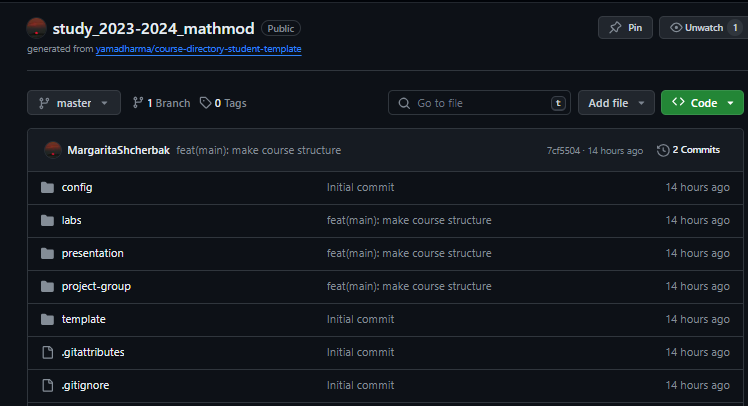{#fig:001 width=90%} 

## Выполнение

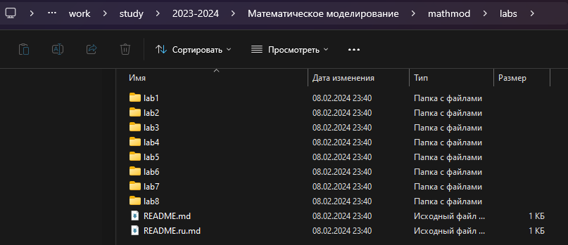{#fig:002 width=90%}

## Работа с Git
Установила имя, эл. почту, параметры установки окончаний строк и отображения unicode,создала страницу «Hello, World» и репозиторий (рис.3 - рис.4).

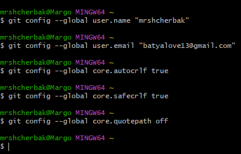{#fig:003 width=70%}

## Выполнение

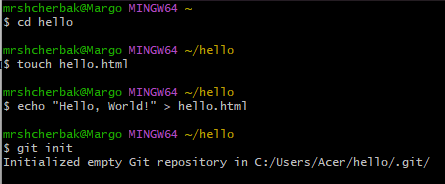{#fig:004 width=80%}

## Работа с Git
Перешла к индексации изменений (рис.5). Изменения файла hello.html были проиндексированы. Это означает, что git теперь знает об изменении, но изменение пока не записано в репозиторий. Следующий коммит будет включать в себя проиндексированные изменения.

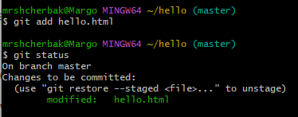{#fig:005 width=60%}

## Работа с Git
Добавила стандартные теги страницы (Рис.6). hello.html указан дважды в состоянии. Первое изменение проиндексировано и готово к коммиту. Второе изменение является непроиндексированным. 

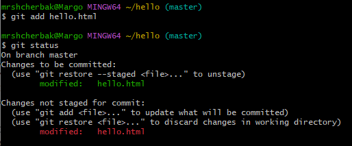{#fig:0011 width=70%}

## Работа с Git
Произвела коммит проиндексированного изменения (рис.7).

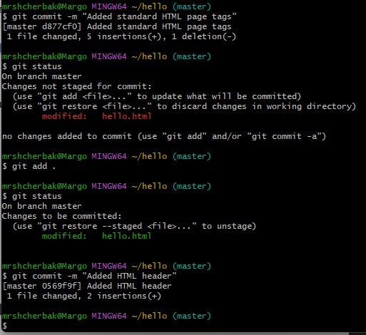{#fig:007 width=50%}

## Получила список произведенных изменений (рис.8).

{#fig:008 width=30%}

## Перешла к созданию тегов версий (рис.9).

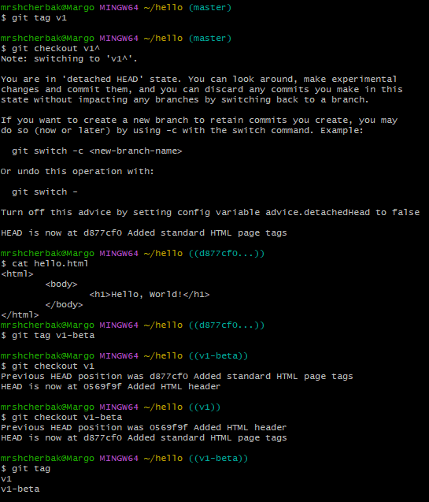{#fig:009 width=55%}

## Внесение изменений в коммиты. 
Оригинальный коммит «автор» заменен коммитом «автор/email» (рис.10).

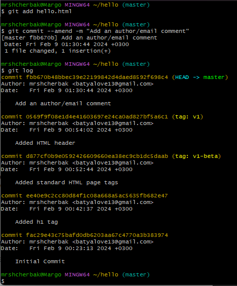{#fig:0010 width=40%}

## Git внутри: каталог .git (рис.11).

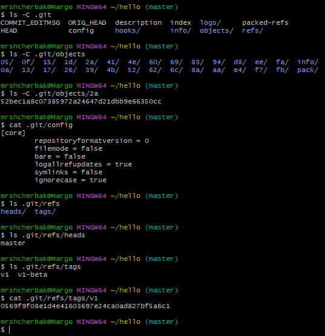{#fig:0011 width=60%}

## Работа непосредственно с объектами git (рис.12).

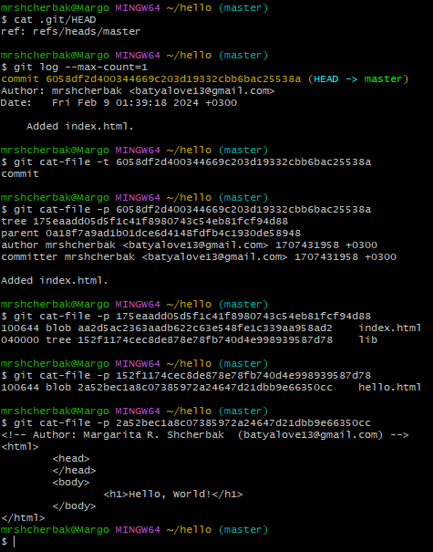{#fig:0012 width=40%}

## Создание конфликта и разрешение конфликтов (рис.13 - рис.15).

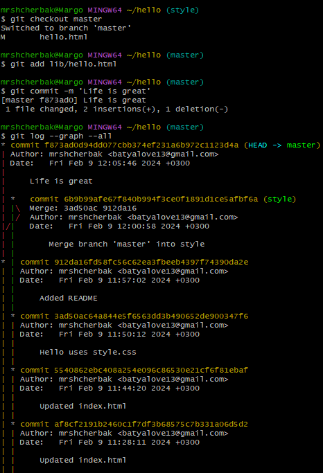{#fig:0013 width=40%}

## Работа с Git

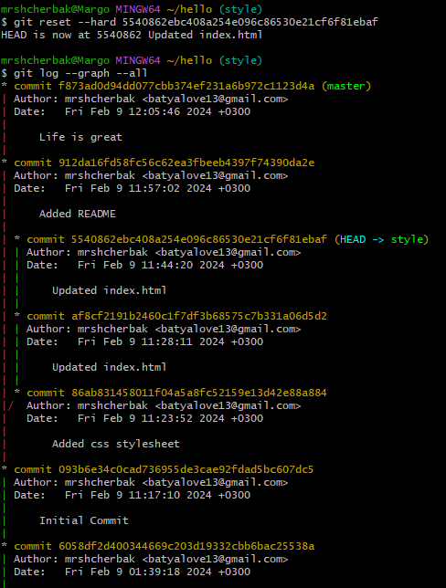{#fig:0014 width=45%}

## Работа с Git

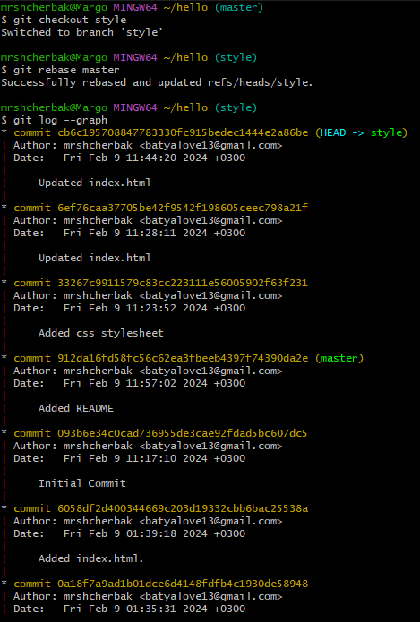{#fig:0015 width=40%}

##  Клонирование репозиториев (рис.16).

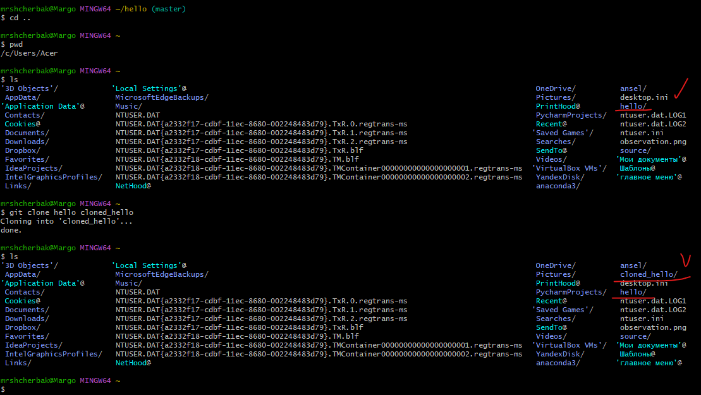{#fig:0016 width=90%}

## Изменение оригинального репозитория (рис.17 - рис.20).

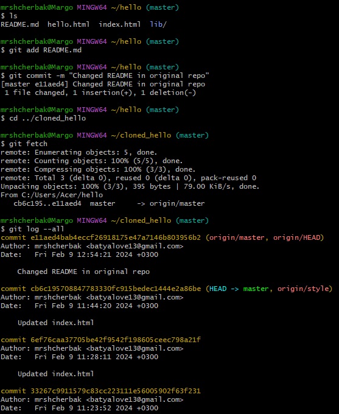{#fig:0017 width=45%}

## Работа с Git

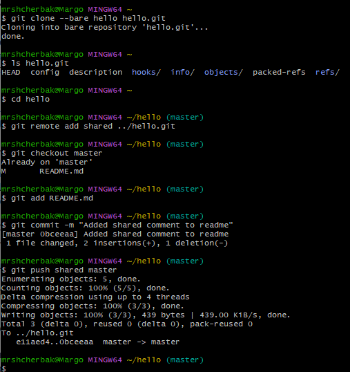{#fig:0018 width=60%}

## Работа с Git

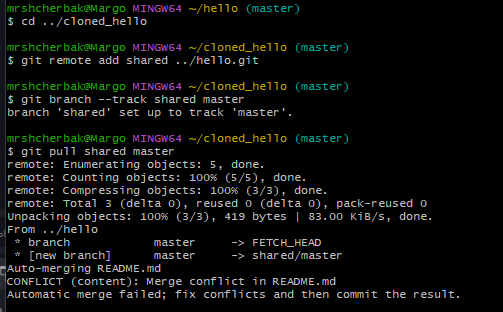{#fig:0019 width=50%}

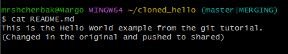{#fig:0020 width=50%}

## **Вывод** 

Таким образом, в ходе ЛР№1 я настроила рабочее пространство для лабораторной работы. Изучила систему контроля версий Git.
