---
## Front matter

title: "Лабораторная работа №1"
subtitle: "Настройка рабочего пространства. Система контроля версий Git"
author: "Щербак Маргарита Романовна, НПИбд-02-21"
date: "2024"
## Generic otions
lang: ru-RU
toc-title: "Содержание"

## Bibliography
bibliography: bib/cite.bib
csl: pandoc/csl/gost-r-7-0-5-2008-numeric.csl

## Pdf output format
toc: true # Table of contents
toc-depth: 2
lof: true # List of figures
fontsize: 12pt
linestretch: 1.5
papersize: a4
documentclass: scrreprt
## I18n polyglossia
polyglossia-lang:
  name: russian
  options:
	- spelling=modern
	- babelshorthands=true
polyglossia-otherlangs:
  name: english
## I18n babel
babel-lang: russian
babel-otherlangs: english
## Fonts
mainfont: PT Serif
romanfont: PT Serif
sansfont: PT Sans
monofont: PT Mono
mainfontoptions: Ligatures=TeX
romanfontoptions: Ligatures=TeX
sansfontoptions: Ligatures=TeX,Scale=MatchLowercase
monofontoptions: Scale=MatchLowercase,Scale=0.9
## Biblatex
biblatex: true
biblio-style: "gost-numeric"
biblatexoptions:
  - parentracker=true
  - backend=biber
  - hyperref=auto
  - language=auto
  - autolang=other*
  - citestyle=gost-numeric

## Pandoc-crossref LaTeX customization
figureTitle: "Скриншот"
tableTitle: "Таблица"
listingTitle: "Листинг"
lofTitle: "Список иллюстраций"
lotTitle: "Список таблиц"
lolTitle: "Листинги"
## Misc options
indent: true
header-includes:
  - \usepackage{indentfirst}
  - \usepackage{float} # keep figures where there are in the text
  - \floatplacement{figure}{H} # keep figures where there are in the text
---

# Цель работы

Настроить рабочее пространство для лабораторной работы. Изучить систему контроля версий Git.

# Задание

Создать репозиторий курса, настроить каталог курса и выполнить задания из файла по работе с Git.

# Теоретическое введение 

Git — это система управления версиями, которая используется для отслеживания изменений в файлах кода или любых других текстовых файлах в проекте. Он позволяет разработчикам работать вместе над проектами, фиксировать изменения, откатываться к предыдущим версиям кода и управлять конфликтами при слиянии изменений.  
Вот несколько ключевых концепций Git:  
- Репозиторий (Repository): Это место, где хранится весь исторический код и его версии. Репозиторий может быть локальным (на вашем компьютере) или удаленным (на сервере). 
- Коммит (Commit): Это снимок текущего состояния файлов в вашем проекте. Каждый коммит имеет уникальный идентификатор, сообщение о коммите и метку времени.  
- Ветка (Branch): Это отдельная линия разработки в вашем репозитории. Она позволяет вам работать над определенной функцией или исправлением без влияния на основную версию проекта. Ветки могут быть созданы, объединены и удалены.  
- Слияние (Merge): Это процесс объединения изменений из одной ветки с другой. Это позволяет объединить работу нескольких разработчиков в одном проекте.  
- Конфликт слияния (Merge Conflict): Это ситуация, когда Git не может автоматически слить изменения из разных веток из-за конфликта в одном и том же участке кода. Это требует ручного разрешения. 

Git является широко используемым инструментом в современной разработке программного обеспечения благодаря своей гибкости, масштабируемости и эффективности.

# Выполнение лабораторной работы
1. Создала репозиторий курса и настроила каталог курса (рис.1 - рис. 2).  

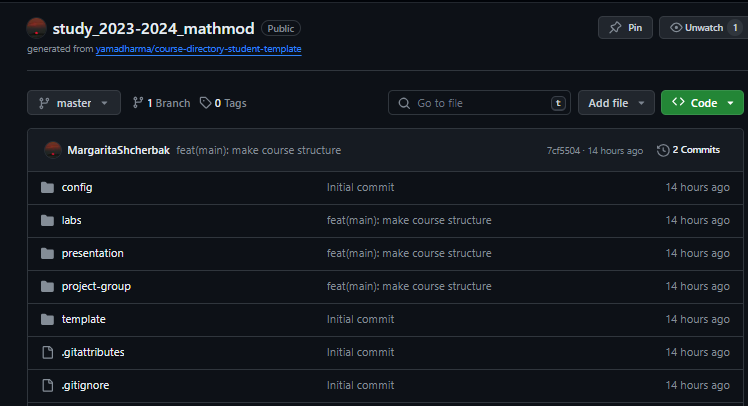{#fig:001 width=80%} 

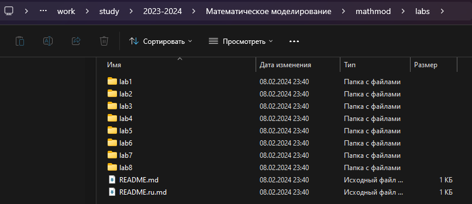{#fig:002 width=80%}

2. Установила имя и эл. почту, а также  параметры установки окончаний строк и установила отображения unicode, после чего  создала страницу «Hello, World» и репозиторий (рис.3 - рис.4).

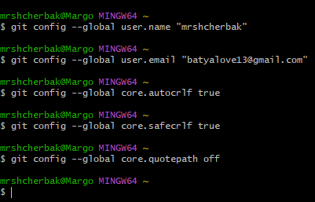{#fig:003 width=70%}

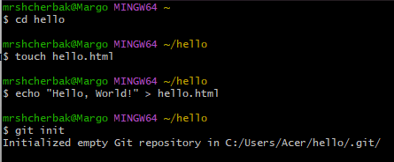{#fig:004 width=70%}

3. Добавила файл в репозиторий и проверила состояние репозитория (рис.5).  

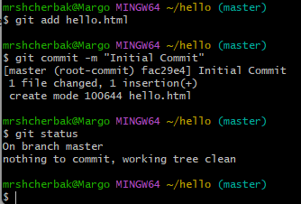{#fig:005 width=70%}

4. Изменила страницу «Hello, World» (рис.6).

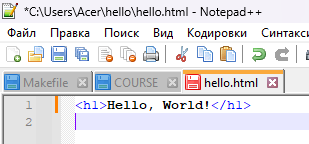{#fig:006 width=60%}

5. Перешла к индексации изменений (рис.7). Изменения файла hello.html были проиндексированы. Это означает, что git теперь знает об изменении, но изменение пока не записано в репозиторий. Следующий коммит будет включать в себя проиндексированные изменения.

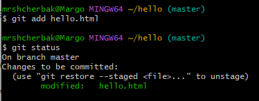{#fig:007 width=60%}

6. Сделала коммит изменений (рис.8 - рис.9). В первой строке ввела комментарий: «Added h1 tag». Сохранила файл и вышла из редактора. 
Рабочий каталог чистый, можно продолжить работу.

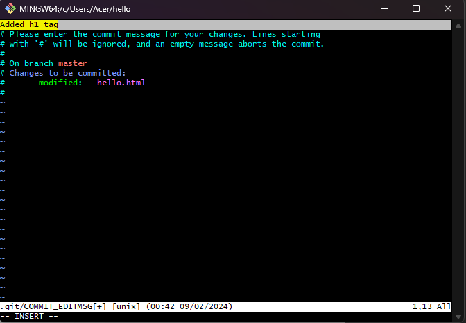{#fig:008 width=80%}

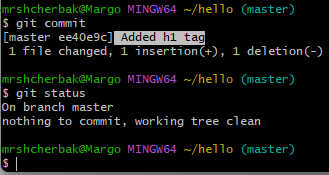{#fig:009 width=70%}

7.  Добавила стандартные теги страницы (Рис.10 - рис.11). hello.html указан дважды в состоянии. Первое изменение (добавление стандартных тегов) проиндексировано и готово к коммиту. Второе изменение (добавление заголовков HTML) является непроиндексированным. Если бы вы делали коммит сейчас, заголовки не были бы сохранены в репозиторий.

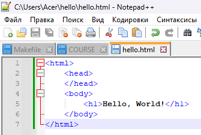{#fig:0010 width=60%}

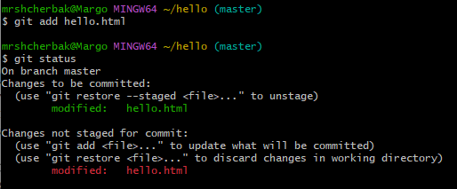{#fig:0011 width=80%}

Произведла коммит проиндексированного изменения (значение по умолчанию), а затем еще раз проверила состояние. Состояние команды говорит о том, что hello.html имеет незафиксированные изменения, но уже не в буферной зоне. Теперь добавила второе изменение в индекс, а затем проверила состояние с помощью команды git status. Сделала коммит второго изменения (рис.12).

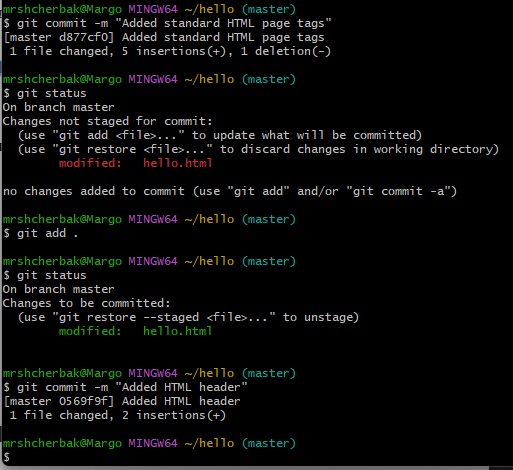{#fig:0012 width=80%}

8. Получила список произведенных изменений. Есть много вариантов отображения лога (рис.13).

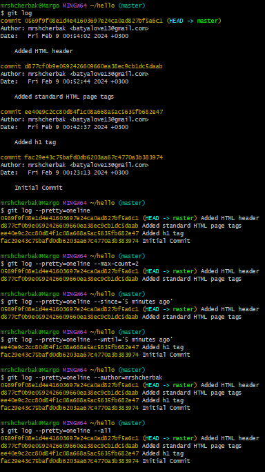{#fig:0013 width=75%}

9. Перешла к этапу получения старых версий (рис.14).

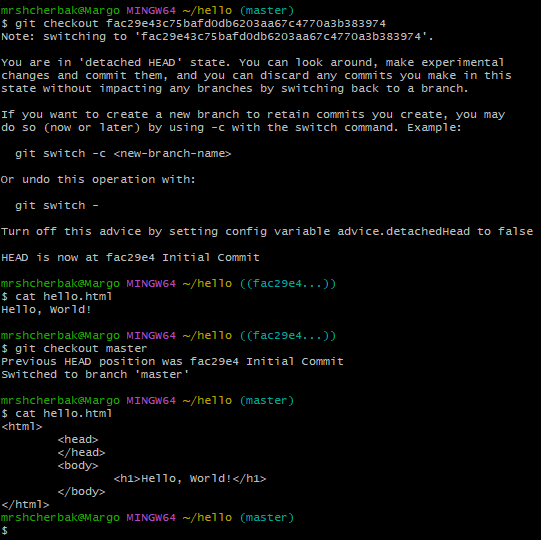{#fig:0014 width=80%}

10. Перешла к созданию тегов версий. Переключение по имени тега. Просмотр тегов с помощью команды tag (рис.15).

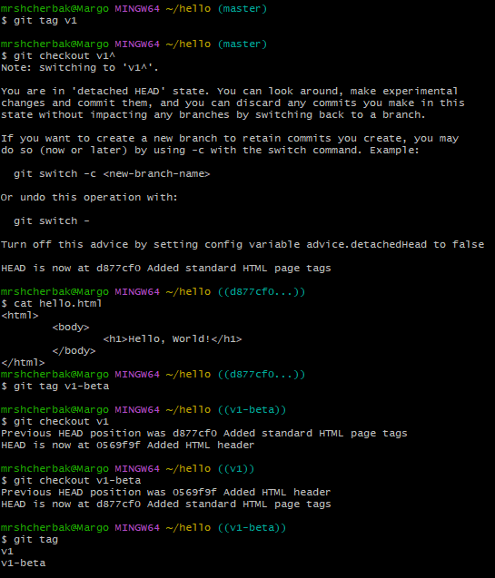{#fig:0015 width=80%}

11. Перешла к этапу отмены локальных изменений (до индексации). Внесла изменение в файл hello.html в виде нежелательного комментария. hello.html был изменен, но еще не проиндексирован. Использовала команду git checkout для переключения версии файла
hello.html в репозитории. Команда git status показывает нам, что не было произведено никаких измнений, не зафиксированных в рабочем каталоге (рис.16 - рис.17).

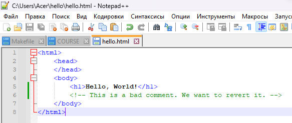{#fig:0016 width=70%}

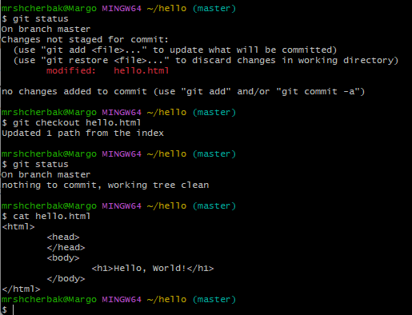{#fig:0017 width=80%}

12. Отмена проиндексированных изменений (перед коммитом). Изменила файл и проиндексировала изменения.  Проверила состояние. Выполнила сброс буферной зоны.  Переключилась на версию коммита (Рис.18 - рис.19).

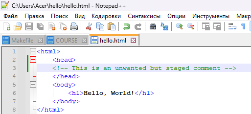{#fig:0018 width=70%}

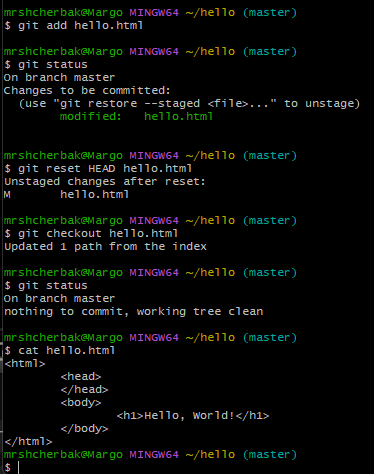{#fig:0019 width=60%}

13. Перешла к этапу отмены коммитов. Отменила коммит путем создания нового коммита, отменяющего нежелательные изменения. Чтобы отменить коммит, необходимо сделать коммит, который удаляет изменения, сохраненные нежелательным коммитом. Сброс коммитов к предшествующим коммиту Oops.  Удаление тега oops (рис.20 - рис.22).

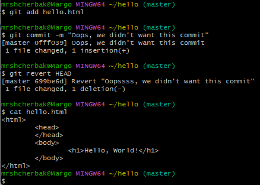{#fig:0020 width=70%}

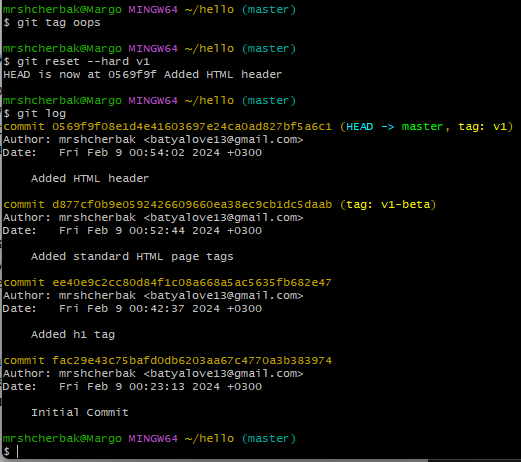{#fig:0021 width=70%}

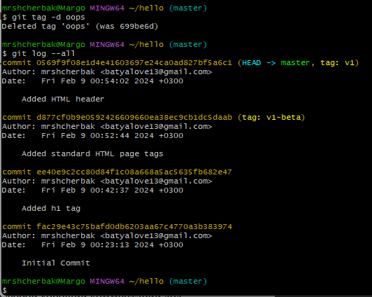{#fig:0022 width=70%}

14. Внесение изменений в коммиты. Мы можем увидеть, что оригинальный коммит «автор» заменен коммитом «автор/email». Этого же эффекта можно достичь путем сброса последнего коммита в ветке, и повторного коммита новых изменений (рис.23 - рис.24).

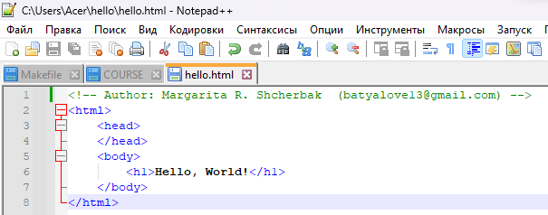{#fig:0023 width=80%}

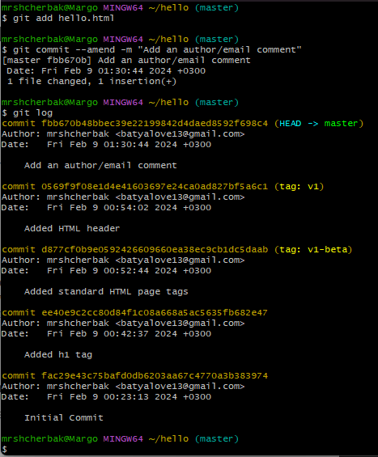{#fig:0024 width=75%}

15. Перемещение файлов. Сейчас мы собираемся создать структуру нашего репозитория. Давайте перенесем страницу в каталог lib (рис.25).

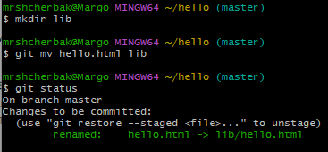{#fig:0025 width=60%}

16. Подробнее о структуре. Добавление index.html. Теперь при открытии index.html, вы должны увидеть кусок страницы hello в
маленьком окошке (рис.26 - рис.27).

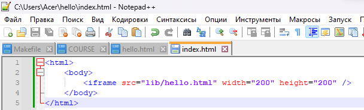{#fig:0026 width=70%}

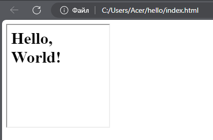{#fig:0027 width=60%}

17.  Git внутри: каталог .git (рис.28).

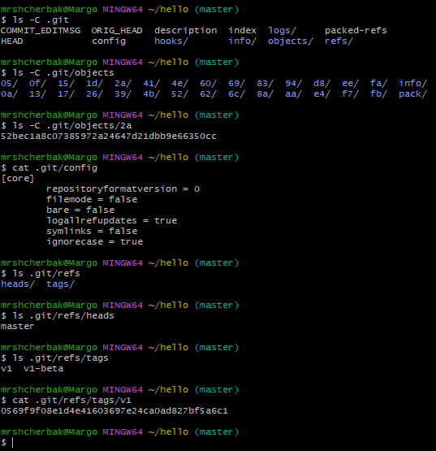{#fig:0028 width=80%}

18. Работа непосредственно с объектами git. Поиск последнего коммита. Вывод последнего коммита с помощью SHA1 хэша.  Поиск дерева.Вывод каталога lib. Вывод файла hello.html (рис.29).

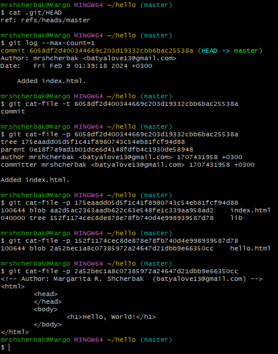{#fig:0029 width=80%}

19. Создание ветки. Добавила файл стилей style.css. Изменила основную страницу. Изменила index.html (рис.30 - рис.32).

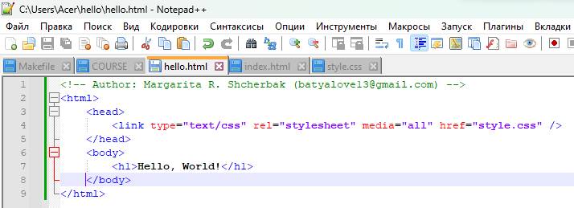{#fig:0030 width=75%}

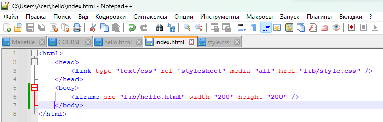{#fig:0031 width=75%}

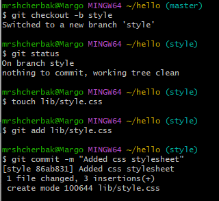{#fig:0032 width=60%}

20. Изменения в ветке master. Сделала коммит изменений README.md в ветку master. Слияние веток (рис.33 - рис.34).

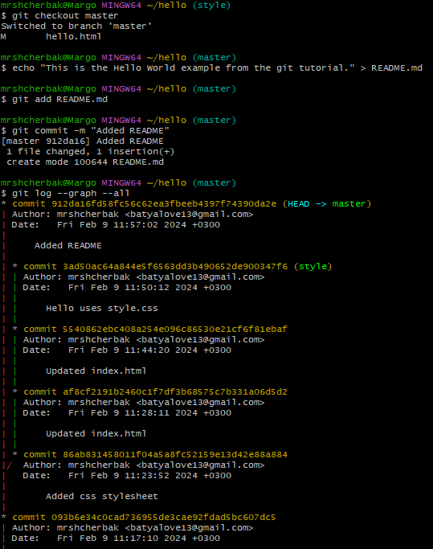{#fig:0033 width=80%}

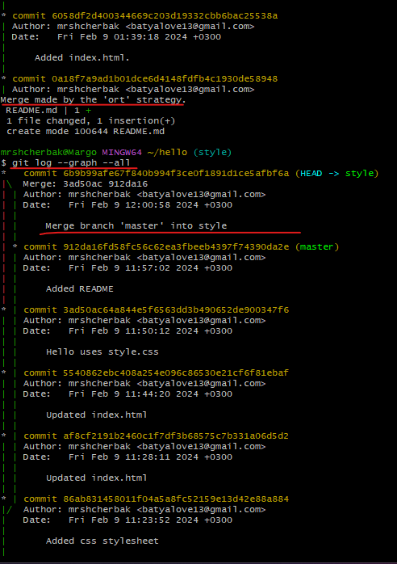{#fig:0034 width=80%}

21. Создание конфликта и разрешение конфликтов.  Слияние master с веткой style. Необходимо вручную разрешить конфликт.  Сброс ветки style. Сброс ветки master. Слияние в ветку master. Теперь ветки style и master идентичны (рис.35 - рис.40).

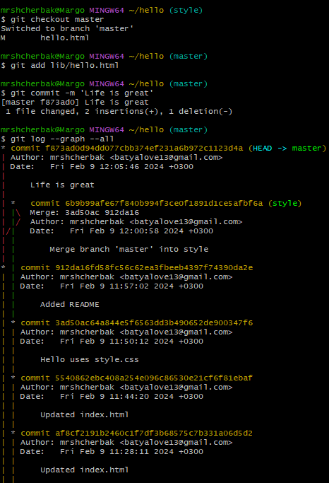{#fig:0035 width=80%}

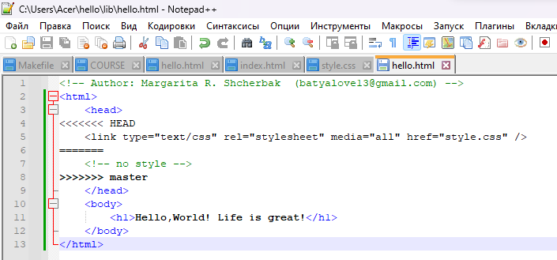{#fig:0036 width=80%}

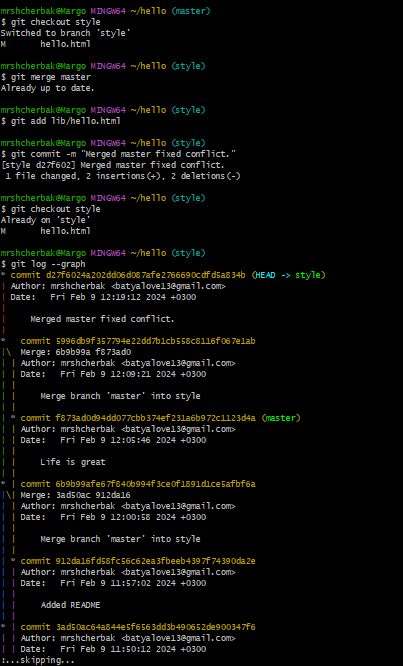{#fig:0037 width=80%}

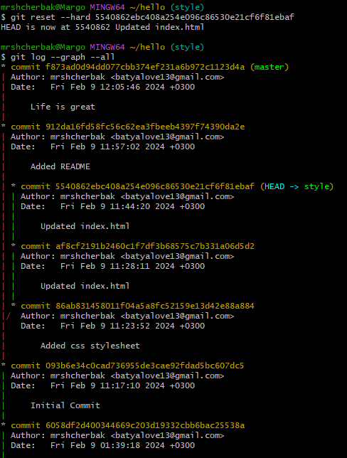{#fig:0038 width=80%}

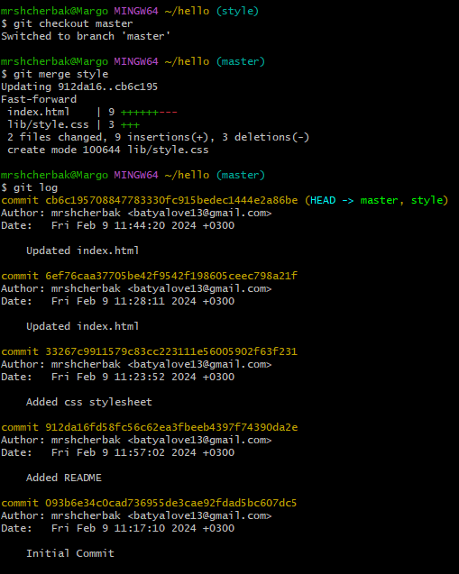{#fig:0039 width=80%}

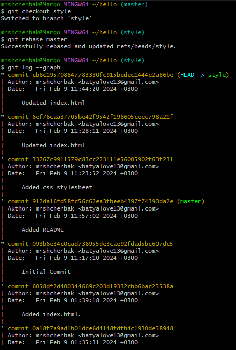{#fig:0040 width=80%}

22. Клонирование репозиториев. Просмотр клонированного репозитория (рис.41 - рис.42).

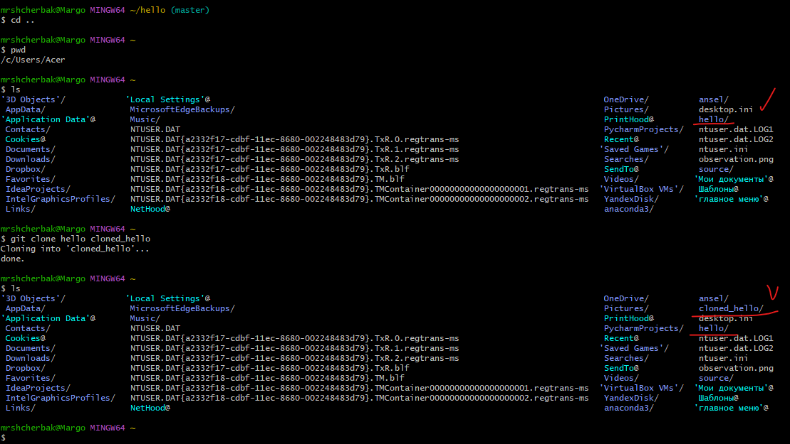{#fig:0041 width=80%}

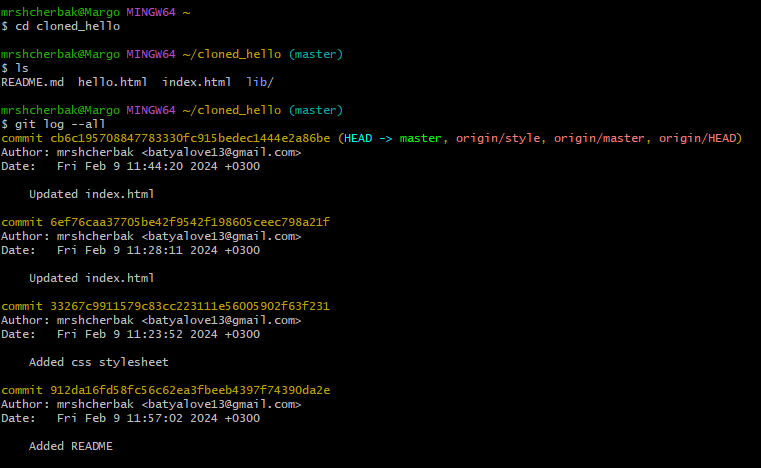{#fig:0042 width=80%}

23.  Изменение оригинального репозитория. Извлечение изменений. Слияние извлеченных изменений. Чистые репозитории. Добавление удаленного репозитория. Отправка изменений. Извлечение общих изменений (рис.43 - рис.46).

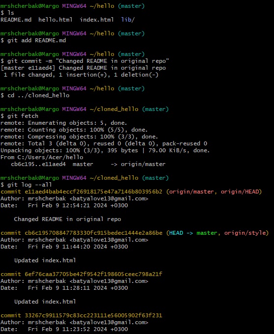{#fig:0043 width=80%}

{#fig:0044 width=80%}

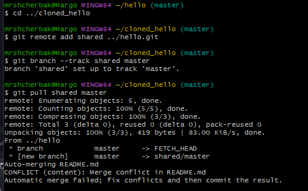{#fig:0045 width=80%}

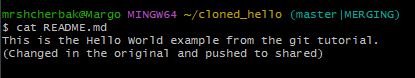{#fig:0046 width=80%}

# Выводы
Таким образом, в ходе ЛР№1 я настроила рабочее пространство для лабораторной работы. Изучила систему контроля версий Git.