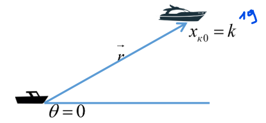
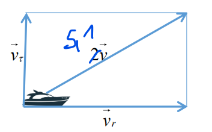
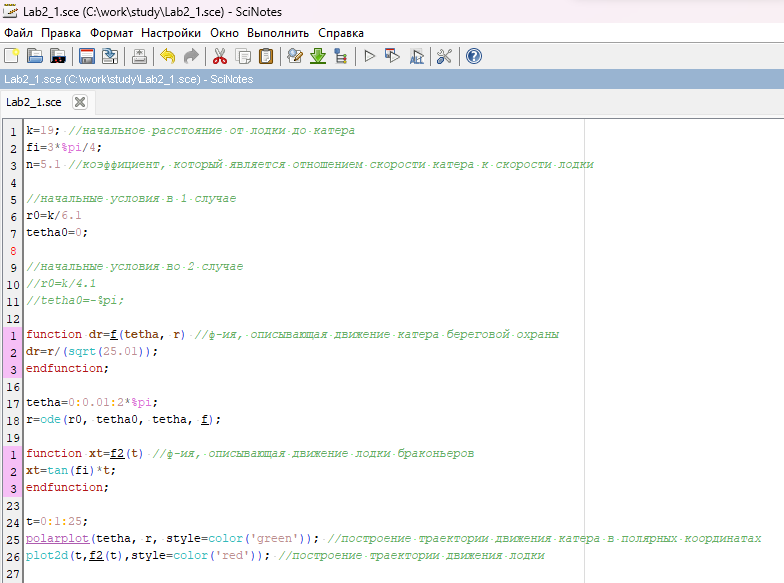
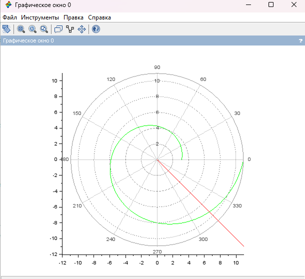
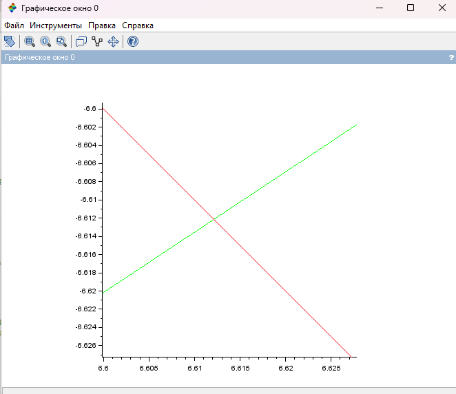
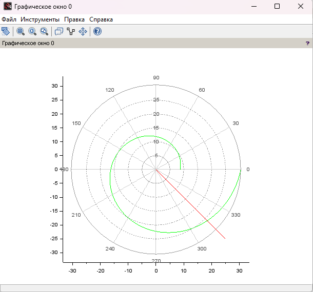
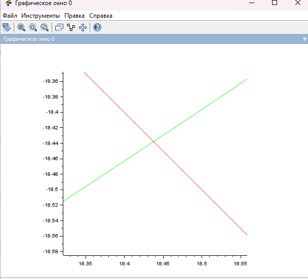

---
## Front matter
lang: ru-RU
title: Лабораторная работа №2
subtitle: Задача о погоне. Вариант №38
author: |
        Щербак Маргарита Романовна
        \        
        НПИбд-02-21
        \
        Студ. билет: 1032216537
institute: |
           RUDN
date: |
      2024

babel-lang: russian
babel-otherlangs: english
mainfont: Arial
monofont: Courier New
fontsize: 9pt

## Formatting
toc: false
slide_level: 2
theme: metropolis
header-includes: 
 - \metroset{progressbar=frametitle,sectionpage=progressbar,numbering=fraction}
 - '\makeatletter'
 - '\beamer@ignorenonframefalse'
 - '\makeatother'
aspectratio: 43
section-titles: true
---

## **Цель работы**

Рассмотреть пример построения математических моделей для выбора правильной стратегии при решении задач поиска. С помощью примера научиться решать задачи такого типа.
Ознакомиться с основами языков программирования Julia и OpenModelica. Освоить библиотеки этих языков, необходимые для визуализации данных и решения дифференциальных уравнений. 
Применить полученные знания к решению задачи о погоне.

## **Задание. Задача о погоне**
Я выполняю свой вариант лабораторной работы №38 по данной формуле:

$(N_{student} mod K_{of variants})$ + 1 = (1032216537 % 70) + 1 = 38.

На море в тумане катер береговой охраны преследует лодку браконьеров.
Через определенный промежуток времени туман рассеивается, и лодка
обнаруживается на расстоянии 19 км от катера. Затем лодка снова скрывается в
тумане и уходит прямолинейно в неизвестном направлении. Известно, что скорость
катера в 5.1 раза больше скорости браконьерской лодки.

## Задачи

1. Записать уравнение, описывающее движение катера, с начальными условиями для двух случаев (в зависимости от расположения катера относительно лодки в начальный момент времени).
2. Построить траекторию движения катера и лодки для двух случаев.
3. Найти точку пересечения траектории катера и лодки.

## Теоретическое введение 
Scilab - интерактивная система для численных вычислений, анализа данных и визуализации результатов, обеспечивающая удобное решение математических задач разной сложности, включая уравнения, обработку сигналов и построение графиков.

Julia - высокоуровневый язык программирования для эффективных математических вычислений и программирования общего назначения. 

## Теоретическое введение 

Тангенциальная скорость – это составляющая вектора скорости, перпендикулярная линии, соединяющей источник и наблюдателя. Она измеряется через угловое перемещение источника.

Радиальная скорость – это проекция скорости точки на прямую, соединяющую её с выбранным началом координат.

Полярная система координат – двумерная система координат, в которой каждая точка на плоскости определяется полярным углом и полярным радиусом.

## Выполнение лабораторной работы

Момент отсчета времени — момент первого рассеивания тумана. Введем полярные координаты с центром в точке обнаружения лодки браконьеров и осью, проходящей через  точку нахождения катера береговой охраны (рис.1). Тогда начальные координаты катера (19; 0).

{#fig:002 width=60%}

## Построение математической модели

Траектория катера должна соответствовать тому, чтобы он всегда находился на одном расстоянии от полюса, чтобы пересечь траекторию лодки. Катер береговой охраны сначала движется прямолинейно, чтобы сравняться с расстоянием до полюса лодки браконьеров, затем движется вокруг полюса с такой же скоростью, как лодка. Расстояние x, с которого катер начнет движение вокруг полюса, находится из уравнения времени, которое они потратят на пройденное расстояние.

## Построение математической модели

Пусть через время $t$ катер и лодка окажутся на одном расстоянии $x$ от полюса. За это время лодка пройдет $x$, а катер $19 - x$ (или $19 + x$, в зависимости от начального положения катера относительно полюса). Время, за которое они пройдут это расстояние, вычисляется как $x/v$ или $(19-x)/5,1v$ (во втором случае $(19+x)/5,1v$).Тогда неизвестное расстояние x можно найти из следующего уравнения:

$\frac {x}{v}$=$\frac {19-x}{5,1v}$ в первом случае

или

$\frac {x}{v}$=$\frac {19+x}{5,1v}$ во втором случае

Отсюда мы найдем два значения $x_1$ = $\frac {190}{61}$, $x_2$ = $\frac {190}{41}$.

## Построение математической модели

Раскладываем скорость катера на две составляющие: $v_r$ -
радиальная скорость и $v_τ$ - тангенциальная скорость (рис. 2). Радиальная скорость - это скорость, с которой катер удаляется от полюса, $v_r$ = $\frac {dr}{dt}$. Полагаем, что $\frac {dr}{dt}$ = $v$. Тангенциальная скорость равна $v_τ$ = r $\frac {dϴ}{dt}$

{#fig:005 width=40%}

Из рисунка видно: $v_τ$ = $\sqrt{26.01v^2-v^2}$= $v$ $\sqrt{25.01}$
Тогда получаем: $r$ $\frac {dϴ}{dt}$ = $v$ $\sqrt{25.01}$.

## Построение математической модели
Решение исходной задачи сводится к решению системы из двух дифференциальных уравнений:
$$
\left\{ 
\begin{array}{c}
\frac {dr}{dt}=v \\
r \frac {dϴ}{dt}=v \sqrt{25.01}
\end{array}
\right.
$$

с начальными условиями

$$
\left\{ 
\begin{array}{c}
ϴ_0 = 0 \\
r_0 = \frac {19}{6,1} 
\end{array}
\right.
$$

или

$$
\left\{ 
\begin{array}{c}
ϴ_0 = -π \\
r_0 = \frac {19}{4,1}
\end{array}
\right.
$$

## Построение математической модели

Исключая из полученной системы производную по $t$, можно перейти к следующему уравнению (с прежними начальными условиями):

$\frac {dr}{dϴ}$ = $\frac {r} {\sqrt{25.01}}$

Решением этого уравнения с заданными начальными условиями и будет являться траектория движения катера в полярных координатах.

## Код в Scilab. Код представлен для двух случаев (рис.3).

{ #fig:007 width=80% }

## Определила траектории катера (green) и лодки (red) для 1 случая (рис.4)

{ #fig:008 width=70% }

## Определила точку пересечения катера и лодки для 1 случая (рис.5)

{ #fig:009 width=70% }

## Определила траектории катера (green) и лодки (red) для 2 случая (рис.6)

{ #fig:0010 width=70% }

## Определила точку пересечения катера и лодки для 2 случая (рис.7)

{ #fig:0011 width=70% }

## Анализ полученных результатов

Так, были построены графики для обоих случаев. На них получилось отрисовать трактерию катера, траекторию лодки и получилось наглядно найти их точки пересечения. Задача о погоне решена.

## Вывод

Таким образом, в ходе ЛР№2 я рассмотрела пример построения математических моделей для выбора правильной стратегии при решении задач поиска. С помощью примера научилась решать задачи такого типа.
Изучила основы языков программирования Julia и OpenModelica. Освоены библиотеки этих языков, которые используются для построения графиков и решения дифференциальных уравнений. Поскольку OpenModelica не работает с полярными координатами, она пока что не была использована в данной лабораторной работе. 

## Список литературы. Библиография

1. Scilab documentation. [Электронный ресурс]. М. URL: [Scilab documentation](https://wiki.scilab.org/Documentation) (Дата обращения: 15.02.2024).

2. Документация по Julia. [Электронный ресурс]. М. URL: [Julia 1.10 Documentation](https://docs.julialang.org/en/v1/) (Дата обращения: 15.02.2024).

3. Документация по OpenModelica. [Электронный ресурс]. М. URL: [openmodelica](https://openmodelica.org/) (Дата обращения: 15.02.2024).

4. Решение дифференциальных уравнений. [Электронный ресурс]. М. URL: [wolframalpha](https://www.wolframalpha.com/) (Дата обращения: 15.02.2024).
