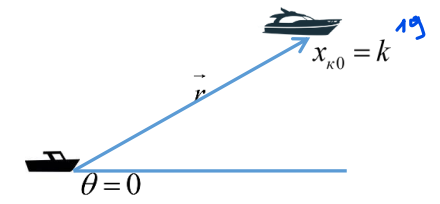
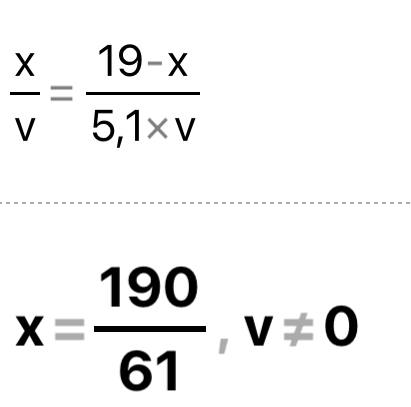
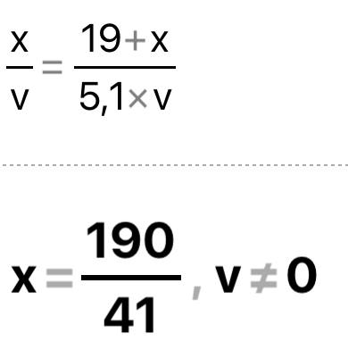
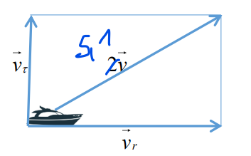
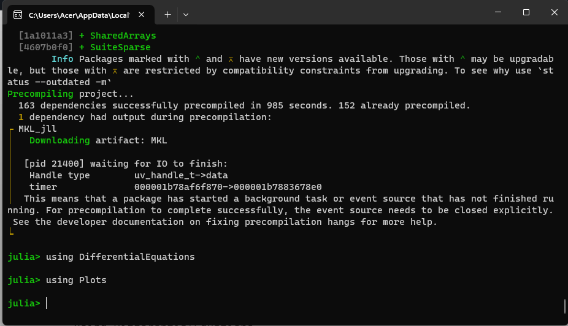
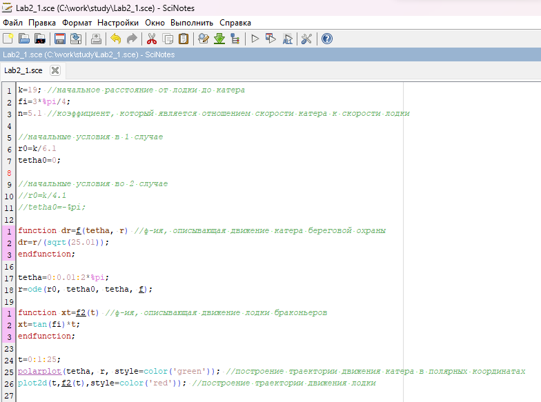
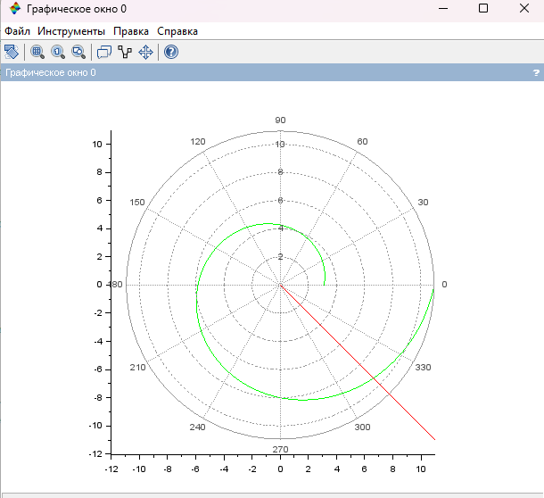
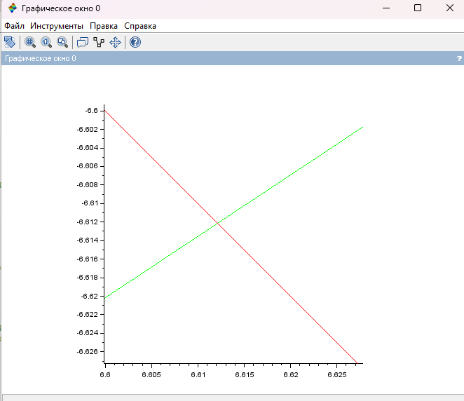
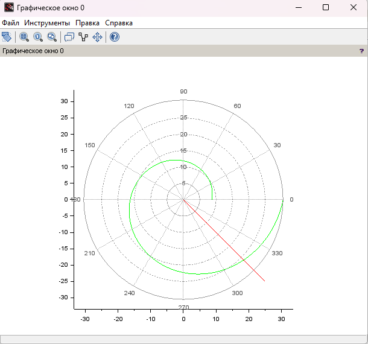
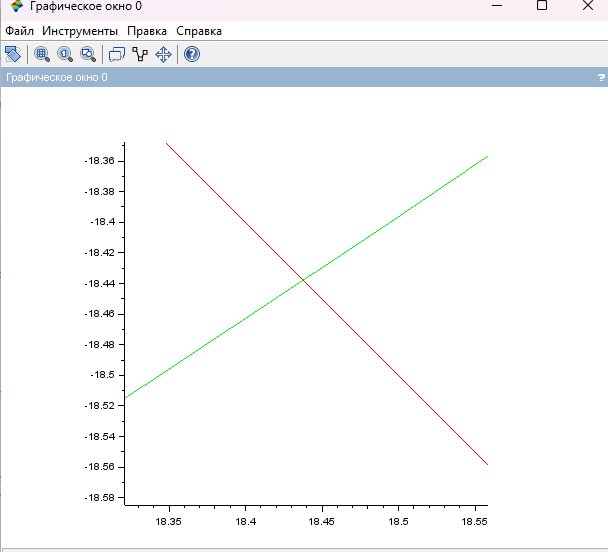

---
## Front matter

title: "Отчёт по лабораторной работе №2


Математическое моделирование"
subtitle: "Задача о погоне. Вариант №38"
author: "Щербак Маргарита Романовна, НПИбд-02-21"
date: "2024"
## Generic otions
lang: ru-RU
toc-title: "Содержание"

## Bibliography
bibliography: bib/cite.bib
csl: pandoc/csl/gost-r-7-0-5-2008-numeric.csl

## Pdf output format
toc: true # Table of contents
toc-depth: 2
lof: true # List of figures
fontsize: 12pt
linestretch: 1.5
papersize: a4
documentclass: scrreprt
## I18n polyglossia
polyglossia-lang:
  name: russian
  options:
	- spelling=modern
	- babelshorthands=true
polyglossia-otherlangs:
  name: english
## I18n babel
babel-lang: russian
babel-otherlangs: english
## Fonts
mainfont: PT Serif
romanfont: PT Serif
sansfont: PT Sans
monofont: PT Mono
mainfontoptions: Ligatures=TeX
romanfontoptions: Ligatures=TeX
sansfontoptions: Ligatures=TeX,Scale=MatchLowercase
monofontoptions: Scale=MatchLowercase,Scale=0.9
## Biblatex
biblatex: true
biblio-style: "gost-numeric"
biblatexoptions:
  - parentracker=true
  - backend=biber
  - hyperref=auto
  - language=auto
  - autolang=other*
  - citestyle=gost-numeric

## Pandoc-crossref LaTeX customization
figureTitle: "Скриншот"
tableTitle: "Таблица"
listingTitle: "Листинг"
lofTitle: "Список иллюстраций"
lotTitle: "Список таблиц"
lolTitle: "Листинги"
## Misc options
indent: true
header-includes:
  - \usepackage{indentfirst}
  - \usepackage{float} # keep figures where there are in the text
  - \floatplacement{figure}{H} # keep figures where there are in the text
---

# Цель работы

Рассмотреть пример построения математических моделей для выбора правильной стратегии при решении задач поиска. С помощью примера научиться решать задачи такого типа.
Ознакомиться с основами языков программирования Julia и OpenModelica. Освоить библиотеки этих языков, необходимые для визуализации данных и решения дифференциальных уравнений. 
Применить полученные знания к решению задачи о погоне.

# Задание

Я выполняю свой вариант лабораторной работы №38 по данной формуле $(N_{student} mod K_{of variants})$ + 1 = (1032216537 % 70) + 1 = 38.

Мой вариант будет применяться во всех последующих лабораторных работах.

**Задача о погоне**

На море в тумане катер береговой охраны преследует лодку браконьеров.
Через определенный промежуток времени туман рассеивается, и лодка
обнаруживается на расстоянии 19 км от катера. Затем лодка снова скрывается в
тумане и уходит прямолинейно в неизвестном направлении. Известно, что скорость
катера в 5.1 раза больше скорости браконьерской лодки.

# Задачи

1. Записать уравнение, описывающее движение катера, с начальными условиями для двух случаев (в зависимости от расположения катера относительно лодки в начальный момент времени).
2. Построить траекторию движения катера и лодки для двух случаев.
3. Найти точку пересечения траектории катера и лодки.

# Теоретическое введение 

Scilab – это интерактивная система для выполнения численных вычислений, анализа данных и визуализации результатов. Она предоставляет пользователю удобное программное средство для решения математических задач различной сложности, включая решение уравнений, обработку сигналов, построение графиков и многое другое [1].

Подобно MATLAB, Scilab предоставляет широкий набор инструментов и функций, которые могут быть использованы для задач, начиная от простых математических операций и заканчивая сложными научными и инженерными вычислениями [1].

Julia – это высокоуровневый язык программирования с динамической типизацией, созданный для эффективных математических вычислений и написания программ общего назначения. В отличие от некоторых других языков, таких как MATLAB и Octave, Julia имеет свой собственный, но знакомый синтаксис. Он разработан на базе языков программирования C, C++ и Scheme. Julia обладает встроенной поддержкой многопоточности и распределенных вычислений, что делает его мощным инструментом для решения различных задач [2].

OpenModelica – это свободное программное обеспечение для моделирования и анализа сложных динамических систем, основанное на языке Modelica. OpenModelica приближается по функциональности к таким инструментам, как Matlab Simulink и Scilab xCos, но обладает более удобным представлением системы уравнений [3].

Дифференциальное уравнение – это уравнение, содержащее производные функции. Оно может быть любого порядка, и его решение представляет собой функцию (или семейство функций), в отличие от решения алгебраических уравнений, где ищется число или несколько чисел. Дифференциальное уравнение высокого порядка можно преобразовать в систему уравнений первого порядка, что облегчает его решение [4].

Тангенциальная скорость – это составляющая вектора скорости, перпендикулярная линии, соединяющей источник и наблюдателя. Она измеряется через угловое перемещение источника.

Радиальная скорость – это проекция скорости точки на прямую, соединяющую её с выбранным началом координат.

Полярная система координат – двумерная система координат, в которой каждая точка на плоскости определяется полярным углом и полярным радиусом.

# Выполнение лабораторной работы

Построим математическую модель для выбора правильной стратегии при решении задачи поиска. Необходимо определить по какой траектории должен двигаться катер, чтобы нагнать лодку.

1. Момент отсчета времени — момент первого рассеивания тумана. Введем полярные координаты с центром в точке обнаружения лодки браконьеров и осью, проходящей через  точку нахождения катера береговой охраны (рис.1). Тогда начальные координаты катера (19; 0). Обозначим скорость лодки $v$.

{#fig:002 width=55%}

2. Траектория катера должна быть такой, чтобы и катер, и лодка все время были на одном расстоянии от полюса, только в этом случае траектория катера пересечется с траекторией лодки. Поэтому для начала катер береговой охраны должен двигаться некоторое время прямолинейно, пока не окажется на том же расстоянии от полюса, что и лодка браконьеров. После этого катер береговой охраны должен двигаться вокруг полюса удаляясь от него с той же скоростью, что и лодка браконьеров.
3. Чтобы найти расстояние $x$ (расстояние после которого катер начнет двигаться вокруг полюса), необходимо составить простое уравнение [1]. Пусть через время $t$ катер и лодка окажутся на одном расстоянии $x$ от полюса. За это время лодка пройдет $x$, а катер $19 - x$ (или $19 + x$, в зависимости от начального положения катера относительно полюса). Время, за которое они пройдут это расстояние, вычисляется как $x/v$ или $(19-x)/5,1v$ (во втором случае $(19+x)/5,1v$). Так как время одно и то же, то эти величины одинаковы. Из этого получаем объединение из двух уравнений (из-за двух разных изначальных позиций катера относительно полюса).
Тогда неизвестное расстояние x можно найти из следующего уравнения [4]:

$\frac {x}{v}$=$\frac {19-x}{5,1v}$ в первом случае

или

$\frac {x}{v}$=$\frac {19+x}{5,1v}$ во втором случае

Отсюда мы найдем два значения $x_1$ = $\frac {190}{61}$, $x_2$ = $\frac {190}{41}$ (рис.2 - рис.3), задачу будем решать для двух случаев.

{#fig:003 width=30%}

{#fig:004 width=30%}

После того, как катер береговой охраны окажется на одном расстоянии от полюса, что и лодка, он должен сменить прямолинейную траекторию и начать двигаться вокруг полюса удаляясь от него со скоростью лодки $v$. 
Для этого скорость катера раскладываем на две составляющие: $v_r$ -
радиальная скорость и $v_τ$ - тангенциальная скорость (рис. 4). Радиальная скорость - это скорость, с которой катер удаляется от полюса, $v_r$ = $\frac {dr}{dt}$. Нам нужно, чтобы эта скорость была равна скорости лодки, поэтому полагаем, что $\frac {dr}{dt}$ = $v$. 
Тангенциальная скорость – это линейная скорость вращения катера 
относительно полюса. Она равна $v_τ$ = r $\frac {dϴ}{dt}$

{#fig:005 width=60%}

Из рисунка видно: $v_τ$ = $\sqrt{26.01v^2-v^2}$= $v$ $\sqrt{25.01}$
Тогда получаем: $r$ $\frac {dϴ}{dt}$ = $v$ $\sqrt{25.01}$.

4. Решение исходной задачи сводится к решению системы из двух дифференциальных уравнений:

$$
\left\{ 
\begin{array}{c}
\frac {dr}{dt}=v \\
r \frac {dϴ}{dt}=v \sqrt{25.01}
\end{array}
\right.
$$

с начальными условиями

$$
\left\{ 
\begin{array}{c}
ϴ_0 = 0 \\
r_0 = \frac {19}{6,1} 
\end{array}
\right.
$$

или

$$
\left\{ 
\begin{array}{c}
ϴ_0 = -π \\
r_0 = \frac {19}{4,1}
\end{array}
\right.
$$

Исключая из полученной системы производную по $t$, можно перейти к следующему уравнению (с прежними начальными условиями):

$\frac {dr}{dϴ}$ = $\frac {r} {\sqrt{25.01}}$

Решением этого уравнения с заданными начальными условиями и будет являться траектория движения катера в полярных координатах.

#### OpenModelica

Оказалось, что OpenModelica не поддерживает использование полярных координат, что делает невозможным корректное отображение результатов данной задачи в этой среде.

#### Julia

Для решения дифференциального уравнения, описанного в постановке задачи лабораторной работы, можно использовать библиотеку DifferentialEquations. Для построения итоговых графиков в полярных координатах можно воспользоваться библиотекой Plots.

Я установила Julia и нужные библиотеки, проверила их установку (рис.5).

{#fig:006 width=100%}

Однако код буду писать в Scilab. Код представлен для двух случаев (рис.6). 

```
k=19; //начальное расстояние от лодки до катера
fi=3*%pi/4;
n=5.1 //отношение скорости катера к скорости лодки

//начальные условия в 1 случае
r0=k/6.1
tetha0=0;

//начальные условия во 2 случае
//r0=k/4.1
//tetha0=-%pi;

function dr=f(tetha, r) //ф-ия, описывающая движение катера береговой охраны
dr=r/(sqrt(25.01));
endfunction;

tetha=0:0.01:2*%pi;
r=ode(r0, tetha0, tetha, f);

function xt=f2(t) //ф-ия, описывающая движение лодки браконьеров
xt=tan(fi)*t;
endfunction;

t=0:1:25;
//траектория движения катера в полярных координатах
polarplot(tetha, r, style=color('green')); 
plot2d(t,f2(t),style=color('red')); //траектория движения лодки
```

{ #fig:007 width=100% }

Определила траектории катера (зелёный цвет) и лодки (красный цвет) для 1 случая (рис.7)

{ #fig:008 width=80% }

И точку пересечения катера и лодки (рис.8).

{ #fig:009 width=80% }

Из рисунка видно, что точка пересечения $(6.6121;-6.6122)$

Определила траектории катера (зелёный цвет) и лодки (красный цвет) для 2 случая (рис.9).

{ #fig:0010 width=80% }

И точку пересечения катера и лодки (рис.10).

{ #fig:0011 width=80% }

Из рисунка видно, что точка пересечения $(18.4378;-18.4378)$

# Анализ полученных результатов

Так, были построены графики для обоих случаев. На них получилось отрисовать трактерию катера, траекторию лодки и получилось наглядно найти их точки пересечения. Задача о погоне решена.

# Вывод

Таким образом, в ходе ЛР№2 я рассмотрела пример построения математических моделей для выбора правильной стратегии при решении задач поиска. С помощью примера научилась решать задачи такого типа.
Изучила основы языков программирования Julia и OpenModelica. Освоены библиотеки этих языков, которые используются для построения графиков и решения дифференциальных уравнений. Поскольку OpenModelica не работает с полярными координатами, она пока что не была использована в данной лабораторной работе. 

# Список литературы. Библиография

1. Scilab documentation. [Электронный ресурс]. М. URL: [Scilab documentation](https://wiki.scilab.org/Documentation) (Дата обращения: 15.02.2024).

2. Документация по Julia. [Электронный ресурс]. М. URL: [Julia 1.10 Documentation](https://docs.julialang.org/en/v1/) (Дата обращения: 15.02.2024).

3. Документация по OpenModelica. [Электронный ресурс]. М. URL: [openmodelica](https://openmodelica.org/) (Дата обращения: 15.02.2024).

4. Решение дифференциальных уравнений. [Электронный ресурс]. М. URL: [wolframalpha](https://www.wolframalpha.com/) (Дата обращения: 15.02.2024).
