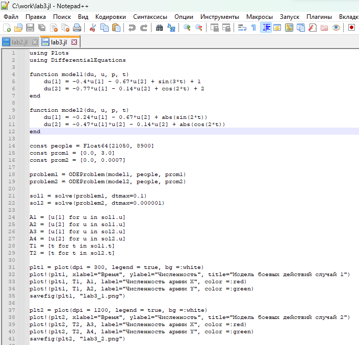

---
## Front matter
lang: ru-RU
title: Лабораторная работа №3
subtitle: Модель боевых действий. Вариант №38
author: |
        Щербак Маргарита Романовна
        \        
        НПИбд-02-21
        \
        Студ. билет: 1032216537
institute: |
           RUDN
date: |
      2024

babel-lang: russian
babel-otherlangs: english
mainfont: Arial
monofont: Courier New
fontsize: 9pt

## Formatting
toc: false
slide_level: 2
theme: metropolis
header-includes: 
 - \metroset{progressbar=frametitle,sectionpage=progressbar,numbering=fraction}
 - '\makeatletter'
 - '\beamer@ignorenonframefalse'
 - '\makeatother'
aspectratio: 43
section-titles: true
---

## Цель работы

Рассмотреть простейшие модели боевых действий – модели Ланчестера. С помощью рассмотренного примера научиться решать задачи такого типа.

## Задание. Модель боевых действий

Между страной $X$ и страной $Y$ идет война. Численность состава войск
исчисляется от начала войны, и являются временными функциями $x(t)$ и $y(t)$. В начальный момент времени страна $X$ имеет армию численностью $882 000$ человек, а в распоряжении страны $Y$ армия численностью в $747 000$ человек. Для упрощения модели считаем, что коэффициенты $a$, $b$, $c$, $h$ постоянны. Также считаем, что $P(t)$ и $Q(t)$ - непрерывные функции.

## Задание. Модель боевых действий

1. Модель боевых действий между регулярными войсками:

$\frac {dx}{dt}$=$-0,4x(t)-0,67y(t)+sin(3t)+1$

$\frac {dy}{dt}$=$-0,77x(t)-0,14y(t)+cos(2t)+2$

2. Модель ведения боевых действий с участием регулярных войск и партизанских отрядов:

$\frac {dx}{dt}$=$-0,24x(t)-0,67y(t)+|sin(2t)|$

$\frac {dy}{dt}$=$-0,47x(t)y(t)-0,14y(t)+|cos(2t)|$

## Задачи

1. Построить графики изменения численности войск армии $X$ и армии $Y$ для
следующих случаев:

 - Модель боевых действий между регулярными войсками;

 - Модель ведения боевых действий с участием регулярных войск и партизанских отрядов.

2. Определить победителя в каждом из случаев.

## Теоретическое введение 

Законы Ланчестера — математические формулы, созданные для определения относительных сил противоборствующих сторон в военных ситуациях. Они были описаны в статье М. П. Осипова в 1915 году, а затем доработаны Ф. У. Ланчестером в 1916 году во время первой мировой войны. Уравнения Ланчестера - это система дифференциальных уравнений, описывающих изменение сил во время конфликта.

## Выполнение лабораторной работы. Julia

Для решения дифференциального уравнения используем библиотеку DifferentialEquations. Для построения графиков воспользуемся библиотекой Plots (рис.1):

{#fig:001 width=55%}

## Выполнение лабораторной работы. Julia
Получим следующие графики (рис.2 - рис.3):

{#fig:002 width=75%}

## Выполнение лабораторной работы. Julia

{#fig:003 width=75%}

## Выполнение лабораторной работы. OpenModelica

OpenModelica – это свободное программное обеспечение для моделирования и анализа сложных динамических систем, основанное на языке Modelica. Решение задачи для двух случаев (рис.4):

{#fig:004 width=60%}

## Выполнение лабораторной работы. OpenModelica

Из рис.5 видно (1 случай), что армия $x$ (красный цвет) выиграла армию $y$ (синий цвет)

{#fig:005 width=85%}

## Выполнение лабораторной работы. OpenModelica

Из рис.6 видно (2 случай), что армия $x$ (красный цвет) выиграла армию $y$ (синий цвет)

{#fig:006 width=85%}

## Анализ полученных результатов

Из анализа графиков первой модели видно, что графики, созданные с помощью Julia и OpenModelica, очень похожи друг на друга, хотя могут иметь некоторые различия из-за разных графических ресурсов и настроек масштаба. То же самое наблюдается и на графиках, отражающих столкновение регулярной армии с силами партизан во второй модели. В обоих случаях армия X выходит победителем.

## Вывод

Таким образом, в ходе ЛР№3 я рассмотрела простейшие модели боевых действий – модели Ланчестера. С помощью рассмотренного примера научилась решать задачи такого типа. Смогла решить задачу о модели боевых действий, а также все поставленные задачи.

## Список литературы. Библиография

1. Законы Ланчестера. [Электронный ресурс]. М. URL: [Законы Осипова — Ланчестера](https://ru.wikipedia.org/wiki/%D0%97%D0%B0%D0%BA%D0%BE%D0%BD%D1%8B_%D0%9E%D1%81%D0%B8%D0%BF%D0%BE%D0%B2%D0%B0_%E2%80%94_%D0%9B%D0%B0%D0%BD%D1%87%D0%B5%D1%81%D1%82%D0%B5%D1%80%D0%B0) (Дата обращения: 18.02.2024). 

2. Решение дифференциальных уравнений. [Электронный ресурс]. М. URL: [wolframalpha](https://www.wolframalpha.com/) (Дата обращения: 18.02.2024).

3. Документация по Julia. [Электронный ресурс]. М. URL: [Julia 1.10 Documentation](https://docs.julialang.org/en/v1/) (Дата обращения: 18.02.2024).

4. Modelica: Language Specification. - 308 с. [Электронный ресурс]. М. URL: [Language Specification](https://modelica.org/documents/ModelicaSpec34.pdf) (Дата обращения: 18.02.2024).