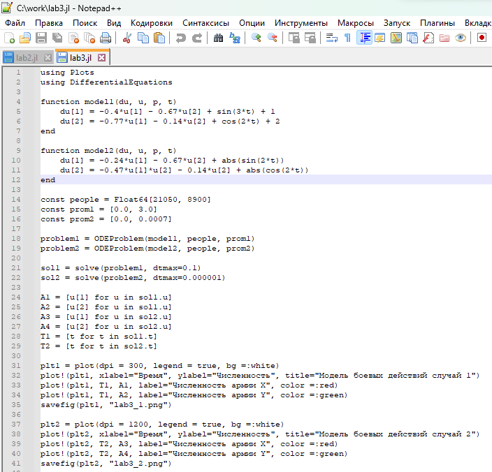
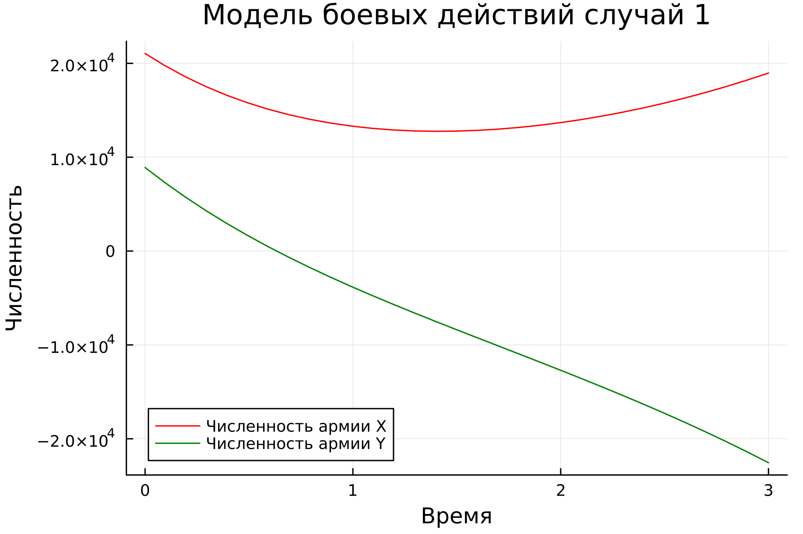
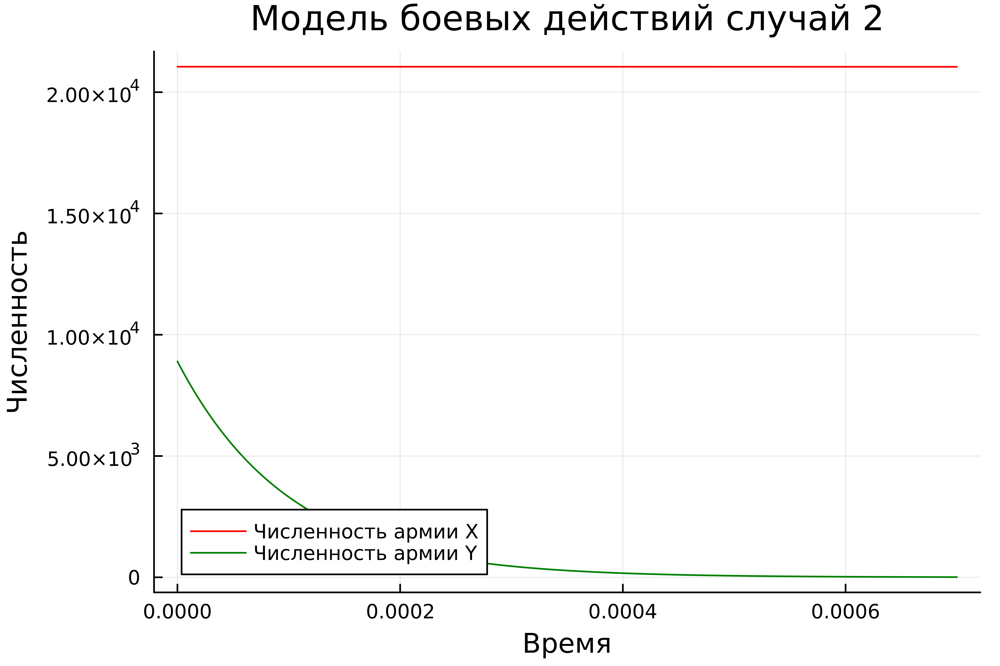
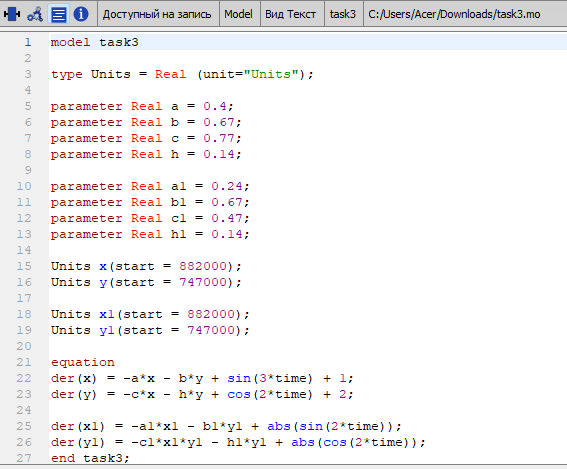
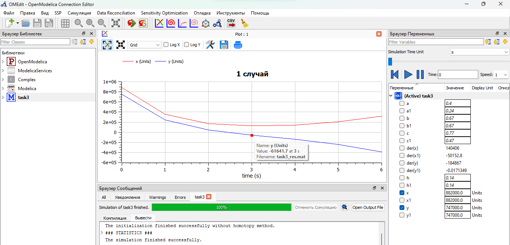
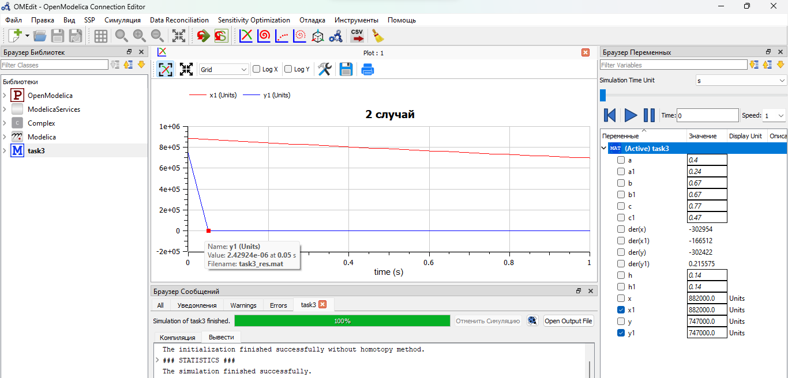

---
## Front matter

title: "Отчёт по лабораторной работе №3

Математическое моделирование"
subtitle: "Модель боевых действий. Вариант №38"
author: "Щербак Маргарита Романовна, НПИбд-02-21"
date: "2024"
## Generic otions
lang: ru-RU
toc-title: "Содержание"

## Bibliography
bibliography: bib/cite.bib
csl: pandoc/csl/gost-r-7-0-5-2008-numeric.csl

## Pdf output format
toc: true # Table of contents
toc-depth: 2
lof: true # List of figures
fontsize: 12pt
linestretch: 1.5
papersize: a4
documentclass: scrreprt
## I18n polyglossia
polyglossia-lang:
  name: russian
  options:
	- spelling=modern
	- babelshorthands=true
polyglossia-otherlangs:
  name: english
## I18n babel
babel-lang: russian
babel-otherlangs: english
## Fonts
mainfont: PT Serif
romanfont: PT Serif
sansfont: PT Sans
monofont: PT Mono
mainfontoptions: Ligatures=TeX
romanfontoptions: Ligatures=TeX
sansfontoptions: Ligatures=TeX,Scale=MatchLowercase
monofontoptions: Scale=MatchLowercase,Scale=0.9
## Biblatex
biblatex: true
biblio-style: "gost-numeric"
biblatexoptions:
  - parentracker=true
  - backend=biber
  - hyperref=auto
  - language=auto
  - autolang=other*
  - citestyle=gost-numeric

## Pandoc-crossref LaTeX customization
figureTitle: "Скриншот"
tableTitle: "Таблица"
listingTitle: "Листинг"
lofTitle: "Список иллюстраций"
lotTitle: "Список таблиц"
lolTitle: "Листинги"
## Misc options
indent: true
header-includes:
  - \usepackage{indentfirst}
  - \usepackage{float} # keep figures where there are in the text
  - \floatplacement{figure}{H} # keep figures where there are in the text
---

# Цель работы

Рассмотреть простейшие модели боевых действий – модели Ланчестера. С помощью рассмотренного примера научиться решать задачи такого типа.

# Задачи

1. Построить графики изменения численности войск армии $X$ и армии $Y$ для
следующих случаев:

 - Модель боевых действий между регулярными войсками;

 - Модель ведения боевых действий с участием регулярных войск и партизанских отрядов.

2. Определить победителя в каждом из случаев.

# Теоретическое введение 

Законы Ланчестера — математическая формула для расчета относительных сил пары сражающихся сторон — подразделений вооруженных сил [1].

Уравнения Ланчестера — это дифференциальные уравнения, описывающие зависимость между силами сражающихся сторон A и D как функцию от времени, причем функция зависит только от A и D [1].

Рассмотрим три случая ведения боевых действий:  
1. Боевые действия между регулярными войсками;  
2. Боевые действия с участием регулярных войск и партизанских
отрядов;  
3. Боевые действия между партизанскими отрядами.  

В первом случае численность регулярных войск определяется тремя факторами:

- скорость уменьшения численности войск из-за причин, не связанных с
боевыми действиями (болезни, травмы, дезертирство);
- скорость потерь, обусловленных боевыми действиями противоборствующих сторон (что связанно с качеством стратегии, уровнем вооружения, профессионализмом солдат и т.п.);
- скорость поступления подкрепления (задаётся некоторой функцией от времени).

В этом случае модель боевых действий между регулярными войсками описывается следующим образом:

$\frac {dx}{dt}$=$-a(t)x(t)-b(t)y(t)+P(t)$

$\frac {dy}{dt}$=$-c(t)x(t)-h(t)y(t)+Q(t)$

Потери, не связанные с боевыми действиями, описывают члены $-a(t)x(t)$ и $-h(t)y(t)$, члены $-b(t)y(t)$ и $-c(t)x(t)$ отражают потери на поле боя. Коэффициенты $b(t)$ и $c(t)$ указывают на эффективность боевых действий со стороны $y$ и $x$ соответственно, $a(t)$, $h(t)$ - величины, характеризующие степень влияния различных факторов на потери. Функции $P(t)$, $Q(t)$ учитывают 
возможность подхода подкрепления к войскам $X$ и $Y$ в течение одного дня. 

Во втором случае в борьбу добавляются партизанские отряды. Нерегулярные войска в отличии от постоянной армии менее уязвимы, так как действуют скрытно, в этом случае сопернику приходится действовать неизбирательно, по площадям, занимаемым партизанами. Поэтому считается, что темп потерь партизан, проводящих свои операции в разных местах на некоторой известной территории,
пропорционален не только численности армейских соединений, но и численности
самих партизан. В результате модель принимает вид:

$\frac {dx}{dt}$=$-a(t)x(t)-b(t)y(t)+P(t)$

$\frac {dy}{dt}$=$-c(t)x(t)y(t)-h(t)y(t)+Q(t)$

В этой системе все величины имеют тот же смысл, что и в системе в 1 случае.

Модель ведение боевых действий между партизанскими отрядами с учетом
предположений, сделанных в предыдущем случае, имеет вид:

$\frac {dx}{dt}$=$-a(t)x(t)-b(t)x(t)y(t)+P(t)$

$\frac {dy}{dt}$=$-h(t)y(t)-c(t)x(t)y(t)+Q(t)$

# Выполнение лабораторной работы

## Условие задачи
Я выполняю свой вариант лабораторной работы №38 по данной формуле $(N_{student} mod K_{of variants})$ + 1 = (1032216537 % 70) + 1 = 38.

Между страной $X$ и страной $Y$ идет война. Численность состава войск
исчисляется от начала войны, и являются временными функциями $x(t)$ и $y(t)$. В начальный момент времени страна $X$ имеет армию численностью $882 000$ человек, а в распоряжении страны $Y$ армия численностью в $747 000$ человек. Для упрощения модели считаем, что коэффициенты $a$, $b$, $c$, $h$ постоянны. Также считаем, что $P(t)$ и $Q(t)$ - непрерывные функции.

1. Модель боевых действий между регулярными войсками:

$\frac {dx}{dt}$=$-0,4x(t)-0,67y(t)+sin(3t)+1$

$\frac {dy}{dt}$=$-0,77x(t)-0,14y(t)+cos(2t)+2$

2. Модель ведения боевых действий с участием регулярных войск и партизанских отрядов:

$\frac {dx}{dt}$=$-0,24x(t)-0,67y(t)+|sin(2t)|$

$\frac {dy}{dt}$=$-0,47x(t)y(t)-0,14y(t)+|cos(2t)|$

## Julia

Julia – это высокоуровневый язык программирования с динамической типизацией, созданный для эффективных математических вычислений и написания программ общего назначения [2].

Для решения дифференциального уравнения, описанного в постановке задачи лабораторной работы, можно использовать библиотеку DifferentialEquations. Для построения графиков можно воспользоваться библиотекой Plots (рис.1):

{#fig:001 width=88%}

Получим следующие графики (рис.2 - рис.3):

{#fig:002 width=70%}

{#fig:003 width=70%}

## OpenModelica

OpenModelica – это свободное программное обеспечение для моделирования и анализа сложных динамических систем, основанное на языке Modelica. OpenModelica приближается по функциональности к таким инструментам, как Matlab Simulink и Scilab xCos, но обладает более удобным представлением системы уравнений [3]. Решение задачи для двух случаев (рис.4):

{#fig:004 width=80%}

Из рис.5 видно (1 случай), что армия $x$ (красный цвет) выиграла армию $y$ (синий цвет)

{#fig:005 width=95%}

Из рис.6 видно (2 случай), что армия $x$ (красный цвет) выиграла армию $y$ (синий цвет)

{#fig:006 width=95%}

## Анализ и сравнение результатов

Из анализа графиков первой модели видно, что графики, созданные с помощью Julia и OpenModelica, очень похожи друг на друга, хотя могут иметь некоторые различия из-за разных графических ресурсов и настроек масштаба. То же самое наблюдается и на графиках, отражающих столкновение регулярной армии с силами партизан во второй модели. В обоих случаях армия X выходит победителем.

# Выводы

Таким образом, в ходе ЛР№3 я рассмотрела простейшие модели боевых действий – модели Ланчестера. С помощью рассмотренного примера научилась решать задачи такого типа. Смогла решить задачу о модели боевых действий, а также все поставленные задачи.

# Список литературы

1. Решение дифференциальных уравнений. [Электронный ресурс]. М. URL: [wolframalpha](https://www.wolframalpha.com/) (Дата обращения: 15.02.2024).

2. Документация по Julia. [Электронный ресурс]. М. URL: [Julia 1.10 Documentation](https://docs.julialang.org/en/v1/) (Дата обращения: 15.02.2024).

3. Документация по OpenModelica. [Электронный ресурс]. М. URL: [openmodelica](https://openmodelica.org/) (Дата обращения: 15.02.2024).

