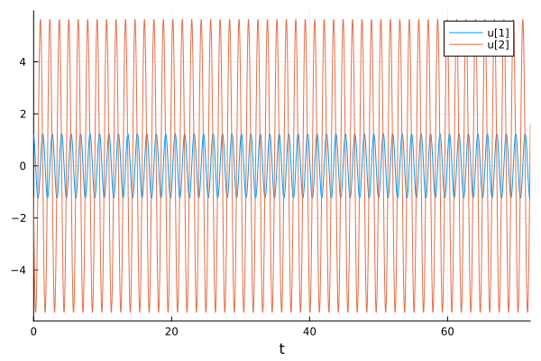
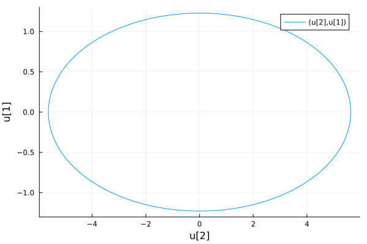
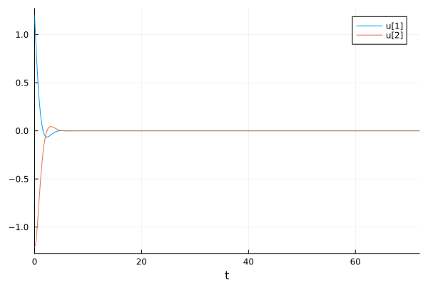
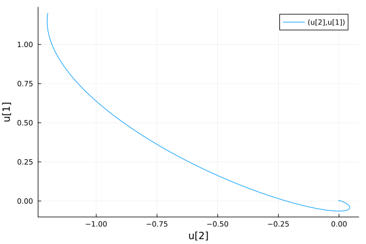
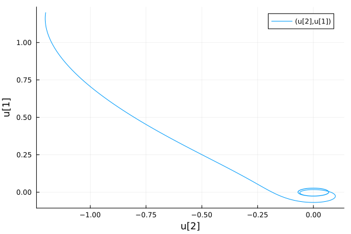

---
## Front matter
lang: ru-RU
title: Лабораторная работа №4
subtitle: Модель гармонических колебаний. Вариант №38
author: |
        Щербак Маргарита Романовна
        \        
        НПИбд-02-21
        \
        Студ. билет: 1032216537
institute: |
           RUDN
date: |
      2024

babel-lang: russian
babel-otherlangs: english
mainfont: Arial
monofont: Courier New
fontsize: 8pt

## Formatting
toc: false
slide_level: 2
theme: metropolis
header-includes: 
 - \metroset{progressbar=frametitle,sectionpage=progressbar,numbering=fraction}
 - '\makeatletter'
 - '\beamer@ignorenonframefalse'
 - '\makeatother'
aspectratio: 43
section-titles: true
---

## Цель работы

Изучить понятие гармонического осциллятора, рассмотреть модели линейного гармонического осциллятора, построить фазовый портрет и найти решение уравнения гармонического осциллятора. С помощью рассмотренного примера научиться решать задачи такого типа для разных случаев.

## Теоретическое введение 

Линейный гармонический осциллятор представляет из себя дифференциальное уравнение,которое в теории колебаний выступает в качестве 
основной модели. Гармонический осциллятор представляет собой систему, которая при отклонении от положения равновесия подвергается воздействию возвращающей силы $F$, пропорциональной величине отклонения $x$.

Гармоническое колебание является типом колебательного движения, при котором параметры движения (такие как смещение, скорость, ускорение и т. д.) изменяются в соответствии с гармоническим законом, описываемым синусоидальной или косинусоидальной функцией.

## Задачи

1. Изучить понятие гармонического осциллятора

2. Ознакомиться с уравнением свободных колебаний гармонического осциллятора

3. Построить фазовый портрет гармонического осциллятора и решение уравнения на языках Julia и Modelica гармонического осциллятора для следующих случаев:

- Колебания гармонического осциллятора без затуханий и без действий внешней силы;

- Колебания гармонического осциллятора c затуханием и без действий внешней силы;

- Колебания гармонического осциллятора c затуханием и под действием внешней силы.

## Задание. Модель гармонических колебаний

Постройте фазовый портрет гармонического осциллятора и решение уравнения
гармонического осциллятора для следующих случаев:

1. Колебания гармонического осциллятора без затуханий и без действий внешней силы

$\ddot{x}+21x=0$

2. Колебания гармонического осциллятора c затуханием и без действий внешней силы

$\ddot{x}+2.2\dot{x}+2.3x=0$

3. Колебания гармонического осциллятора c затуханием и под действием внешней силы

$\ddot{x}+2.4\dot{x}+2.5x=0.2sin(2.6t)$

На интервале $t∈[0;72]$ (шаг $0.05$) с начальными условиями $x_0=1.2$, $y_0=-1.2$

## Выполнение лабораторной работы (1 случай). Julia

Код программы и результаты (рис.1 - рис.3):

{#fig:001 width=80%}

## Выполнение лабораторной работы (1 случай). Julia

{#fig:002 width=80%}

## Выполнение лабораторной работы (1 случай). Julia

{#fig:003 width=80%}

## Выполнение лабораторной работы (2 случай). Julia

Код программы и результаты (рис.4 - рис.6):

{#fig:004 width=80%}

## Выполнение лабораторной работы (2 случай). Julia

{#fig:005 width=80%}

## Выполнение лабораторной работы (2 случай). Julia

{#fig:006 width=80%}

## Выполнение лабораторной работы (3 случай). Julia

Код программы и результаты (рис.7 - рис.9):

{#fig:007 width=80%}

## Выполнение лабораторной работы (3 случай). Julia

{#fig:008 width=80%}

## Выполнение лабораторной работы (3 случай). Julia

{#fig:009 width=80%}

## Выполнение лабораторной работы. OpenModelica

Написала код для 3х случаев в OpenModelica (рис.10).

{#fig:0010 width=80%}

## Выполнение лабораторной работы. OpenModelica

Задала параметры симуляции (рис.11).

{ #fig:0011 width=70%}

## Выполнение лабораторной работы (1 случай). OpenModelica

Колебания гармонического осциллятора без затуханий и без действий внешней силы (рис.12 - рис.13).

{#fig:0012 width=80%}

## Выполнение лабораторной работы (1 случай). OpenModelica

{#fig:0013 width=80%}

## Выполнение лабораторной работы (2 случай). OpenModelica

Колебания гармонического осциллятора c затуханием и без действий внешней силы (рис.14 - рис.15).

{#fig:0014 width=80%}

## Выполнение лабораторной работы (2 случай). OpenModelica

{#fig:0015 width=80%}

## Выполнение лабораторной работы (3 случай). OpenModelica

Колебания гармонического осциллятора c затуханием и под действием внешней силы (рис.16 - рис.17).

{#fig:016 width=80%}

## Выполнение лабораторной работы (3 случай). OpenModelica

{#fig:017 width=80%}

## Анализ полученных результатов

В результате работы я создала три модели колебаний, каждая из которых включает в себя два графика, используя языки программирования Julia и Modelica. Моделирование колебаний на языке Modelica требует меньше строк кода по сравнению с аналогичным моделированием на Julia.

## Вывод

Таким образом, в ходе ЛР№4 я изучила  понятие гармонического осциллятора, рассмотрела модели линейного гармонического осциллятора, построила фазовый портрет и нашла решение уравнения гармонического осциллятора на языках Julia и Modelica в 3 случаях.

## Список литературы. Библиография

1. Бутиков И. Е. Собственные колебания линейного осциллятора.
Учебное пособие [Электронный ресурс]. М. URL: [Собственные колебания линейного осциллятора](http://butikov.faculty.ifmo.ru/Applets/manlr_1.pdf) (Дата обращения: 20.02.2024).

2. Документация по Julia. [Электронный ресурс]. М. URL: [Julia 1.10 Documentation](https://docs.julialang.org/en/v1/) (Дата обращения: 20.02.2024).

3. Документация по OpenModelica. [Электронный ресурс]. М. URL: [openmodelica](https://openmodelica.org/) (Дата обращения: 20.02.2024).

4. Решение дифференциальных уравнений. [Электронный ресурс]. М. URL: [wolframalpha](https://www.wolframalpha.com/) (Дата обращения: 20.02.2024).