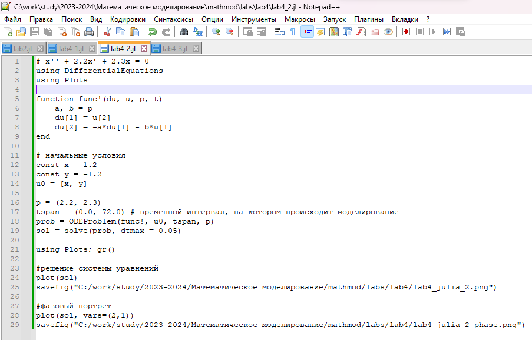
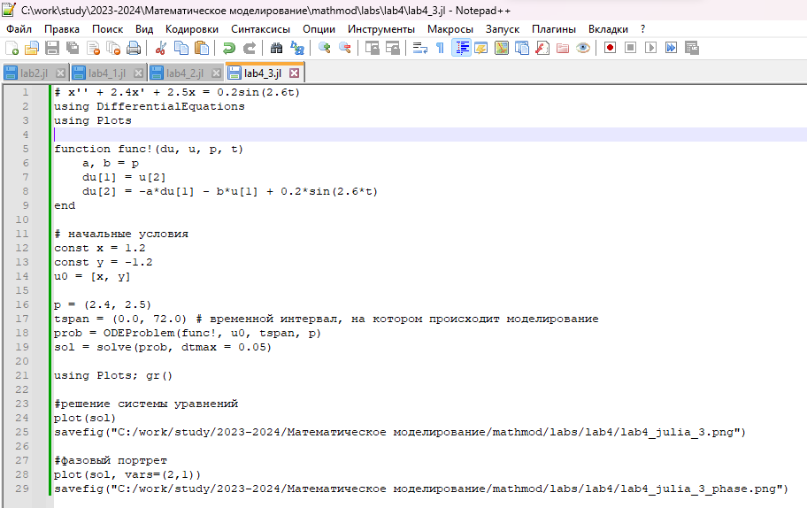
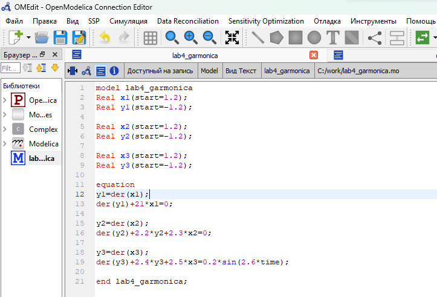
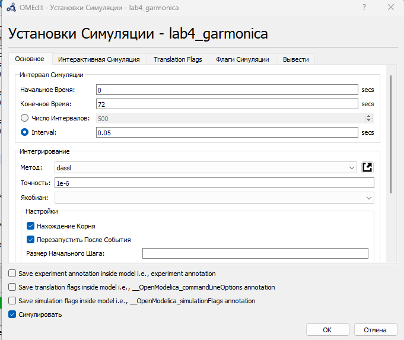
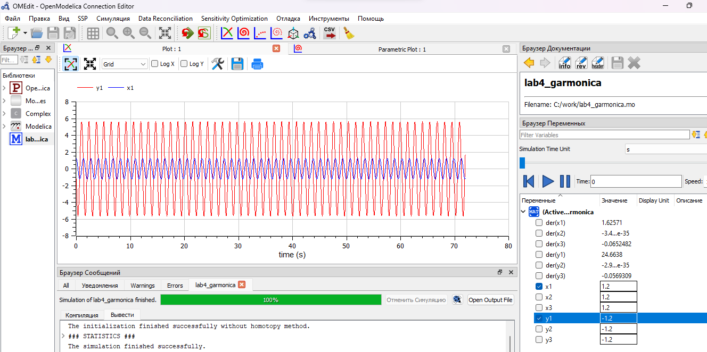
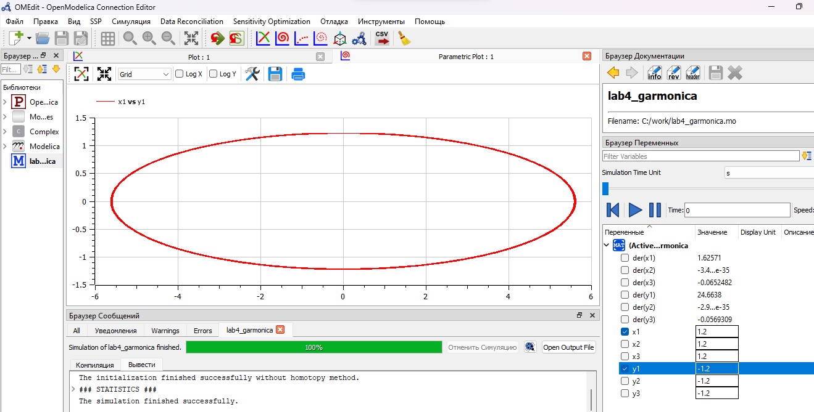
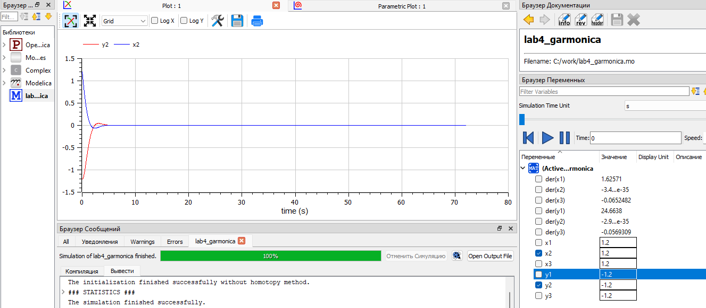
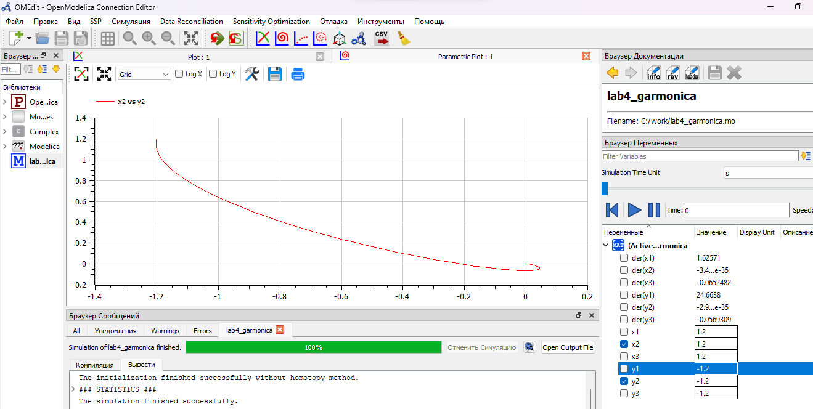
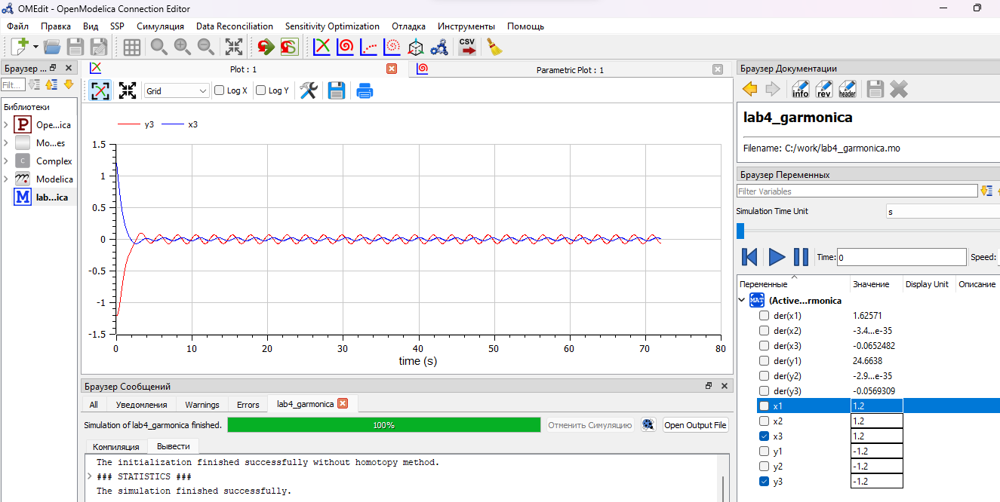
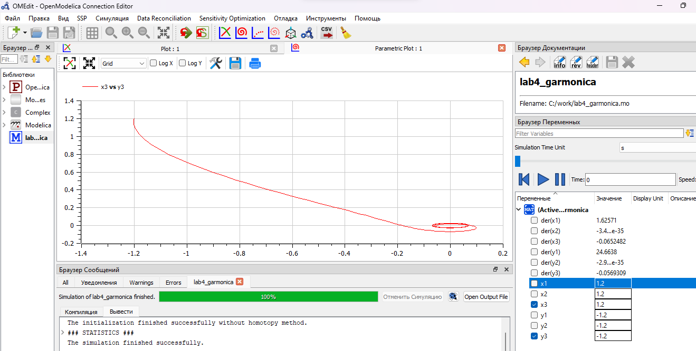

---
## Front matter
lang: ru-RU
title: Лабораторная работа №5
subtitle: Модель хищник-жертва. Вариант №38
author: |
        Щербак Маргарита Романовна
        \        
        НПИбд-02-21
        \
        Студ. билет: 1032216537
institute: |
           RUDN
date: |
      2024

babel-lang: russian
babel-otherlangs: english
mainfont: Arial
monofont: Courier New
fontsize: 8pt

## Formatting
toc: false
slide_level: 2
theme: metropolis
header-includes: 
 - \metroset{progressbar=frametitle,sectionpage=progressbar,numbering=fraction}
 - '\makeatletter'
 - '\beamer@ignorenonframefalse'
 - '\makeatother'
aspectratio: 43
section-titles: true
---

## Цель работы

Рассмотреть простейшую модель взаимодействия двух видов типа «хищник - жертва» —
модель Лотки-Вольтерры. С помощью рассмотренного примера научиться решать задачи такого типа.

## Теоретическое введение 

Модель взаимодействия двух видов типа «хищник - жертва» —
модель Лотки-Вольтерры описывается следующим уравнением:

$$
\left\{ 
\begin{array}{c}
\frac {dx}{dt}=-ax(t)+bx(t)y(t) \\
\frac {dy}{dt}=cy(t)-dx(t)y(t) 
\end{array}
\right.
$$

Стационарное состояние системы (положение равновесия, не зависящее
от времени решение) будет в точке: $x_0$=$\frac {c}{d}$, $y_0$=$\frac {a}{b}$. Если начальные значения
задать в стационарном состоянии $x(0)$=$x_0$,$y(0)$=$y_0$, то в любой момент времени численность популяций изменяться не будет.

## Задание. Модель «хищник-жертва»

Для модели «хищник-жертва»:

$$
\left\{ 
\begin{array}{c}
\frac {dx}{dt}=-0.7x(t)+0.06x(t)y(t) \\
\frac {dy}{dt}=0.6y(t)-0.07x(t)y(t) 
\end{array}
\right.
$$

Построить график зависимости численности хищников от численности жертв, а также графики изменения численности хищников и численности жертв при начальных условиях: $x_0$ = 8, $y_0$ = 15. Найти стационарное состояние системы.

## Выполнение лабораторной работы

По теоретическому материалу были составлены модели на языках Julia и Modelica. Код реализует модель хищник-жертва и строит графики, иллюстрирующие изменение численности хищников и жертв со временем, а также график стационарного состояния.

Для решения дифференциального уравнения, описанного в постановке задачи лабораторной работы, на языке Julia использовалась библиотека DifferentialEquations. Для построения графиков — библиотека Plots.

## График зависимости численности хищников от численности жертв в виде фазового портрета

:::::::::::::: {.columns align=center}
::: {.column width="50%"}

{#fig:001}

::: 
::: {.column width="50%"}

{#fig:004 width=90% height=90%}

:::
::::::::::::::

## Результаты работы кода на Julia и Open Modelica для второго случая (График численности жертв и хищников от времени)

:::::::::::::: {.columns align=center}
::: {.column width="50%"}

{#fig:002}

::: 
::: {.column width="50%"}

{#fig:005 width=90% height=90%}

:::
::::::::::::::

## Результаты работы кода на Julia и Open Modelica для третьего случая (стационарное состояние)

:::::::::::::: {.columns align=center}
::: {.column width="50%"}

{#fig:003}

::: 
::: {.column width="50%"}

{#fig:006 width=90% height=90%}

:::
::::::::::::::

## Выполнение лабораторной работы. OpenModelica

Написала код для 3х случаев в OpenModelica (рис.10).

{#fig:0010 width=80%}

## Выполнение лабораторной работы. OpenModelica

Задала параметры симуляции (рис.11).

{ #fig:0011 width=70%}

## Выполнение лабораторной работы (1 случай). OpenModelica

Колебания гармонического осциллятора без затуханий и без действий внешней силы (рис.12 - рис.13).

{#fig:0012 width=80%}

## Выполнение лабораторной работы (1 случай). OpenModelica

{#fig:0013 width=80%}

## Выполнение лабораторной работы (2 случай). OpenModelica

Колебания гармонического осциллятора c затуханием и без действий внешней силы (рис.14 - рис.15).

{#fig:0014 width=80%}

## Выполнение лабораторной работы (2 случай). OpenModelica

{#fig:0015 width=80%}

## Выполнение лабораторной работы (3 случай). OpenModelica

Колебания гармонического осциллятора c затуханием и под действием внешней силы (рис.16 - рис.17).

{#fig:016 width=80%}

## Выполнение лабораторной работы (3 случай). OpenModelica

{#fig:017 width=80%}

## Анализ полученных результатов

В результате работы я создала три модели колебаний, каждая из которых включает в себя два графика, используя языки программирования Julia и Modelica. Моделирование колебаний на языке Modelica требует меньше строк кода по сравнению с аналогичным моделированием на Julia.

## Вывод

Таким образом, в ходе ЛР№4 я изучила  понятие гармонического осциллятора, рассмотрела модели линейного гармонического осциллятора, построила фазовый портрет и нашла решение уравнения гармонического осциллятора на языках Julia и Modelica в 3 случаях.

## Список литературы. Библиография

1. Бутиков И. Е. Собственные колебания линейного осциллятора.
Учебное пособие [Электронный ресурс]. М. URL: [Собственные колебания линейного осциллятора](http://butikov.faculty.ifmo.ru/Applets/manlr_1.pdf) (Дата обращения: 20.02.2024).

2. Документация по Julia. [Электронный ресурс]. М. URL: [Julia 1.10 Documentation](https://docs.julialang.org/en/v1/) (Дата обращения: 20.02.2024).

3. Документация по OpenModelica. [Электронный ресурс]. М. URL: [openmodelica](https://openmodelica.org/) (Дата обращения: 20.02.2024).

4. Решение дифференциальных уравнений. [Электронный ресурс]. М. URL: [wolframalpha](https://www.wolframalpha.com/) (Дата обращения: 20.02.2024).