---
## Front matter

title: "Отчёт по лабораторной работе №5

Математическое моделирование"
subtitle: "Модель хищник-жертва. Вариант №38"
author: "Щербак Маргарита Романовна, НПИбд-02-21"
date: "2024"
## Generic otions
lang: ru-RU
toc-title: "Содержание"

## Bibliography
bibliography: bib/cite.bib
csl: pandoc/csl/gost-r-7-0-5-2008-numeric.csl

## Pdf output format
toc: true # Table of contents
toc-depth: 2
lof: true # List of figures
fontsize: 12pt
linestretch: 1.5
papersize: a4
documentclass: scrreprt
## I18n polyglossia
polyglossia-lang:
  name: russian
  options:
	- spelling=modern
	- babelshorthands=true
polyglossia-otherlangs:
  name: english
## I18n babel
babel-lang: russian
babel-otherlangs: english
## Fonts
mainfont: PT Serif
romanfont: PT Serif
sansfont: PT Sans
monofont: PT Mono
mainfontoptions: Ligatures=TeX
romanfontoptions: Ligatures=TeX
sansfontoptions: Ligatures=TeX,Scale=MatchLowercase
monofontoptions: Scale=MatchLowercase,Scale=0.9
## Biblatex
biblatex: true
biblio-style: "gost-numeric"
biblatexoptions:
  - parentracker=true
  - backend=biber
  - hyperref=auto
  - language=auto
  - autolang=other*
  - citestyle=gost-numeric

## Pandoc-crossref LaTeX customization
figureTitle: "Скриншот"
tableTitle: "Таблица"
listingTitle: "Листинг"
lofTitle: "Список иллюстраций"
lotTitle: "Список таблиц"
lolTitle: "Листинги"
## Misc options
indent: true
header-includes:
  - \usepackage{indentfirst}
  - \usepackage{float} # keep figures where there are in the text
  - \floatplacement{figure}{H} # keep figures where there are in the text
---

# Цель работы

Изучить понятие гармонического осциллятора, рассмотреть модели линейного гармонического осциллятора, построить фазовый портрет и найти решение уравнения гармонического осциллятора. С помощью рассмотренного примера научиться решать задачи такого типа для разных случаев.

# Теоретическое введение

Линейный гармонический осциллятор представляет из себя дифференциальное уравнение,которое в теории колебаний выступает в качестве 
основной модели. Гармонический осциллятор представляет собой систему, которая при отклонении от положения равновесия подвергается воздействию возвращающей силы $F$, пропорциональной величине отклонения $x$ [1].

Гармоническое колебание является типом колебательного движения, при котором параметры движения (такие как смещение, скорость, ускорение и т. д.) изменяются в соответствии с гармоническим законом, описываемым синусоидальной или косинусоидальной функцией [1].

Движение грузика на пружинке, маятника, заряда в электрическом контуре, а также эволюция во времени многих систем в физике, химии, биологии и других науках при определенных предположениях можно описать одним и тем же дифференциальным уравнением, которое в теории колебаний выступает в качестве основной модели. Эта модель называется линейным гармоническим осциллятором.
Уравнение свободных колебаний гармонического осциллятора имеет следующий вид:
$$\ddot{x}+2\gamma\dot{x}+\omega_0^2=0$$

где $x$ — переменная, описывающая состояние системы (смещение грузика, заряд конденсатора и т.д.), $\gamma$ — параметр, характеризующий потери энергии (трение в механической системе, сопротивление в контуре), $\omega_0$ — собственная частота колебаний.
Это уравнение есть линейное однородное дифференциальное  уравнение второго порядка и оно является примером линейной динамической системы.

При отсутствии потерь в системе ( $\gamma=0$ ) получаем уравнение консервативного осциллятора энергия колебания которого сохраняется во времени.
$$\ddot{x}+\omega_0^2x=0$$

Для однозначной разрешимости уравнения второго порядка необходимо задать два начальных условия вида
 
$$
 \begin{cases}
	x(t_0)=x_0
	\\   
	\dot{x(t_0)}=y_0
 \end{cases}
$$

Уравнение второго порядка можно представить в виде системы двух уравнений первого порядка:
$$
 \begin{cases}
	x=y
	\\   
	y=-\omega_0^2x
 \end{cases}
$$

Начальные условия для системы примут вид:
$$
 \begin{cases}
	x(t_0)=x_0
	\\   
	y(t_0)=y_0
 \end{cases}
$$

Независимые	переменные	$x, y$	определяют	пространство,	в	котором «движется» решение. Это фазовое пространство системы, поскольку оно двумерно будем называть его фазовой плоскостью.

Значение фазовых координат $x, y$ в любой момент времени полностью определяет состояние системы. Решению уравнения движения как функции времени отвечает гладкая кривая в фазовой плоскости. Она называется фазовой траекторией. Если множество различных решений (соответствующих различным 
начальным условиям) изобразить на одной фазовой плоскости, возникает общая картина поведения системы. Такую картину, образованную набором фазовых траекторий, называют фазовым портретом.

# Задачи

1. Изучить понятие гармонического осциллятора

2. Ознакомиться с уравнением свободных колебаний гармонического осциллятора

3. Построить фазовый портрет гармонического осциллятора и решение уравнения на языках Julia и Modelica гармонического осциллятора для следующих случаев:

- Колебания гармонического осциллятора без затуханий и без действий внешней силы;

- Колебания гармонического осциллятора c затуханием и без действий внешней силы;

- Колебания гармонического осциллятора c затуханием и под действием внешней силы.

# Выполнение лабораторной работы

## Задание
Я выполняю свой вариант лабораторной работы №38 по данной формуле $(N_{student} mod K_{of variants})$ + 1 = (1032216537 % 70) + 1 = 38.

Постройте фазовый портрет гармонического осциллятора и решение уравнения
гармонического осциллятора для следующих случаев:

1. Колебания гармонического осциллятора без затуханий и без действий внешней силы

$\ddot{x}+21x=0$

2. Колебания гармонического осциллятора c затуханием и без действий внешней силы

$\ddot{x}+2.2\dot{x}+2.3x=0$

3. Колебания гармонического осциллятора c затуханием и под действием внешней силы

$\ddot{x}+2.4\dot{x}+2.5x=0.2sin(2.6t)$

На интервале $t∈[0;72]$ (шаг $0.05$) с начальными условиями $x_0=1.2$, $y_0=-1.2$

## Julia

Julia – это высокоуровневый язык программирования с динамической типизацией, созданный для эффективных математических вычислений и написания программ общего назначения [2]. Для решения дифференциального уравнения, описанного в постановке задачи лабораторной работы, можно использовать библиотеку DifferentialEquations. Для построения графиков можно воспользоваться библиотекой Plots.

Код программы для первого случая и результаты (рис.1 - рис.3):

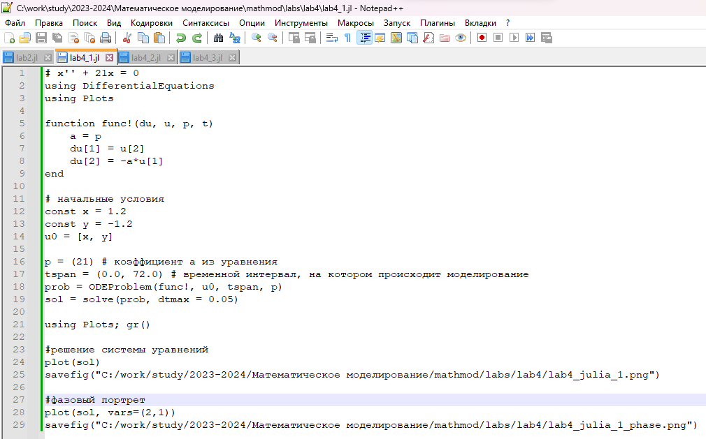{#fig:001}

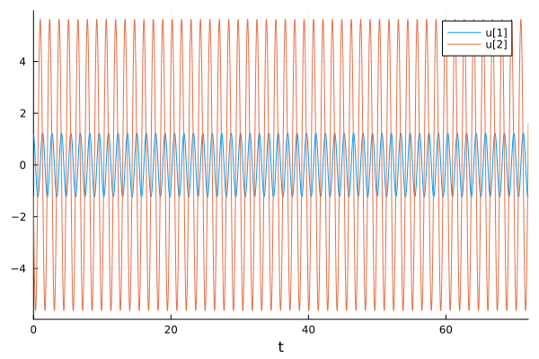{#fig:002}

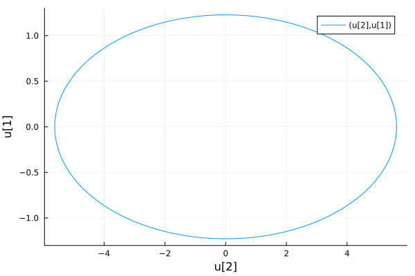{#fig:003}

Код программы для второго случая и результаты (рис.4 - рис.6):

{#fig:004}

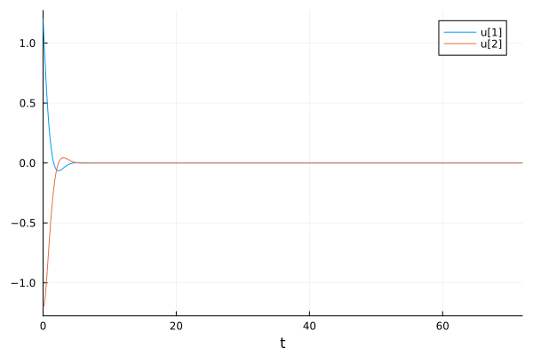{#fig:005}

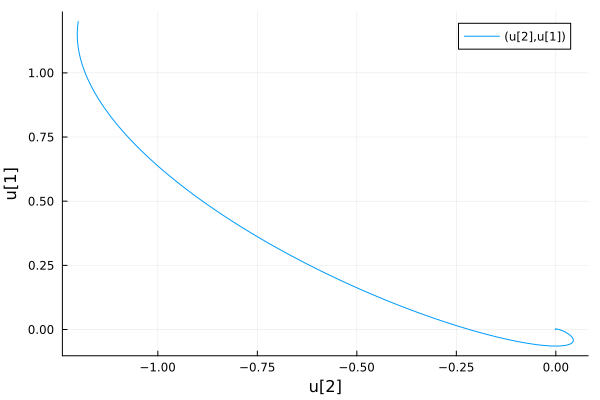{#fig:006}

Код программы для третьего случая и результаты (рис.7 - рис.9):

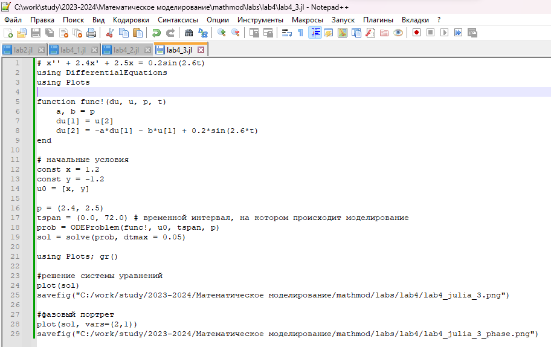{#fig:007}

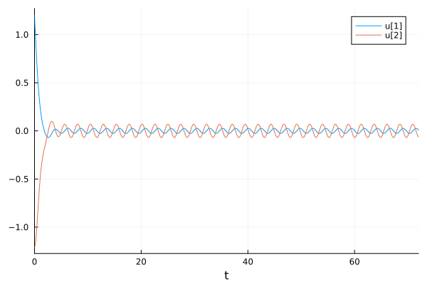{#fig:008}

{#fig:009}

## OpenModelica

OpenModelica – это свободное программное обеспечение для моделирования и анализа сложных динамических систем, основанное на языке Modelica. OpenModelica приближается по функциональности к таким инструментам, как Matlab Simulink и Scilab xCos, но обладает более удобным представлением системы уравнений [3]. Написала код для 3х случаев в OpenModelica (рис.10).

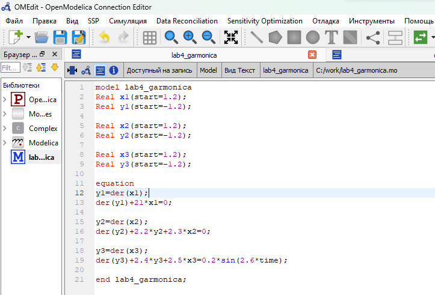{#fig:0010}

Зададла параметры симуляции (рис.11).

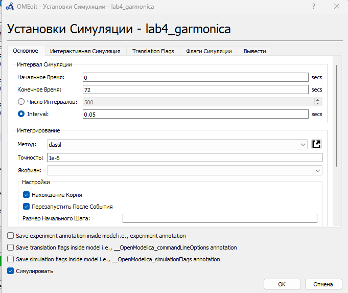{ #fig:0011 width=90%}

Первый случай: колебания гармонического осциллятора без затуханий и без действий внешней силы (рис.12 - рис.13).

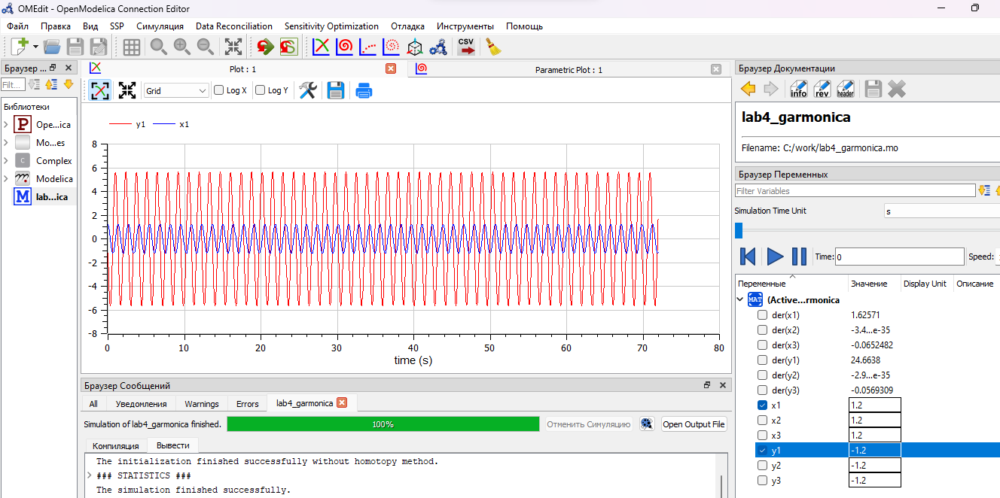{#fig:0012}

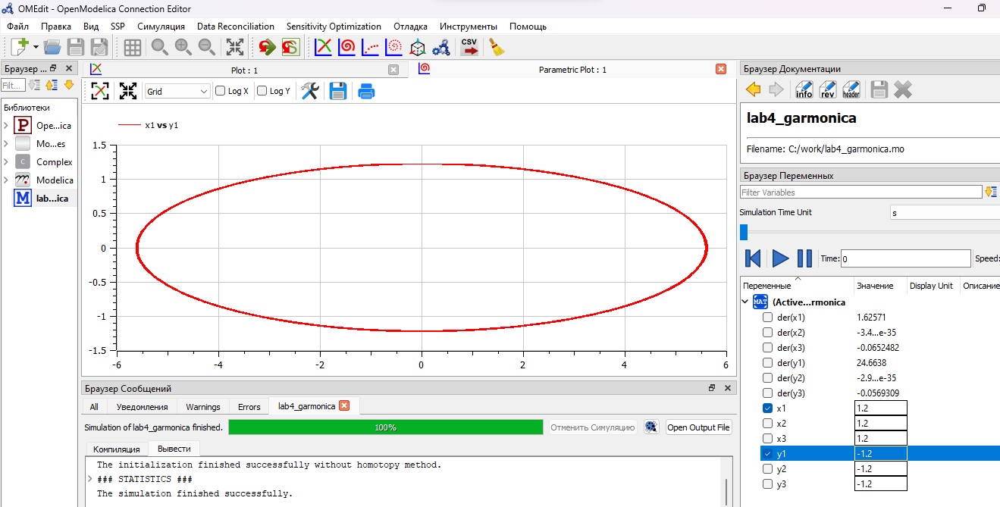{#fig:0013}

Второй случай: колебания гармонического осциллятора c затуханием и без действий внешней силы (рис.14 - рис.15).

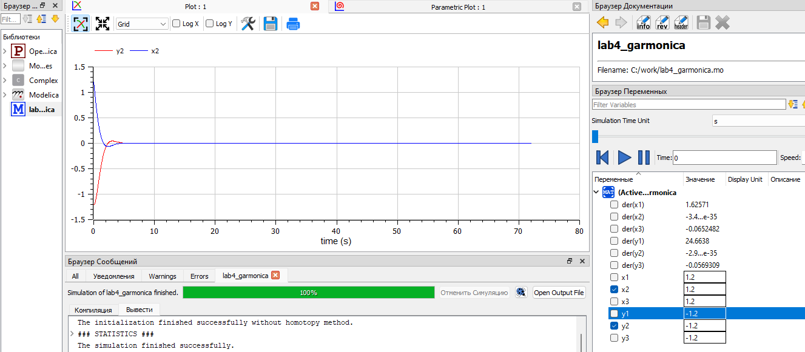{#fig:0014}

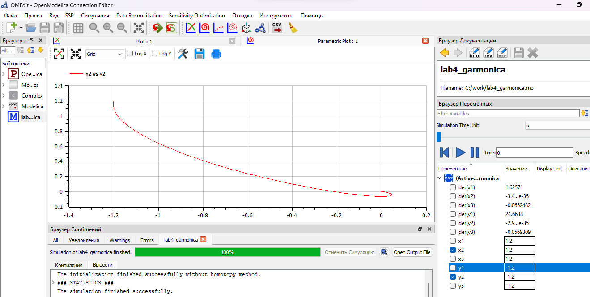{#fig:0015}

Третий случай: колебания гармонического осциллятора c затуханием и под действием внешней силы (рис.16 - рис.17).

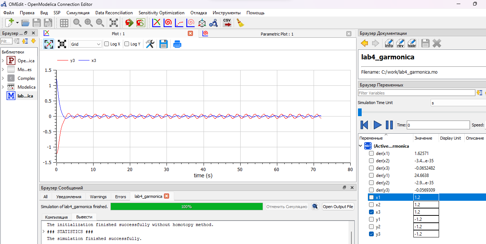{#fig:016}

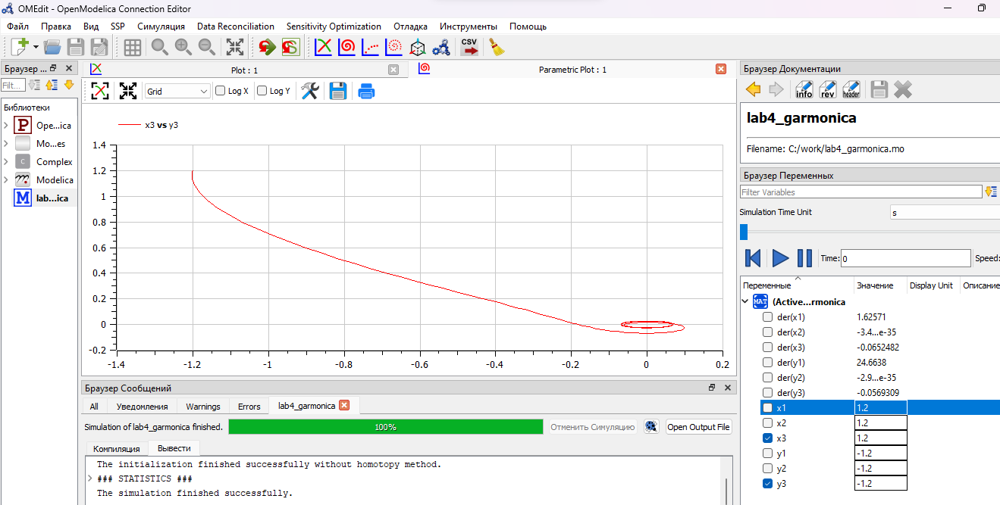{#fig:017}

## Анализ и сравнение результатов

В результате работы я создала три модели колебаний, каждая из которых включает в себя два графика, используя языки программирования Julia и Modelica. Моделирование колебаний на языке Modelica требует меньше строк кода по сравнению с аналогичным моделированием на Julia.

# Выводы

Таким образом, в ходе ЛР№4 я изучила  понятие гармонического осциллятора, рассмотрела модели линейного гармонического осциллятора, построила фазовый портрет и нашла решение уравнения гармонического осциллятора на языках Julia и Modelica в 3 случаях.

# Вопросы к лабораторной работе

1. Запишите простейшую модель гармонических колебаний

Уравнение гармонических колебаний:
$$x=Acos(ω_0t+ϕ)$$
где $x$ - смещение колеблющейся точки от положения равновесия;

$t$ - время;

$A$ - соответственно амплитуда;

$ω_0$ - угловая частота,

$ϕ$ - начальная фаза колебаний;

$(ω_0t +ϕ)$ - фаза колебаний в момент $t$. 

2. Дайте определение осциллятора

Осциллятор — система, совершающая колебания. Показатели такой системы переодически повторяются во времени.

3. Запишите модель математического маятника

$$\ddot{x}+ω^2_0=0$$ 

4. Запишите алгоритм перехода от дифференциального уравнения второго порядка к двум дифференциальным уравнениям первого порядка

Переменную, от которой берется производная 2 порядка, заменяем на ту же переменную, но от которой берется производная 1 порядка. Далее записываем её как другую переменную $-$ первое уравнение системы. Далее берём производную от неё и смотрим на исходное уравнение $-$ второе уравнение системы [4]. Например:

$$\ddot{x}+5x=0$$ 

Переменную, от которой берется производная 2 порядка($\ddot{x}$), заменяем на ту же переменную, но от которой берется производная 1 порядка ($\dot{x}$). Далее записываем её как другую переменную($y$):

$y=\dot{x}$ $-$ первое уравнение системы.

Далее берём производную от неё ($\dot{y}$=$\ddot{x}$) и смотрим на исходное уравнение:

$\dot{y}=-5x$ $-$ второе уравнение системы.

Полная система уравнений:

$$
\left\{ 
\begin{array}{c}
y=\dot{x} \\
\dot{y}=-5x
\end{array}
\right.
$$

5. Что такое фазовый портрет и фазовая траектория?

Фазовый портрет - это множество различных решений (совокупность фазовых траекторий), изображённых на одной фазовой плоскости.

Фазовая траектория - кривая в фазовом пространстве, составленная из точек, представляющих состояние динамической системы в последоват. моменты времени в течение всего времени эволюции.

# Список литературы

1. Бутиков И. Е. Собственные колебания линейного осциллятора.
Учебное пособие [Электронный ресурс]. М. URL: [Собственные колебания линейного осциллятора](http://butikov.faculty.ifmo.ru/Applets/manlr_1.pdf) (Дата обращения: 20.02.2024).

2. Документация по Julia. [Электронный ресурс]. М. URL: [Julia 1.10 Documentation](https://docs.julialang.org/en/v1/) (Дата обращения: 20.02.2024).

3. Документация по OpenModelica. [Электронный ресурс]. М. URL: [openmodelica](https://openmodelica.org/) (Дата обращения: 20.02.2024).

4. Решение дифференциальных уравнений. [Электронный ресурс]. М. URL: [wolframalpha](https://www.wolframalpha.com/) (Дата обращения: 20.02.2024).

