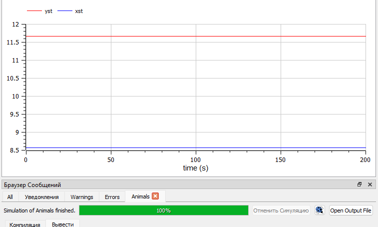

---
## Front matter
lang: ru-RU
title: Лабораторная работа №5
subtitle: Модель хищник-жертва. Вариант №38
author: |
        Щербак Маргарита Романовна
        \        
        НПИбд-02-21
        \
        Студ. билет: 1032216537
institute: |
           RUDN
date: |
      2024

babel-lang: russian
babel-otherlangs: english
mainfont: Arial
monofont: Courier New
fontsize: 8pt

## Formatting
toc: false
slide_level: 2
theme: metropolis
header-includes: 
 - \metroset{progressbar=frametitle,sectionpage=progressbar,numbering=fraction}
 - '\makeatletter'
 - '\beamer@ignorenonframefalse'
 - '\makeatother'
aspectratio: 43
section-titles: true
---

## Цель работы

Рассмотреть простейшую модель взаимодействия двух видов типа «хищник - жертва» —
модель Лотки-Вольтерры. С помощью рассмотренного примера научиться решать задачи такого типа.

## Теоретическое введение 

Модель взаимодействия двух видов типа «хищник - жертва» —
модель Лотки-Вольтерры описывается следующим уравнением:       

dy/dt = -ax(t) + bx(t)y(t)     
dy/dt = cy(t) - dx(t)y(t)     

Стационарное состояние системы (положение равновесия, не зависящее
от времени решение) будет в точке: $x_0$=$dy/dt$, $y_0$=$dy/dt$. Если начальные значения
задать в стационарном состоянии $x(0)$=$x_0$,$y(0)$=$y_0$, то в любой момент времени численность популяций изменяться не будет.

## Задание. Модель «хищник-жертва»

Для модели «хищник-жертва»:    

dy/dt = -0.7x(t) + 0.06x(t)y(t)    
dy/dt = 0.6y(t) - 0.07x(t)y(t)

Построить график зависимости численности хищников от численности жертв, а также графики изменения численности хищников и численности жертв при начальных условиях: $x_0$ = 8, $y_0$ = 15. Найти стационарное состояние системы.

## Выполнение лабораторной работы

По теоретическому материалу были составлены модели на языках Julia и Modelica. Код реализует модель хищник-жертва и строит график зависимости численности хищников от численности жертв в виде фазового портрета, график изменения численности хищников и жертв со временем, а также график стационарного состояния.

Для решения дифференциального уравнения, описанного в постановке задачи лабораторной работы, на языке Julia использовалась библиотека DifferentialEquations. Для построения графиков — библиотека Plots.

## Код в OpenModelica и параметры симуляции (рис.1 - рис.2)

:::::::::::::: {.columns align=center}
::: {.column width="50%"}

{#fig:001}

::: 
::: {.column width="50%"}

{#fig:002 width=90% height=90%}

:::
::::::::::::::

## График зависимости численности хищников от численности жертв в виде фазового портрета (рис.3 - рис.4)

:::::::::::::: {.columns align=center}
::: {.column width="50%"}

{#fig:003}

::: 
::: {.column width="50%"}

{#fig:004 width=90% height=90%}

:::
::::::::::::::

## График изменения численности хищников и жертв со временем (рис.5 - рис.6)

:::::::::::::: {.columns align=center}
::: {.column width="50%"}

{#fig:005}

::: 
::: {.column width="50%"}

{#fig:006 width=90% height=90%}

:::
::::::::::::::

## График стационарного состояния (рис.7 - рис.8)

:::::::::::::: {.columns align=center}
::: {.column width="50%"}

{#fig:007}

::: 
::: {.column width="50%"}

{#fig:008 width=90% height=90%}

:::
::::::::::::::

## Анализ полученных результатов

В результате работы я построила график зависимости численности хищников от численности жертв, график изменения численности хищников и численности жертв со временем, а также стационарное состояние на языках Julia и Modelica. Построение модели хищник-жертва на языке Modelica занимает меньше строк, чем аналогичное построение на Julia.

## Вывод

Таким образом, в ходе ЛР№5 я рассмотрела простейшую модель взаимодействия двух видов типа «хищник - жертва» — модель Лотки-Вольтерры. С помощью рассмотренного примера научилась решать задачи такого типа.

## Список литературы

1. Модель Лотки—Вольтерры. [Электронный ресурс]. М. URL: [Модель Лотки-Вольтерры](https://math-it.petrsu.ru/users/semenova/MathECO/Lections/Lotka_Volterra.pdf) (Дата обращения: 04.03.2024).
 
2. Документация по Julia. [Электронный ресурс]. М. URL: [Julia 1.10 Documentation](https://docs.julialang.org/en/v1/) (Дата обращения: 04.03.2024).

3. Документация по OpenModelica. [Электронный ресурс]. М. URL: [openmodelica](https://openmodelica.org/) (Дата обращения: 04.03.2024).
