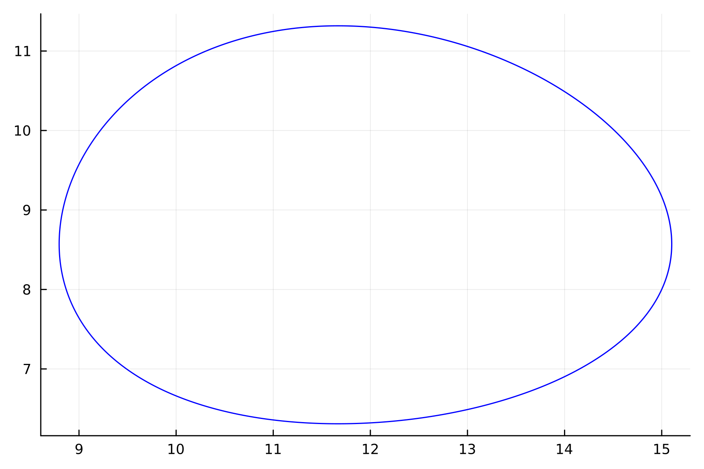
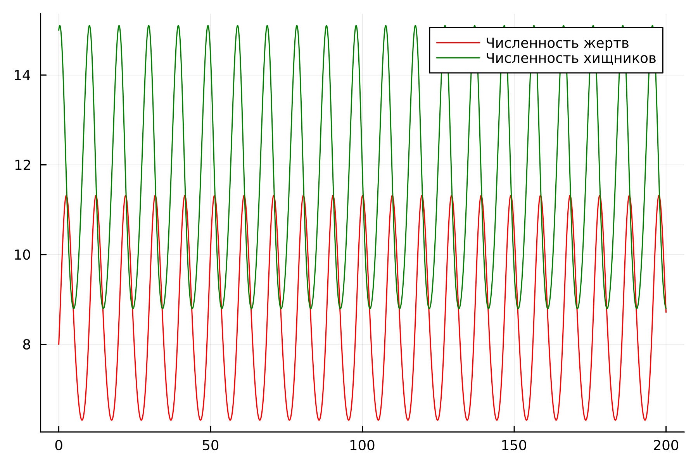
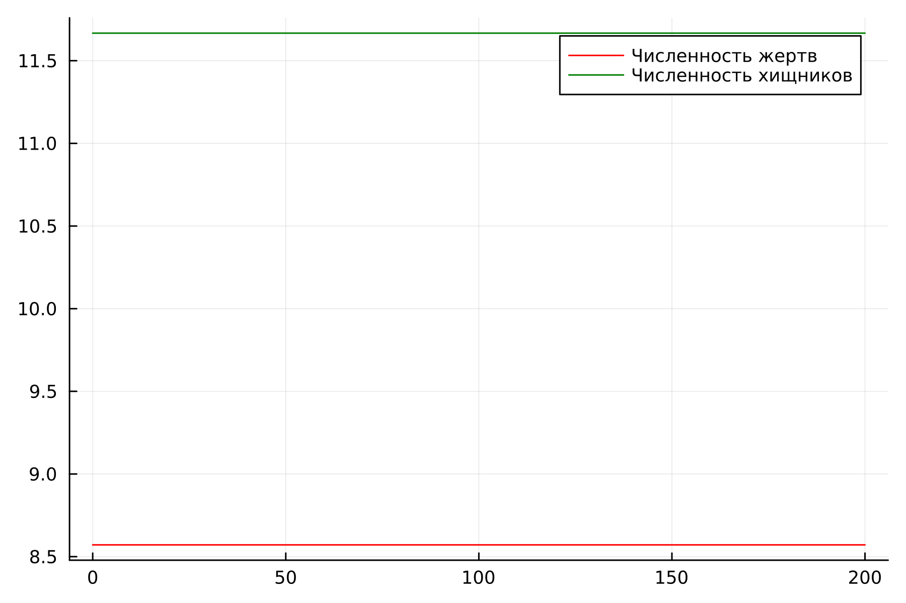
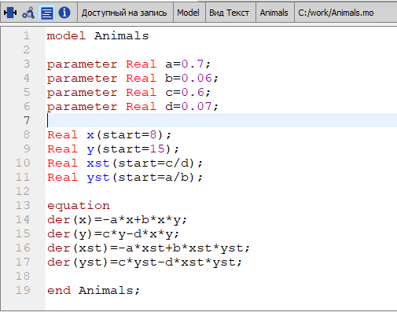
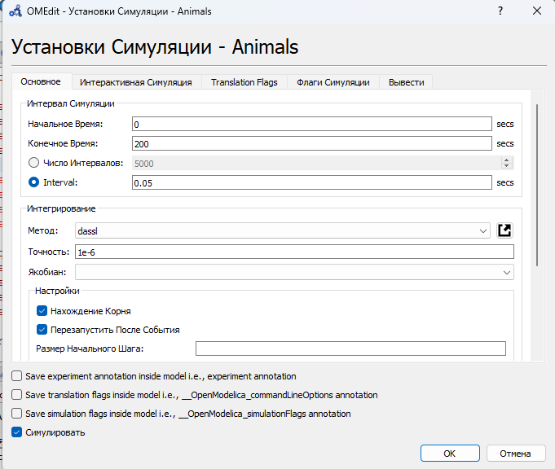
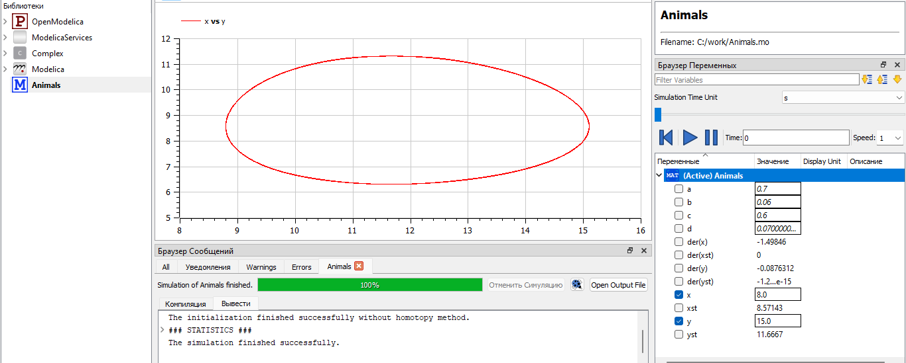
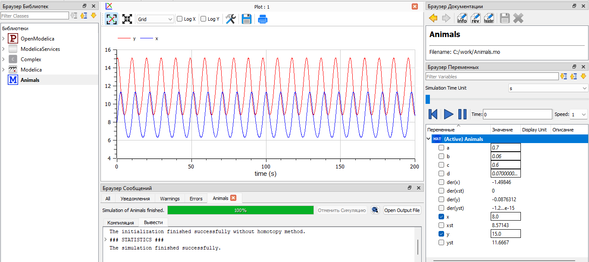
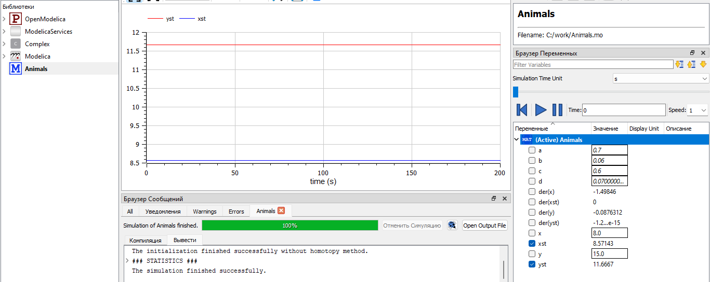

---
## Front matter

title: "Отчёт по лабораторной работе №5


Математическое моделирование"
subtitle: "Модель хищник-жертва. Вариант №38"
author: "Щербак Маргарита Романовна, НПИбд-02-21"
date: "2024"
## Generic otions
lang: ru-RU
toc-title: "Содержание"

## Bibliography
bibliography: bib/cite.bib
csl: pandoc/csl/gost-r-7-0-5-2008-numeric.csl

## Pdf output format
toc: true # Table of contents
toc-depth: 2
lof: true # List of figures
fontsize: 12pt
linestretch: 1.5
papersize: a4
documentclass: scrreprt
## I18n polyglossia
polyglossia-lang:
  name: russian
  options:
	- spelling=modern
	- babelshorthands=true
polyglossia-otherlangs:
  name: english
## I18n babel
babel-lang: russian
babel-otherlangs: english
## Fonts
mainfont: PT Serif
romanfont: PT Serif
sansfont: PT Sans
monofont: PT Mono
mainfontoptions: Ligatures=TeX
romanfontoptions: Ligatures=TeX
sansfontoptions: Ligatures=TeX,Scale=MatchLowercase
monofontoptions: Scale=MatchLowercase,Scale=0.9
## Pandoc-crossref LaTeX customization
figureTitle: "Скриншот"
tableTitle: "Таблица"
listingTitle: "Листинг"
lofTitle: "Список иллюстраций"
lotTitle: "Список таблиц"
lolTitle: "Листинги"
## Misc options
indent: true
header-includes:
  - \usepackage{indentfirst}
  - \usepackage{float} # keep figures where there are in the text
  - \floatplacement{figure}{H} # keep figures where there are in the text
---

# Цель работы

Рассмотреть простейшую модель взаимодействия двух видов типа «хищник - жертва» —
модель Лотки-Вольтерры. С помощью рассмотренного примера научиться решать задачи такого типа.

# Теоретическое введение

Простейшая модель взаимодействия двух видов типа «хищник - жертва» —
модель Лотки-Вольтерры. Данная двувидовая модель основывается на
следующих предположениях:   
&nbsp;&nbsp;&nbsp;&nbsp;1. Численность популяции жертв и хищников зависят только от времени
(модель не учитывает пространственное распределение популяции на
занимаемой территории);    
&nbsp;&nbsp;&nbsp;&nbsp;2. В отсутствии взаимодействия численность видов изменяется по модели
Мальтуса, при этом число жертв увеличивается, а число хищников падает;    
&nbsp;&nbsp;&nbsp;&nbsp;3. Естественная смертность жертвы и естественная рождаемость хищника
считаются несущественными;    
&nbsp;&nbsp;&nbsp;&nbsp;4. Эффект насыщения численности обеих популяций не учитывается;     
&nbsp;&nbsp;&nbsp;&nbsp;5. Скорость роста численности жертв уменьшается пропорционально
численности хищников.

Данная модель описывается следующим уравнением:

$$
 \begin{cases}
	\frac{dx}{dt} = -ax(t) + bx(t)y(t)
	\\   
	\frac{dy}{dt} = cy(t) - dx(t)y(t)
 \end{cases}
$$

где $x$ - число хищников; $y$ - число жертв;
$a$, $d$ - коэффициенты смертности;
$b$,$c$ - коэффициенты прироста популяции.

Стационарное состояние системы (положение равновесия, не зависящее
от времени решение) будет в точке: $x_0=\frac{c}{d}$, $y_0=\frac{a}{b}$ . Если начальные значения
задать в стационарном состоянии $x(0)=x_0$,$y(0)=y_0$, то в любой момент времени численность популяций изменяться не будет [@Lotka_Volterra].

# Выполнение лабораторной работы

## Задание. Вариант 38

Для модели «хищник-жертва»:

$$
 \begin{cases}
	\frac{dx}{dt} = -0.7x(t) + 0.06x(t)y(t)
	\\   
	\frac{dy}{dt} = 0.6y(t) - 0.07x(t)y(t)
 \end{cases}
$$

Построить график зависимости численности хищников от численности жертв, а также графики изменения численности хищников и численности жертв при начальных условиях: $x_0$ = 8, $y_0$ = 15. Найти стационарное состояние системы.

## Julia

Julia – это высокоуровневый язык программирования с динамической типизацией, созданный для эффективных математических вычислений и написания программ общего назначения [@julialang]. Для решения дифференциального уравнения, описанного в постановке задачи лабораторной работы, можно использовать библиотеку DifferentialEquations. Для построения графиков можно воспользоваться библиотекой Plots.

Код реализует модель хищник-жертва и строит графики, иллюстрирующие изменение численности хищников и жертв со временем.

```
using Plots
using DifferentialEquations

# начальные условия
x0 = 8
y0 = 15

a = 0.7 # коэффициент естественной смертности хищников
b = 0.06 # коэффициент естественного прироста жертв
c = 0.6 # коэффициент увеличения числа хищников
d = 0.07 # коэффициент смертности жертв 

function f(du, u, p, t)
    x, y = u
    du[1] = -a*u[1] + b * u[1] * u[2]
    du[2] = c * u[2] - d * u[1] * u[2]
end

v0 = [x0, y0]
tspan = (0.0, 200.0)
prob = ODEProblem(f, v0, tspan)
sol = solve(prob, dtmax=0.05)
X = [u[1] for u in sol.u]
Y = [u[2] for u in sol.u]
T = [t for t in sol.t]

plt = plot(
  dpi=300,
  legend=false)

plot!(
  plt,
  Y,
  X,
  color=:blue)

# зависимость числ-ти хищников от числ-ти жертв в виде фазового портрета
savefig(plt, "lab05_1.png")

plt2 = plot(
  dpi=300,
  legend=true)

plot!(
  plt2,
  T,
  X,
  label="Численность жертв",
  color=:red)

plot!(
  plt2,
  T,
  Y,
  label="Численность хищников",
  color=:green)

# изменение численности хищников и жертв 
savefig(plt2, "lab05_2.png")
```

График зависимости численности хищников от численности жертв в виде фазового портрета представлен на рис.1, а график изменения численности хищников и жертв со временем представлен на рис.2.

{#fig:001}

{ #fig:002}


График стационарного состояния представлен на рис.3.

```
using Plots
using DifferentialEquations

a = 0.7 # коэффициент естественной смертности хищников
b = 0.06 # коэффициент естественного прироста жертв
c = 0.6 # коэффициент увеличения числа хищников
d = 0.07 # коэффициент смертности жертв 

x0 = c / d 
y0 = a / b 

function f(du, u, p, t)
    x, y = u
    du[1] = -a*u[1] + b * u[1] * u[2]
    du[2] = c * u[2] - d * u[1] * u[2]
end

v0 = [x0, y0]
tspan = (0.0, 200.0)
prob = ODEProblem(f, v0, tspan)
sol = solve(prob, dtmax=0.05)
X = [u[1] for u in sol.u]
Y = [u[2] for u in sol.u]
T = [t for t in sol.t]

plt2 = plot(
  dpi=300,
  legend=true)

plot!(
  plt2,
  T,
  X,
  label="Численность жертв",
  color=:red)

plot!(
  plt2,
  T,
  Y,
  label="Численность хищников",
  color=:green)

savefig(plt2, "lab05_3.png")
```

{ #fig:003}


## OpenModelica

OpenModelica – это свободное программное обеспечение для моделирования и анализа сложных динамических систем, основанное на языке Modelica. OpenModelica приближается по функциональности к таким инструментам, как Matlab Simulink и Scilab xCos, но обладает более удобным представлением системы уравнений [@modelica]. Написала код в OpenModelica (рис.4). 

{ #fig:004}

Настроила параметры симуляции (рис.5).

{ #fig:005}

Получила график зависимости численности хищников от численности жертв, график изменения численности хищников и численности жертв со временем и нашла стационарное
состояние системы (рис.6 - рис.8).

{ #fig:006}

{ #fig:007}

{ #fig:008}

# Анализ и сравнение результатов

В результате работы я построила график зависимости численности хищников от численности жертв, график изменения численности хищников и численности жертв со временем, а также стационарное состояние на языках Julia и Modelica. Графики схожи. 

# Выводы

Таким образом, в ходе ЛР№5 я рассмотрела простейшую модель взаимодействия двух видов типа «хищник - жертва» — модель Лотки-Вольтерры. С помощью рассмотренного примера научилась решать задачи такого типа.

# Список литературы{.unnumbered}

::: {#refs}
:::
:::

