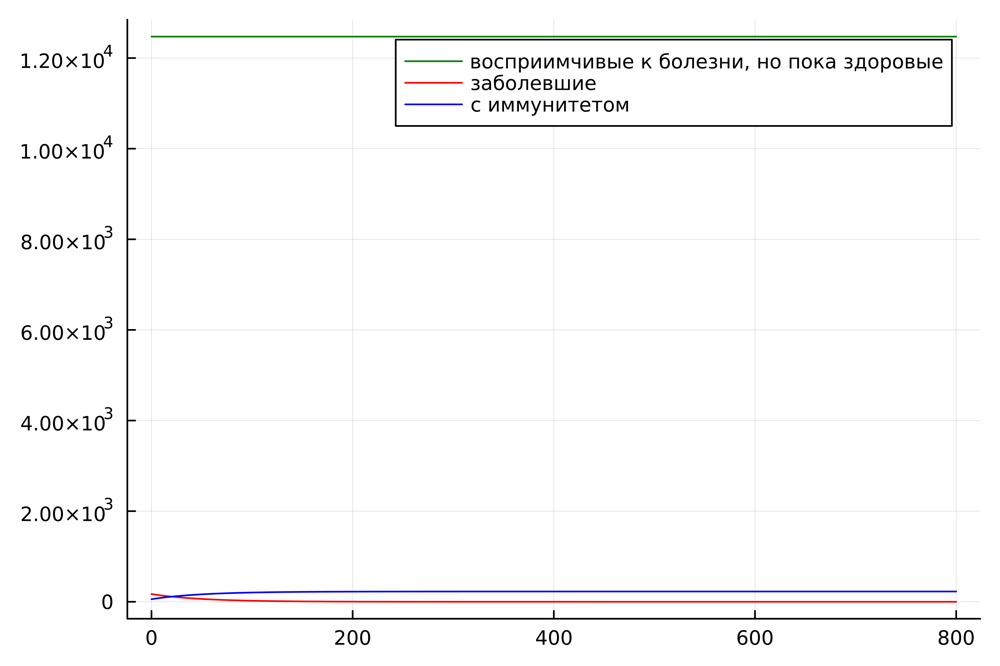
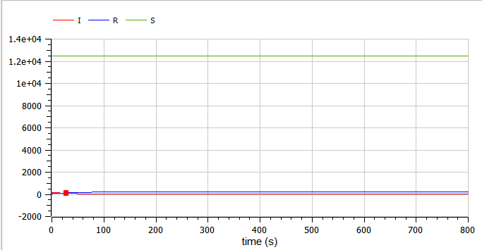
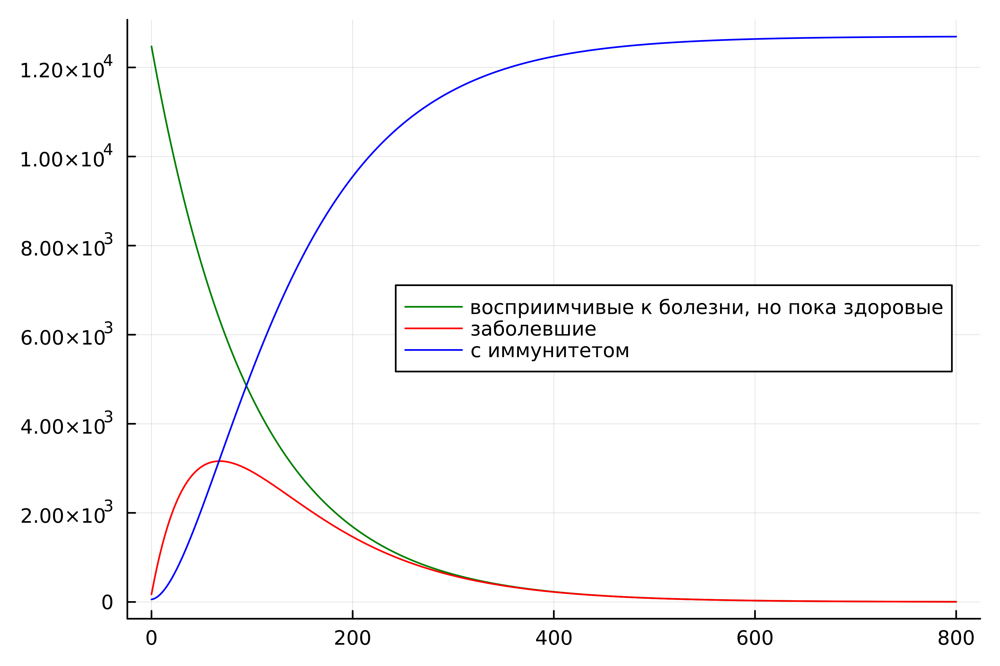
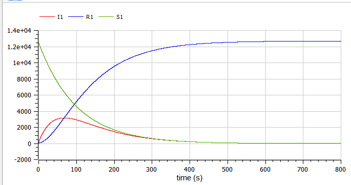

---
## Front matter
lang: ru-RU
title: Лабораторная работа №6
subtitle: Задача об эпидемии. Вариант №38
author: |
        Щербак Маргарита Романовна
        \        
        НПИбд-02-21
        \
        Студ. билет: 1032216537
institute: |
           RUDN
date: |
      2024

babel-lang: russian
babel-otherlangs: english
mainfont: Arial
monofont: Courier New
fontsize: 8pt

## Formatting
toc: false
slide_level: 2
theme: metropolis
header-includes: 
 - \metroset{progressbar=frametitle,sectionpage=progressbar,numbering=fraction}
 - '\makeatletter'
 - '\beamer@ignorenonframefalse'
 - '\makeatother'
aspectratio: 43
section-titles: true
---

## Цель работы

Рассмотреть простейшую модель эпидемии. С помощью рассмотренного примера научиться решать задачи такого типа.

## Теоретическое введение 

Предположим, что популяция разделена на три группы: восприимчивые к болезни, инфицированные и иммунные. Когда количество инфицированных превышает критическое значение, они начинают заражать восприимчивых. Модель описывает изменение числа особей в каждой группе по времени, учитывая коэффициенты заболеваемости и выздоровления. Начальные условия и два случая анализируются: когда количество инфицированных меньше и больше критического значения.

## Задание

На одном острове вспыхнула эпидемия. Известно, что из всех проживающих на острове ($N=12 700$) в момент начала эпидемии ($t=0$) число заболевших людей (являющихся распространителями инфекции) 
$I(0)=170$, а число здоровых людей с иммунитетом к болезни $R(0)=57$. Таким образом, число людей восприимчивых к болезни, но пока здоровых, в начальный момент времени $S(0)=N-I(0)-R(0)$.

Постройте графики изменения числа особей в каждой из трех групп. Рассмотрите, как будет протекать эпидемия в случае:

1) если $I(0) \leq I^*$

2) если $I(0) > I^*$

## Выполнение лабораторной работы

По теоретическому материалу была составлена модель на языках Julia и Modelica. Для решения дифференциального уравнения, описанного в постановке задачи лабораторной работы, на языке Julia использовалась библиотека DifferentialEquations. Для построения графиков — библиотека Plots.

Код описывает модель распространения инфекции на острове с помощью модели SIR (восприимчивые — S, инфицированные — I, иммунные — R) для 1 случая $I(0) \leq I^*$ и для 2 случая $I(0) > I^*$.

## Код в OpenModelica (рис.1)

{#fig:001 width=70%}

## Динамика численности каждой группы для случая $I(0) \leq I^*$
На графиках видно, что все больные изолированы и не заражают здоровых (рис.2 - рис.3).

:::::::::::::: {.columns align=center}
::: {.column width="50%"}

{#fig:002}

::: 
::: {.column width="50%"}

{#fig:003 width=90% height=90%}

:::
::::::::::::::

## Динамика численности каждой группы для случая $I(0) > I^*$
На графиках видно, что инфицированные способны заражать восприимчивых к болезни (рис.4 - рис.5).

:::::::::::::: {.columns align=center}
::: {.column width="50%"}

{#fig:004}

::: 
::: {.column width="50%"}

{#fig:005 width=90% height=90%}

:::
::::::::::::::

## Анализ полученных результатов

В результате работы я построила графики зависимости численности особей трех групп S, I, R для случаев, когда больные изолированы и когда они могут заражать особей группы S. Графики на двух языках одинаковые. В первом случае на графике видно, что все больные изолированы и не заражают здоровых, а во втором случае видно, что инфицированные передают болезнь восприимчивым. В начале количество восприимчивых уменьшается, а затем растет количество иммунных к болезни. Количество инфицированных сначала растет, а затем уменьшается по мере роста иммунитета к болезни.

## Вывод

Таким образом, в ходе ЛР№6 я рассмотрела простейшую модель эпидемии. С помощью рассмотренного примера научилась решать задачи такого типа.

## Список литературы

1. Конструирование эпидемиологических моделей. [Электронный ресурс]. URL: [Эпидемиологическая модель](https://habr.com/ru/post/551682/) (Дата обращения: 09.03.2024).
 
2. Документация по Julia. [Электронный ресурс]. URL: [Julia 1.10 Documentation](https://docs.julialang.org/en/v1/) (Дата обращения: 09.03.2024).

3. Документация по OpenModelica. [Электронный ресурс]. URL: [openmodelica](https://openmodelica.org/) (Дата обращения: 09.03.2024).
