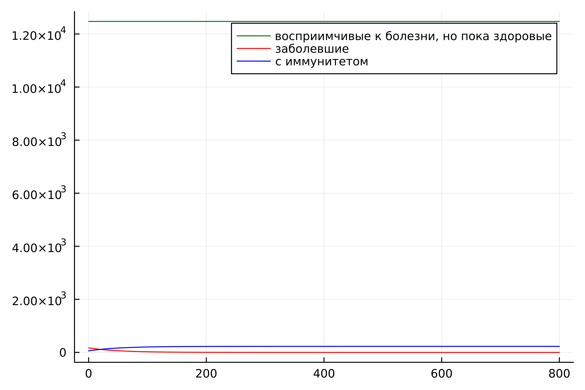
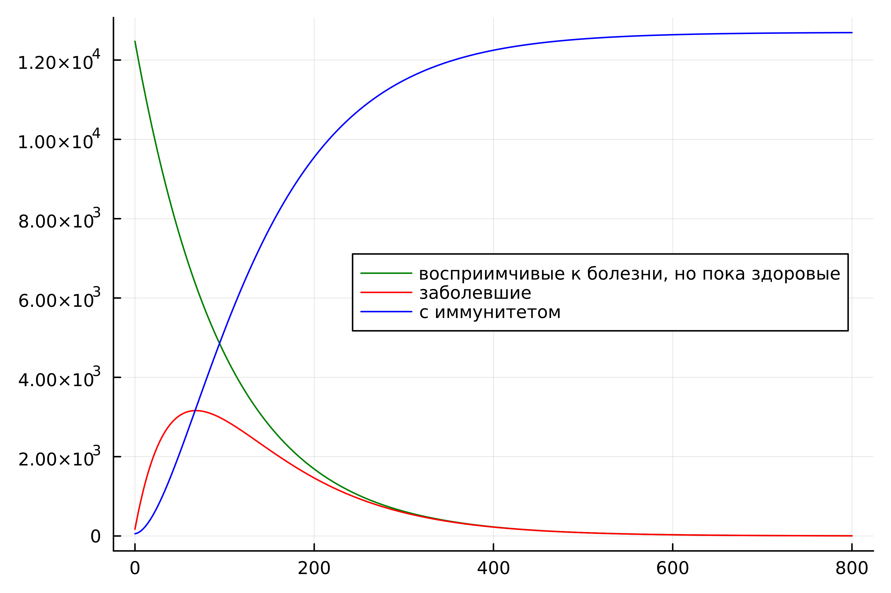
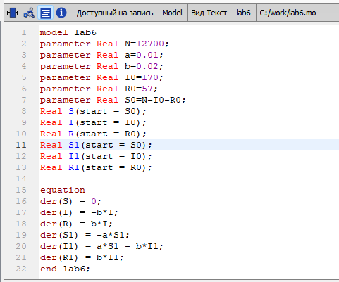
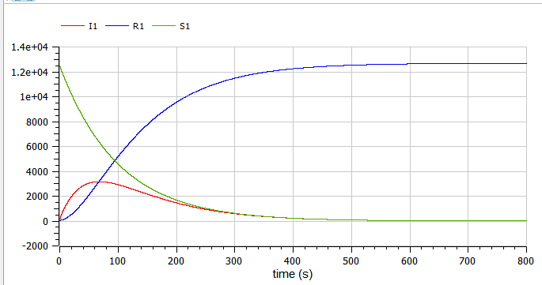

---
## Front matter

title: "Отчёт по лабораторной работе №6


Математическое моделирование"
subtitle: "Задача об эпидемии. Вариант №38"
author: "Щербак Маргарита Романовна, НПИбд-02-21"
date: "2024"
## Generic otions
lang: ru-RU
toc-title: "Содержание"

## Bibliography
bibliography: bib/cite.bib
csl: pandoc/csl/gost-r-7-0-5-2008-numeric.csl

## Pdf output format
toc: true # Table of contents
toc-depth: 2
lof: true # List of figures
fontsize: 12pt
linestretch: 1.5
papersize: a4
documentclass: scrreprt
## I18n polyglossia
polyglossia-lang:
  name: russian
  options:
	- spelling=modern
	- babelshorthands=true
polyglossia-otherlangs:
  name: english
## I18n babel
babel-lang: russian
babel-otherlangs: english
## Fonts
mainfont: PT Serif
romanfont: PT Serif
sansfont: PT Sans
monofont: PT Mono
mainfontoptions: Ligatures=TeX
romanfontoptions: Ligatures=TeX
sansfontoptions: Ligatures=TeX,Scale=MatchLowercase
monofontoptions: Scale=MatchLowercase,Scale=0.9
## Pandoc-crossref LaTeX customization
figureTitle: "Скриншот"
tableTitle: "Таблица"
listingTitle: "Листинг"
lofTitle: "Список иллюстраций"
lotTitle: "Список таблиц"
lolTitle: "Листинги"
## Misc options
indent: true
header-includes:
  - \usepackage{indentfirst}
  - \usepackage{float} # keep figures where there are in the text
  - \floatplacement{figure}{H} # keep figures where there are in the text
---

# Цель работы

Рассмотреть простейшую модель эпидемии. С помощью рассмотренного примера научиться решать задачи такого типа.

# Теоретическое введение

&nbsp;&nbsp;Предположим, что некая популяция, состоящая из $N$ особей, (считаем, что популяция изолирована)
подразделяется на три группы. Первая группа – это восприимчивые к болезни, но пока здоровые особи, обозначим их через $S(t)$. Вторая группа – это число инфицированных особей, которые также при этом являются распространителями инфекции, обозначим их $I(t)$. А третья группа, обозначающаяся через $R(t)$ – это здоровые особи с иммунитетом к болезни. До того, как число заболевших не превышает критического значения $I^*$, считаем, что все больные изолированы и не заражают здоровых. Когда $I(t) > I^*$, тогда инфицирование способны заражать восприимчивых к болезни особей  [@epidemiological_models].

&nbsp;&nbsp;&nbsp;&nbsp;Таким образом, скорость изменения числа $S(t)$ меняется по следующему
закону:

$$
\frac{dS}{dt}=
\left\{
\begin{array}{ll}
    -\alpha S & \text{, если } I(t) > I^* \\
    0 & \text{, если } I(t) \leq I^*
\end{array}
\right.
$$

&nbsp;&nbsp;&nbsp;&nbsp;Поскольку каждая восприимчивая к болезни особь, которая, в конце концов, заболевает, сама становится инфекционной, то скорость изменения числа инфекционных особей представляет разность за единицу времени между заразившимися и теми, кто уже болеет и лечится, то есть:

$$
\frac{dI}{dt}=
\left\{
\begin{array}{ll}
    \alpha S -\beta I & \text{, если } I(t) > I^* \\
    -\beta I & \text{, если } I(t) \leq I^*
\end{array}
\right.
$$

&nbsp;&nbsp;&nbsp;&nbsp;А скорость изменения выздоравливающих особей (при этом приобретающие иммунитет к болезни):

$$\frac{dR}{dt} = \beta I$$

&nbsp;&nbsp;&nbsp;&nbsp;Постоянные пропорциональности $\alpha, \beta$ - это коэффициенты заболеваемости и выздоровления соответственно. Для того, чтобы решения соответствующих уравнений определялось однозначно, необходимо задать начальные условия. Считаем, что на начало эпидемии в момент времени $t=0$ нет особей с иммунитетом к болезни $R(0)=0$, а число инфицированных и восприимчивых к болезни особей $I(0)$ и $S(0)$ соответственно. Для анализа картины протекания эпидемии необходимо рассмотреть два случая:  $I(0) ≤ I^*$ и  $I(0)>I^*$

# Выполнение лабораторной работы

## Задание. Вариант 38

На одном острове вспыхнула эпидемия. Известно, что из всех проживающих на острове ($N=12 700$) в момент начала эпидемии ($t=0$) число заболевших людей (являющихся распространителями инфекции) 
$I(0)=170$, а число здоровых людей с иммунитетом к болезни $R(0)=57$. Таким образом, число людей восприимчивых к болезни, но пока здоровых, в начальный момент времени $S(0)=N-I(0)-R(0)$.

Постройте графики изменения числа особей в каждой из трех групп. Рассмотрите, как будет протекать эпидемия в случае:

1) если $I(0) ≤ I^*$

2) если $I(0) > I^*$

## Julia

Julia – это высокоуровневый язык программирования с динамической типизацией, созданный для эффективных математических вычислений и написания программ общего назначения [@julialang]. Для решения дифференциального уравнения, описанного в постановке задачи лабораторной работы, можно использовать библиотеку DifferentialEquations. Для построения графиков можно воспользоваться библиотекой Plots.

Код моделирует распространение инфекции на острове с помощью модели SIR (восприимчивые — S, инфицированные — I, иммунные — R) для случая $I(0) ≤ I^*$. На графике видно, что все больные изолированы и не заражают здоровых (рис.1).

```
#I0 <= I*

using Plots
using DifferentialEquations

N = 12700 # все проживающие на острове
I0 = 170 # заболевшие 
R0 = 57 # с иммунитетом
S0 = N - I0 - R0 # восприимчивые к болезни, но пока здоровые
alpha = 0.01 # коэффициент заболеваемости
beta = 0.02 # коэффициент выздоровления

function f(du, u, p, t)
    S, I, R = u
    du[1] = 0
    du[2] = -beta*u[2]
    du[3] = beta*I
end

v0 = [S0, I0, R0]
tspan = (0.0, 800.0)
prob = ODEProblem(f, v0, tspan)
sol = solve(prob, dtmax = 0.05)

S = [u[1] for u in sol.u]
I = [u[2] for u in sol.u]
R = [u[3] for u in sol.u]
T = [t for t in sol.t]

plt = plot(
  dpi = 600,
  legend = :topright)
plot!(
  plt,
  T,
  S,
  label = "восприимчивые к болезни, но пока здоровые",
  color = :green)
plot!(
  plt,
  T,
  I,
  label = "заболевшие ",
  color = :red)
plot!(
  plt,
  T,
  R,
  label = "с иммунитетом",
  color = :blue)

savefig(plt, "lab6_1.png")
```

{#fig:001}

Код моделирует распространение инфекции на острове с помощью модели SIR для случая $I(0) > I^*$. На графике видно, что инфицированные способны заражать восприимчивых к болезни. Количество здоровых, но восприимчивых к болезни особей (S) со временем уменьшается и идет прирост здоровых с иммунитетом к болезни (R). Количество инфицированных распространителей (I) вначале увеличивается, затем уменьшается по мере роста здоровых с иммунитетом к болезни (R) (рис.2).

```
#I0 > I*

using Plots
using DifferentialEquations

N = 12700 # все проживающие на острове
I0 = 170 # заболевшие 
R0 = 57 # с иммунитетом
S0 = N - I0 - R0 # восприимчивые к болезни, но пока здоровые
alpha = 0.01 # коэффициент заболеваемости
beta = 0.02 # коэффициент выздоровления

function ode_fn(du, u, p, t)
    S, I, R = u
    du[1] = -alpha*u[1]
    du[2] = alpha*u[1] - beta*u[2]
    du[3] = beta*I
end

v0 = [S0, I0, R0]
tspan = (0.0, 800.0)
prob = ODEProblem(ode_fn, v0, tspan)
sol = solve(prob, dtmax=0.05)

S = [u[1] for u in sol.u]
I = [u[2] for u in sol.u]
R = [u[3] for u in sol.u]
T = [t for t in sol.t]

plt = plot(
  dpi=600,
  legend=:right)

plot!(
  plt,
  T,
  S,
  label = "восприимчивые к болезни, но пока здоровые",
  color = :green)
plot!(
  plt,
  T,
  I,
  label = "заболевшие ",
  color = :red)
plot!(
  plt,
  T,
  R,
  label = "с иммунитетом",
  color = :blue)


savefig(plt, "lab6_2.png")
```

{#fig:002}


## OpenModelica

OpenModelica – это свободное программное обеспечение для моделирования и анализа сложных динамических систем, основанное на языке Modelica. OpenModelica приближается по функциональности к таким инструментам, как Matlab Simulink и Scilab xCos, но обладает более удобным представлением системы уравнений [@modelica]. Написала код в OpenModelica (рис.3). 

{#fig:003}

Код описывает модель распространения инфекции на острове с помощью модели SIR (восприимчивые - S, инфицированные - I, иммунные - R) для 1 случая $I(0) ≤ I^*$ и для 2 случая $I(0) > I^*$(рис.4).

{ #fig:004}

{#fig:005}


# Анализ и сравнение результатов

В результате работы я построила графики зависимости численности особей трех групп S, I, R для случаев, когда больные изолированы и когда они могут заражать особей группы S. Графики на двух языках одинаковые. В первом случае на графике видно, что все больные изолированы и не заражают здоровых, а во втором случае видно, что инфицированные передают болезнь восприимчивым. В начале количество восприимчивых уменьшается, а затем растет количество иммунных к болезни. Количество инфицированных сначала растет, а затем уменьшается по мере роста иммунитета к болезни.

# Выводы

Таким образом, в ходе ЛР№6 я рассмотрела простейшую модель эпидемии. С помощью рассмотренного примера научилась решать задачи такого типа.

