---
## Front matter
lang: ru-RU
title: Лабораторная работа №7
subtitle: Эффективность рекламы. Вариант №38
author: |
        Щербак Маргарита Романовна
        \        
        НПИбд-02-21
        \
        Студ. билет: 1032216537
institute: |
           RUDN
date: |
      2024

babel-lang: russian
babel-otherlangs: english
mainfont: Arial
monofont: Courier New
fontsize: 8pt

## Formatting
toc: false
slide_level: 2
theme: metropolis
header-includes: 
 - \metroset{progressbar=frametitle,sectionpage=progressbar,numbering=fraction}
 - '\makeatletter'
 - '\beamer@ignorenonframefalse'
 - '\makeatother'
aspectratio: 43
section-titles: true
---

## Цель работы

Рассмотреть математическую модель распространения рекламы. С помощью рассмотренной модели и теоретических сведений научиться строить модели такого типа. 

## Теоретическое введение 

Рекламная кампания нового товара должна покрывать расходы прибылью от будущих продаж, начиная с периода, когда расходы превышают прибыль из-за низкой информированности потенциальных покупателей. По мере распространения информации и увеличения числа продаж возрастает и прибыль. Модель рекламной кампании описывается уравнением:    

$dn/dt$=$(α_1(t)+α_2(t)n(t))(N-n(t))$

где $n$ – количество уже информированных клиентов, $N$ – общее количество потенциальных платежеспособных покупателей, $a_1(t)$ и $a_2(t)$ – параметры интенсивности рекламной кампании и распространения информации соответственно.

## Задание

Построить график распространения рекламы, математическая модель которой описывается следующим уравнением:   

1. $dn/dt$=$(0.25+0.000075n(t))(N-n(t))$   

2. $dn/dt$=$(0.000075+0.25n(t))(N-n(t))$  

3. $dn/dt$=$(0.25sin(t)+0.75*t*n(t))(N-n(t))$  

При этом объем аудитории $N=1130$, в начальный момент о товаре знает $11$ человек. Для случая $2$ определить, в какой момент времени скорость распространения рекламы будет иметь максимальное значение.

## Выполнение лабораторной работы

Код программы для первого случая $dn/dt$=$(0.25+0.000075n(t))(N-n(t))$ (рис.1):

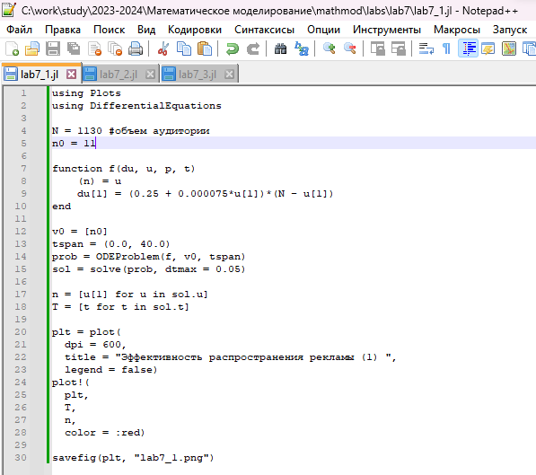{#fig:001 width=70%}

## Выполнение лабораторной работы

График показывает изменение числа людей, видящих рекламу, с течением времени (рис.2). В данном случае $α_1(t)≫α_2(t)$, следовательно, получаем модель типа модели Мальтуса.

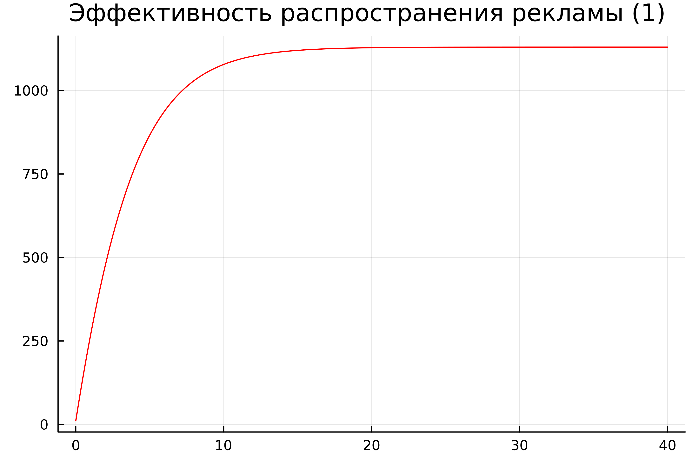{#fig:002 width=80%}

## Выполнение лабораторной работы

Код программы для второго случая $dn/dt$=$(0.000075+0.25n(t))(N-n(t))$ (рис.3):

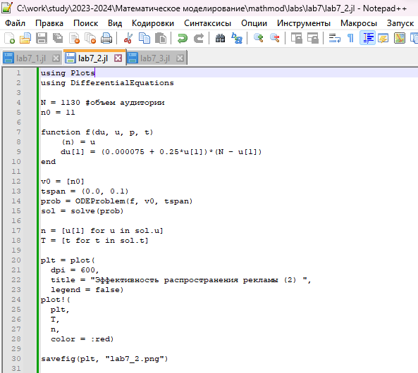{#fig:003 width=70%}

## Выполнение лабораторной работы

График описывает динамику распространения рекламы (рис.4). В данном случае $α_1(t)≪α_2(t)$, следовательно, получаем уравнение логистической кривой.

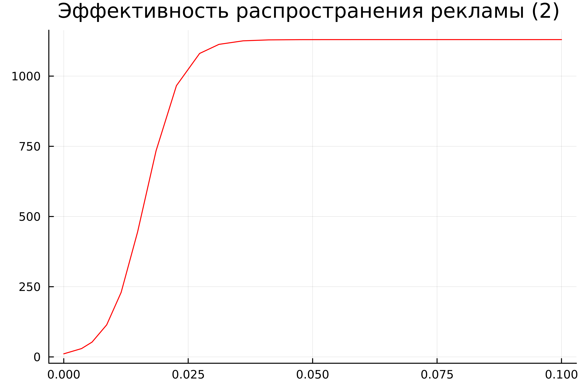{#fig:004 width=80%}

## Выполнение лабораторной работы

Определим, в какой момент времени скорость распространения рекламы будет иметь максимальное значение (рис.5).

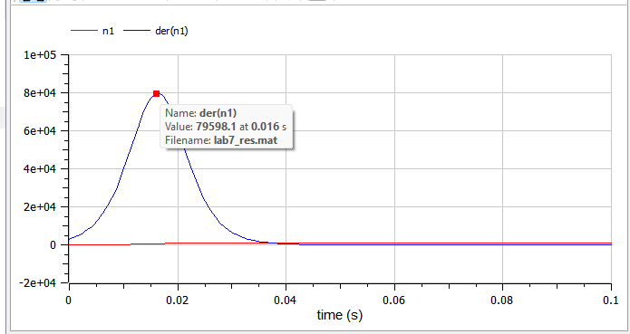{ #fig:005 }

## Выполнение лабораторной работы

Код программы для третьего случая $dn/dt$=$(0.25sin(t)+0.75*t*n(t))(N-n(t))$ (рис.6):

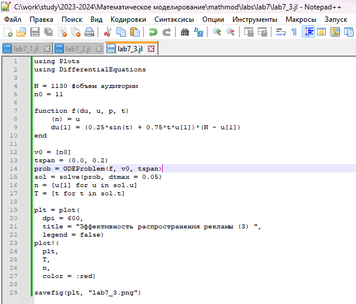{#fig:006 width=70%}

## Выполнение лабораторной работы

График описывает динамику распространения рекламы (рис.7).

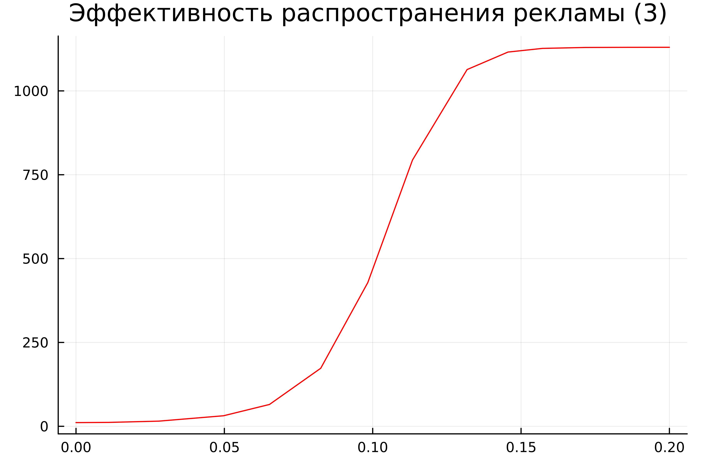{#fig:007 width=80%}

## Выполнение лабораторной работы

Код описывает три различных модели динамики распространения рекламы в аудитории (рис.8 - рис.11).

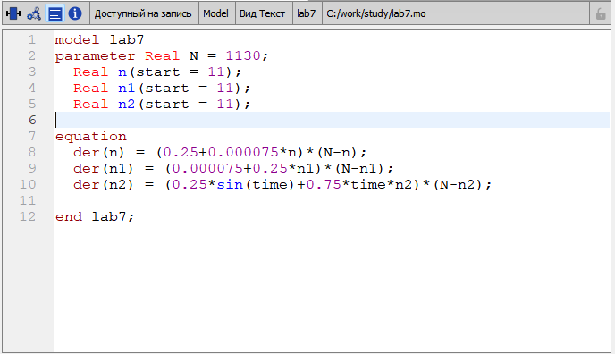{#fig:008 width=85%}

## Выполнение лабораторной работы

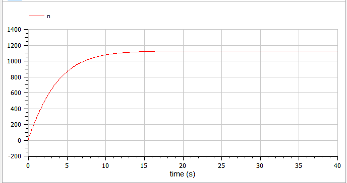{#fig:009}

## Выполнение лабораторной работы

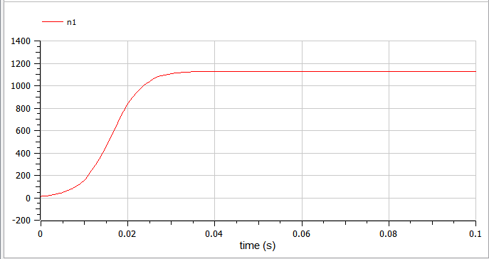{#fig:0010}

## Выполнение лабораторной работы

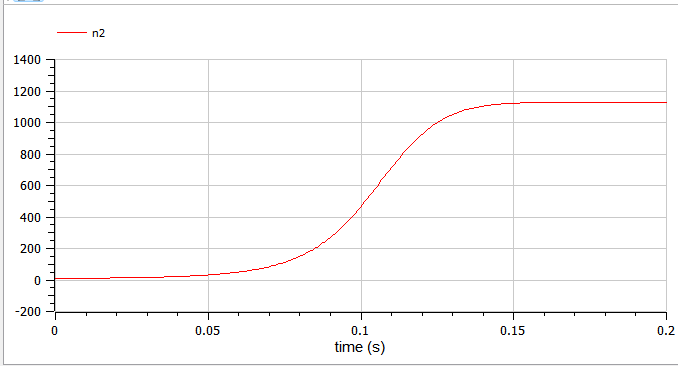{#fig:0011}

## Анализ и сравнение результатов

В результате работы я построила графики распространения рекламы для трех случаев на языках Julia и Modelica. Графики аналогичные.
Оба примера кода, написанные на Julia и Modelica, моделируют динамику распространения рекламы в аудитории. Обе модели решают дифференциальные уравнения, описывающие изменение числа людей, видящих рекламу, в зависимости от времени. 

## Выводы

Таким образом, в ходе ЛР№7 я рассмотрела математическую модель распространения рекламы. С помощью рассмотренной модели и теоретических сведений научилась строить модели такого типа.

## Список литературы

1. The simplest mathematical models of population dynamics [Электронный ресурс]. The Malthus Model. URL: https://clck.ru/39TKb6.
2. Julia 1.10 Documentation [Электронный ресурс]. JuliaLang, 2023. URL: https://docs.julialang.org/en/v1/.
3. OpenModelica User’s Guide [Электронный ресурс]. Open Source Modelica Consortium, 2024. URL: https://openmodelica.org/doc/OpenModelicaUsersGuide/latest/.
