---
## Front matter

title: "Отчёт по лабораторной работе №7

Математическое моделирование"
subtitle: "Эффективность рекламы. Вариант №38"
author: "Щербак Маргарита Романовна, НПИбд-02-21"
date: "2024"
## Generic otions
lang: ru-RU
toc-title: "Содержание"

## Bibliography
bibliography: bib/cite.bib
csl: pandoc/csl/gost-r-7-0-5-2008-numeric.csl

## Pdf output format
toc: true # Table of contents
toc-depth: 2
lof: true # List of figures
fontsize: 12pt
linestretch: 1.5
papersize: a4
documentclass: scrreprt
## I18n polyglossia
polyglossia-lang:
  name: russian
  options:
	- spelling=modern
	- babelshorthands=true
polyglossia-otherlangs:
  name: english
## I18n babel
babel-lang: russian
babel-otherlangs: english
## Fonts
mainfont: PT Serif
romanfont: PT Serif
sansfont: PT Sans
monofont: PT Mono
mainfontoptions: Ligatures=TeX
romanfontoptions: Ligatures=TeX
sansfontoptions: Ligatures=TeX,Scale=MatchLowercase
monofontoptions: Scale=MatchLowercase,Scale=0.9
## Pandoc-crossref LaTeX customization
figureTitle: "Скриншот"
tableTitle: "Таблица"
listingTitle: "Листинг"
lofTitle: "Список иллюстраций"
lotTitle: "Список таблиц"
lolTitle: "Листинги"
## Misc options
indent: true
header-includes:
  - \usepackage{indentfirst}
  - \usepackage{float} # keep figures where there are in the text
  - \floatplacement{figure}{H} # keep figures where there are in the text
---

# Цель работы

Рассмотреть математическую модель распространения рекламы. С помощью рассмотренной модели и теоретических сведений научиться строить модели такого типа. 

# Теоретическое введение

Организуется рекламная кампания нового товара или услуги. Необходимо, чтобы прибыль будущих продаж с избытком покрывала издержки на рекламу. Вначале расходы могут превышать прибыль, поскольку лишь малая часть потенциальных покупателей будет информирована о новинке. Затем, при
увеличении числа продаж, возрастает и прибыль, и, наконец, наступит момент, когда рынок насытится, и рекламировать товар станет бесполезным.

Предположим, что торговыми учреждениями реализуется некоторая продукция, о которой в момент времени $t$ из числа потенциальных покупателей $N$ знает лишь $n$ покупателей. Для ускорения сбыта продукции запускается реклама по радио, телевидению и другим средствам массовой информации. После запуска рекламной кампании информация о продукции начнет распространяться среди потенциальных покупателей путем общения друг с другом. Таким образом, после запуска рекламных объявлений скорость изменения числа знающих о продукции людей пропорциональна как числу знающих о товаре покупателей, так и числу покупателей о нем не знающих.

Модель рекламной кампании описывается следующими величинами. Считаем, что $\frac {dn}{dt}$ – скорость изменения со временем числа потребителей, узнавших о товаре и готовых его купить, $t$ – время, прошедшее с начала рекламной кампании, $n(t)$ – число уже информированных клиентов. Эта величина пропорциональна числу покупателей, еще не знающих о нем, это описывается следующим образом: $α_1(t)(N-n(t))$, где $N$ – общее число потенциальных платежеспособных покупателей, $α_1(t)>0$ характеризует интенсивность рекламной кампании (зависит от затрат на рекламу в данный момент времени). Помимо этого, узнавшие о товаре потребители также распространяют полученную информацию среди потенциальных покупателей, не знающих о нем (в этом случае работает т.н. сарафанное радио). Этот вклад в рекламу описывается величиной $α_2(t)n(t)(N-n(t))$, которая увеличивается с увеличением потребителей узнавших о товаре. Математическая модель распространения рекламы описывается уравнением: 

$\frac {dn}{dt}$=$(α_1(t)+α_2(t)n(t))(N-n(t))$.

При $α_1(t)≫α_2(t)$ получается модель типа модели Мальтуса [@malthus_model].

В обратном случае, при $α_1(t)≪α_2(t)$ получаем уравнение логистической кривой.

# Выполнение лабораторной работы

## Задание. Вариант 38

Построить график распространения рекламы, математическая модель которой описывается следующим уравнением:   

1. $\frac {dn}{dt}$=$(0.25+0.000075n(t))(N-n(t))$   

2. $\frac {dn}{dt}$=$(0.000075+0.25n(t))(N-n(t))$  

3. $\frac {dn}{dt}$=$(0.25sin(t)+0.75*t*n(t))(N-n(t))$  

При этом объем аудитории $N=1130$, в начальный момент о товаре знает $11$ человек. Для случая $2$ определить, в какой момент времени скорость распространения рекламы будет иметь максимальное значение.

## Julia

Julia – это высокоуровневый язык программирования с динамической типизацией, созданный для эффективных математических вычислений и написания программ общего назначения [@julialang]. Для решения дифференциального уравнения, описанного в постановке задачи лабораторной работы, можно использовать библиотеку DifferentialEquations. Для построения графиков можно воспользоваться библиотекой Plots.

Код программы для первого случая $\frac {dn}{dt}$=$(0.25+0.000075n(t))(N-n(t))$ (рис.1):

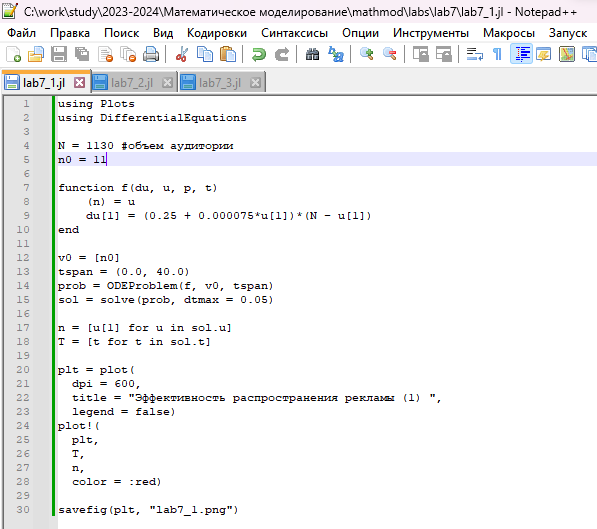{#fig:001}

График показывает изменение числа людей, видящих рекламу, с течением времени (рис.2). В данном случае $α_1(t)≫α_2(t)$, следовательно, получаем модель типа модели Мальтуса.

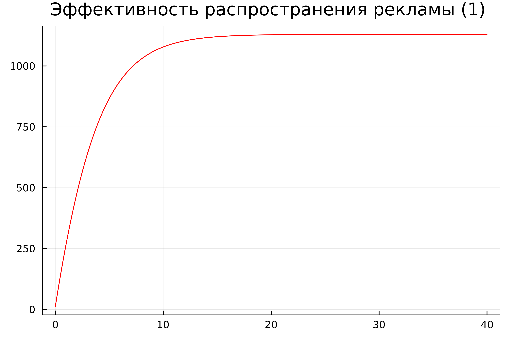{#fig:002}

Код программы для второго случая $\frac {dn}{dt}$=$(0.000075+0.25n(t))(N-n(t))$ (рис.3):

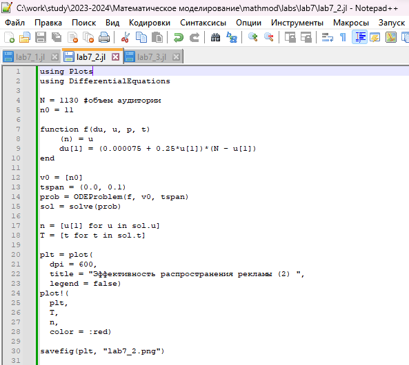{#fig:003}

График описывает динамику распространения рекламы (рис.4). В данном случае $α_1(t)≪α_2(t)$, следовательно, получаем уравнение логистической кривой.

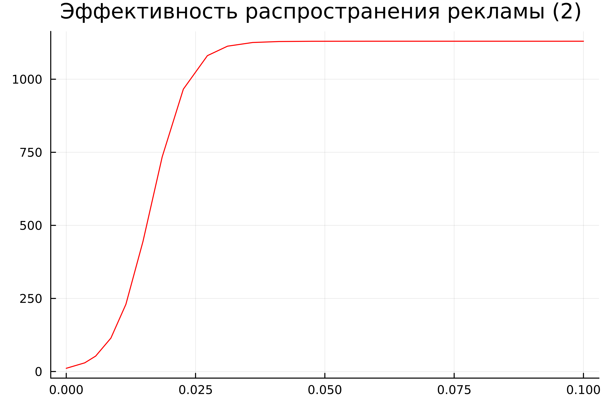{#fig:004}

Определим, в какой момент времени скорость распространения рекламы будет иметь максимальное значение (рис.5).

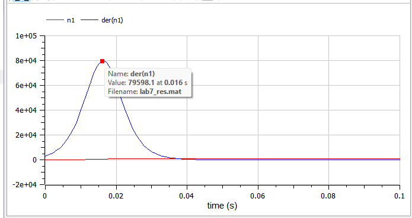{ #fig:005 }

Код программы для третьего случая $\frac {dn}{dt}$=$(0.25sin(t)+0.75*t*n(t))(N-n(t))$ (рис.6):

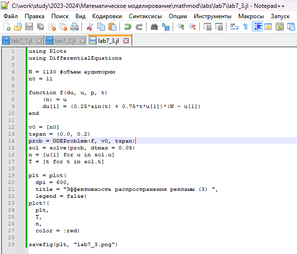{#fig:006}

График описывает динамику распространения рекламы (рис.7).

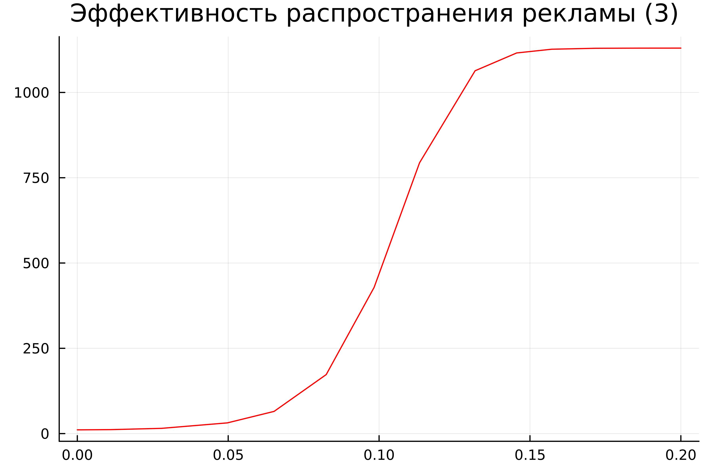{#fig:007}

## OpenModelica

OpenModelica – это свободное программное обеспечение для моделирования и анализа сложных динамических систем, основанное на языке Modelica. OpenModelica приближается по функциональности к таким инструментам, как Matlab Simulink и Scilab xCos, но обладает более удобным представлением системы уравнений [@modelica]. Написала код в OpenModelica (рис.8). 

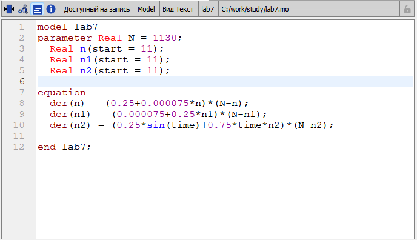{#fig:008}

Код описывает три различных модели динамики распространения рекламы в аудитории (рис.9 - рис.11).

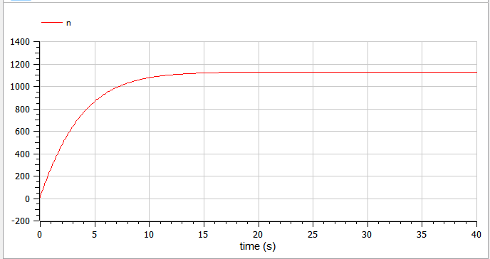{#fig:009}

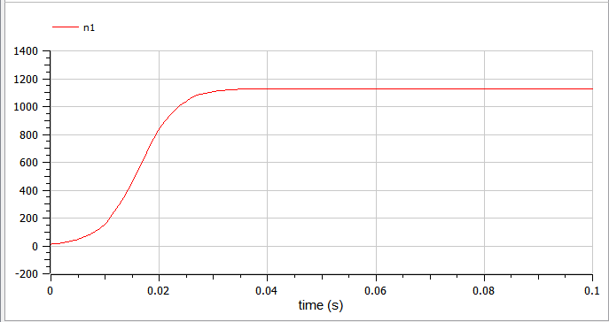{#fig:0010}

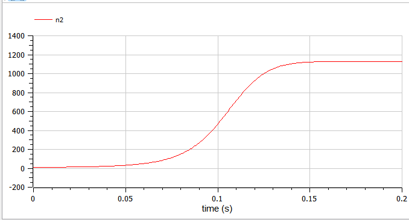{#fig:0011}

# Анализ и сравнение результатов

В результате работы я построила графики распространения рекламы для трех случаев на языках Julia и Modelica. Графики аналогичные.
Оба примера кода, написанные на Julia и Modelica, моделируют динамику распространения рекламы в аудитории. Обе модели решают дифференциальные уравнения, описывающие изменение числа людей, видящих рекламу, в зависимости от времени. 

# Выводы

Таким образом, в ходе ЛР№7 я рассмотрела математическую модель распространения рекламы. С помощью рассмотренной модели и теоретических сведений научилась строить модели такого типа.

# Список литературы{.unnumbered}

::: {#refs}
:::
