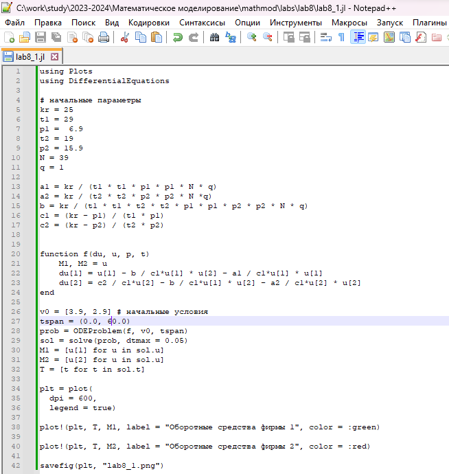
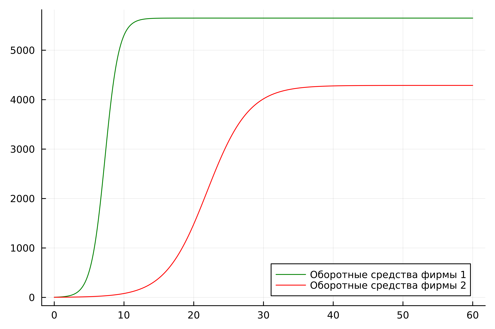
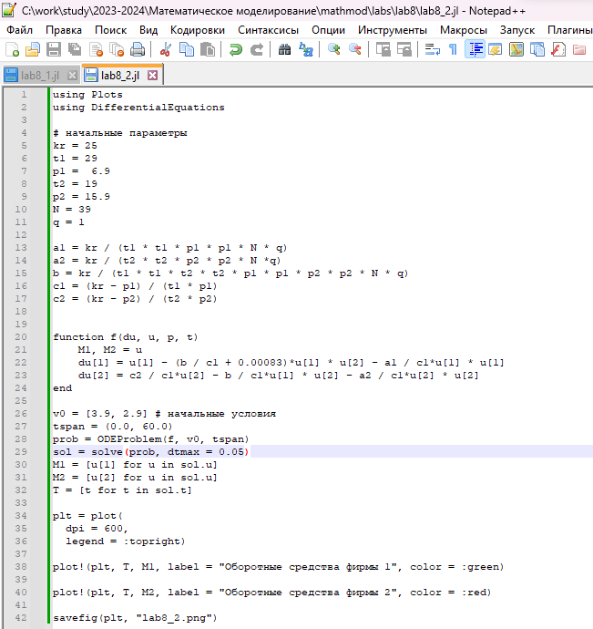
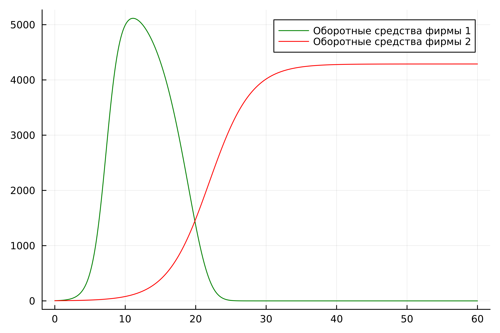
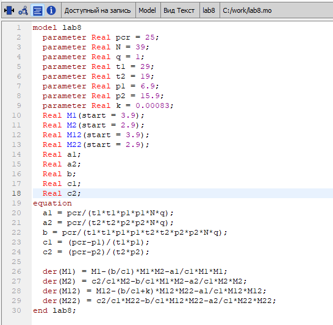
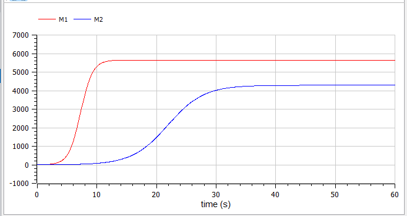
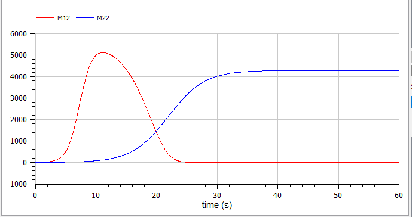

---
## Front matter
lang: ru-RU
title: Лабораторная работа №8
subtitle: Модель конкуренции двух фирм. Вариант №38
author: |
        Щербак Маргарита Романовна
        \        
        НПИбд-02-21
        \
        Студ. билет: 1032216537
institute: |
           RUDN
date: |
      2024

babel-lang: russian
babel-otherlangs: english
mainfont: Arial
monofont: Courier New
fontsize: 8pt

## Formatting
toc: false
slide_level: 2
theme: metropolis
header-includes: 
 - \metroset{progressbar=frametitle,sectionpage=progressbar,numbering=fraction}
 - '\makeatletter'
 - '\beamer@ignorenonframefalse'
 - '\makeatother'
aspectratio: 43
section-titles: true
---

## Цель работы

Рассмотреть математическую модель конкуренции двух фирм. С помощью рассмотренной модели и теоретических сведений научиться строить модели такого типа. 

## Теоретическое введение 

В данной модели конкуренции исследуется влияние спроса, предложения, стоимости производства и оборотных средств на устойчивость функционирования фирмы, производящей продукт долговременного пользования.

Ключевые моменты:   

- Цена и спрос взаимосвязаны. Предложение зависит от оборотных средств и количества потребителей.    

- Цена продукта стремится к равновесию, определяемому спросом и предложением. Оборотные средства влияют на стабильность предприятия.   

- Фирма может стабильно функционировать или столкнуться с банкротством в зависимости от соотношения оборотных средств и издержек.   

- Параметры $\delta$ и $\tau$ определяют эффективность производства, влияя на устойчивость фирмы.   

## Задачи

1. Построить графики изменения оборотных средств фирмы 1 и фирмы 2 без учета постоянных издержек и с введенной нормировкой для случая 1.
2. Построить графики изменения оборотных средств фирмы 1 и фирмы 2 без учета постоянных издержек и с введенной нормировкой для случая 2.

Для обоих случаев рассмотрим задачу со следующими начальными условиями и параметрами:   
$M_0^1$=$3.9$, $M_0^2$=$2.9$, $p_{cr}$=$25$, $N$=$39$, $q$=$1$, $τ_1$=$29$, $τ_2$=$19$, $\tilde{p}_1$=$6.9$, $\tilde{p}_2$=$15.9$. 

## Задание. 1 случай

Рассмотрим конкуренцию двух фирм, производящих одинаковые товары в одной нише. Они могут изменять параметры производства, но не вмешиваться в цену или поведение потребителей. Учитывая незначительные постоянные издержки, динамика их продаж описывается системой уравнений:

$dM_1/dθ$=$M_1-b/c_1*M_1M_2-a_1/c_1*M_1^2$

$dM_2/dθ$=$c_2/c_1*M_2-b/c_1*M_1M_2-a_2/c_1*M_2^2$

где

где $a_1$, $a_2$, $b$, $c_1$, $c_2$ и $t$ представляют нормированные параметры, связанные с производством и спросом на товары.

## Задание. 2 случай

Рассмотрим модель, где помимо экономических факторов влияния, учитываются социально-психологические факторы, такие как предпочтения потребителей. Для взаимодействия двух фирм в этой модели используется следующая система уравнений:

$dM_1/dθ$=$M_1-b/c_1*M_1M_2-a_1/c_1*M_1^2$

$dM_2/dθ$=$c_2/c_1*M_2-(b/c_1+0.00083)M_1M_2-a_2/c_1M_2^2$

## Выполнение лабораторной работы

Код программы для первого случая (рис.1).

{#fig:001 width=60%}

## Выполнение лабораторной работы

По графику видно, что рост оборотных средств предприятий идет независимо друг от друга. Каждая фирма достигает свое максимальное значение объема продаж и остается на рынке с этим значением, то есть каждая фирма захватывает свою часть рынка потребителей, которая не изменяется (рис.2).

{#fig:002 width=55%}

## Выполнение лабораторной работы

Код программы для второго случая (рис.3).

{#fig:003 width=60%}

## Выполнение лабораторной работы

По графику видно, что первая фирма, несмотря на начальный рост, достигнув своего максимального объема продаж, начитает нести убытки и, в итоге, терпит банкротство. Динамика роста объемов оборотных средств второй фирмы остается без изменения: достигнув максимального значения, остается на этом уровне (рис.4).

{#fig:004 width=55%}

## Выполнение лабораторной работы

Код описывает математическую модель конкуренции двух фирм (рис.5).

{#fig:005 width=65%}

## Графики конкуренции двух фирм для двух случаев (рис.6 - рис.7)

:::::::::::::: {.columns align=center}
::: {.column width="50%"}

{#fig:006}

::: 
::: {.column width="50%"}

{#fig:007}

:::
::::::::::::::

## Анализ и сравнение результатов

В результате работы я построила графики изменения оборотных средств для двух фирм для случаев, когда конкурентная борьба ведётся только рыночными методами и когда помимо экономического фактора влияния используются еще и социально-психологические факторы на языках Julia и Modelica. Графики идентичны.

## Выводы

Таким образом, в ходе ЛР№8 я рассмотрела математическую модель конкуренции двух фирм. С помощью рассмотренной модели и теоретических сведений научилась строить модели такого типа.

## Список литературы

1. Mathematical models of the competitive environment [Электронный ресурс]. 2018. St. Petersburg State University. URL: https://clck.ru/39bh2e.
2. Julia 1.10 Documentation [Электронный ресурс]. JuliaLang, 2023. URL: https://docs.julialang.org/en/v1/.
3. OpenModelica User’s Guide [Электронный ресурс]. Open Source Modelica Consortium, 2024. URL: https://openmodelica.org/doc/OpenModelicaUsersGuide/latest/.
