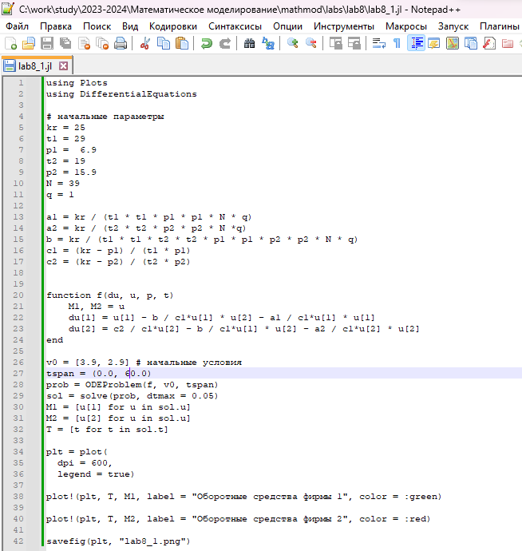
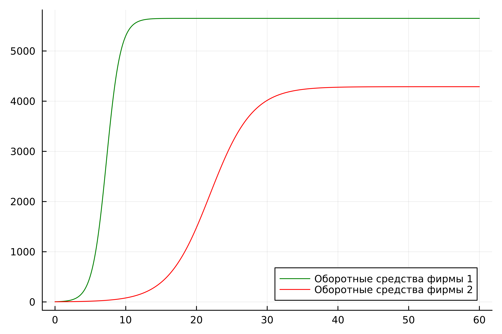
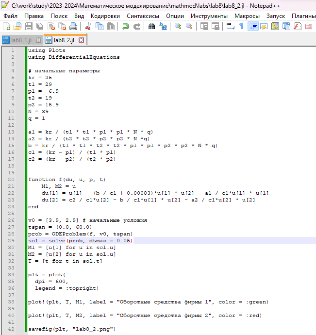
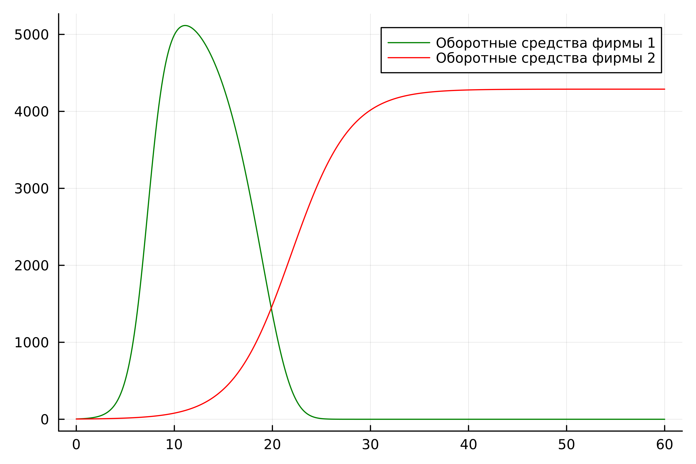
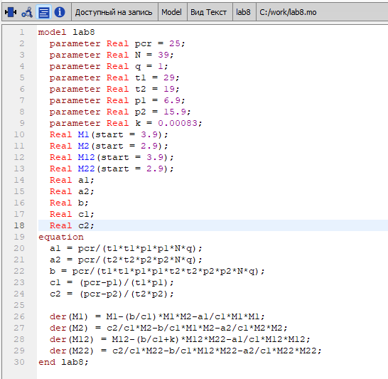
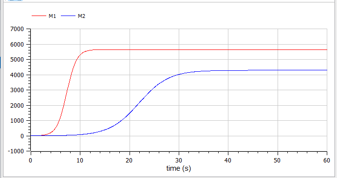
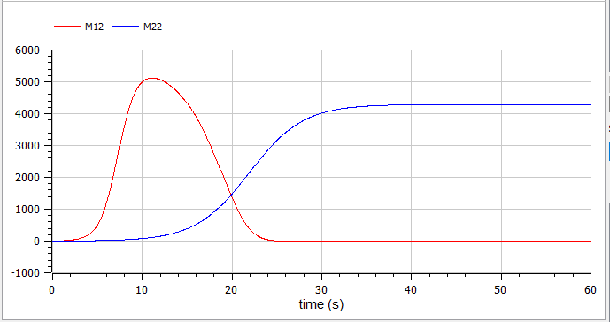

---
## Front matter

title: "Отчёт по лабораторной работе №8

Математическое моделирование"
subtitle: "Модель конкуренции двух фирм. Вариант №38"
author: "Щербак Маргарита Романовна, НПИбд-02-21"
date: "2024"
## Generic otions
lang: ru-RU
toc-title: "Содержание"

## Bibliography
bibliography: bib/cite.bib
csl: pandoc/csl/gost-r-7-0-5-2008-numeric.csl

## Pdf output format
toc: true # Table of contents
toc-depth: 2
lof: true # List of figures
fontsize: 12pt
linestretch: 1.5
papersize: a4
documentclass: scrreprt
## I18n polyglossia
polyglossia-lang:
  name: russian
  options:
	- spelling=modern
	- babelshorthands=true
polyglossia-otherlangs:
  name: english
## I18n babel
babel-lang: russian
babel-otherlangs: english
## Fonts
mainfont: PT Serif
romanfont: PT Serif
sansfont: PT Sans
monofont: PT Mono
mainfontoptions: Ligatures=TeX
romanfontoptions: Ligatures=TeX
sansfontoptions: Ligatures=TeX,Scale=MatchLowercase
monofontoptions: Scale=MatchLowercase,Scale=0.9
## Pandoc-crossref LaTeX customization
figureTitle: "Скриншот"
tableTitle: "Таблица"
listingTitle: "Листинг"
lofTitle: "Список иллюстраций"
lotTitle: "Список таблиц"
lolTitle: "Листинги"
## Misc options
indent: true
header-includes:
  - \usepackage{indentfirst}
  - \usepackage{float} # keep figures where there are in the text
  - \floatplacement{figure}{H} # keep figures where there are in the text
---

# Цель работы

Рассмотреть математическую модель конкуренции двух фирм. С помощью рассмотренной модели и теоретических сведений научиться строить модели такого типа. 

# Теоретическое введение

Для построения модели конкуренции хотя бы двух фирм необходимо рассмотреть модель одной фирмы. Вначале рассмотрим модель фирмы, производящей продукт долговременного пользования, когда цена его определяется балансом спроса и предложения. Примем, что этот продукт занимает определенную нишу рынка и конкуренты в ней отсутствуют. 

Обозначим:

$N$ – число потребителей производимого продукта. 

$S$ – доходы потребителей данного продукта. Считаем, что доходы всех потребителей одинаковы. Это предположение справедливо, если речь идет об одной рыночной нише, т.е. производимый продукт ориентирован на определенный слой населения. 

$M$ – оборотные средства предприятия 

$\tau$ – длительность производственного цикла

$p$ – рыночная цена товара 

$\tilde{p}$ – себестоимость продукта, то есть переменные издержки на производство единицы продукции

$\delta$ – доля оборотных средств, идущая на покрытие переменных издержек

$k$ – постоянные издержки, которые не зависят от количества выпускаемой продукции

$Q(S/p)$ – функция спроса, зависящая от отношения дохода $S$ к цене $p$. Она равна количеству продукта, потребляемого одним потребителем в единицу времени.

Функцию спроса товаров долговременного использования часто представляют в простейшей форме: 

$$Q = q - k\frac{p}{S} = q(1 - \frac{p}{p_{cr}})$$

где $q$ – максимальная потребность одного человека в продукте в единицу времени.
Эта функция падает с ростом цены и при $p = p_{cr}$ (критическая стоимость продукта) потребители отказываются от приобретения товара. Величина $p_{cr} = Sq/k$. Параметр $k$ – мера эластичности функции спроса по цене. Таким образом, функция спроса является пороговой (то есть, $Q(S/p) = 0$ при $p \geq p_{cr}$) и обладает свойствами насыщения.

Уравнения динамики оборотных средств можно записать в виде:

$$\frac{dM}{dt} = -\frac{M \delta}{\tau} + NQp - k = -\frac{M\delta}{\tau} + Nq(1 - \frac{p}{p_{cr}})p - k$$

Уравнение для рыночной цены $p$ представим в виде:

$$\frac{dp}{dt} = \gamma (-\frac{M\delta}{\tau \tilde{p}} + Nq(1-\frac{p}{p_{cr}}) )$$

Первый член соответствует количеству поставляемого на рынок товара (то есть, предложению), а второй член – спросу.
Параметр $\gamma$ зависит от скорости оборота товаров на рынке. Как правило, время торгового оборота существенно меньше времени производственного цикла $\tau$. При заданном M уравнение описывает быстрое стремление цены к равновесному значению цены, которое устойчиво.

В этом случае уравнение можно заменить алгебраическим соотношением

$$ -\frac{M\delta}{\tau \tilde{p}} + Nq(1-\frac{p}{p_{cr}}) = 0$$

равновесное значение цены $p$ равно

$$ p = p_{cr}(1 - \frac{M\delta}{\tau \tilde{p} Nq})$$

Тогда уравнения динамики оборотных средств приобретает вид

$$\frac{dM}{dt} = -\frac{M \delta}{\tau}(\frac{p}{p_{cr}}-1) - M^2 ( \frac{\delta}{\tau \tilde{p} })^2 \frac{p_{cr}}{Nq} - k$$

Данное уравнение имеет два стационарных решения, которые соответствуют условию $dM/dt=0$

$$ \tilde{M_{1,2}} = \frac{1}{2} a \pm \sqrt{\frac{a^2}{4} - b}$$

где

$$ a = Nq(1 - \frac{\tilde{p}}{p_{cr}} \tilde{p} \frac{\tau}{\delta}), b = kNq \frac{(\tau \tilde{p})^2}{p_{cr}\delta ^2} $$

Получается, что при больших постоянных издержках (в случае $a^2 < 4b$) стационарных состояний нет. Это означает, что в этих условиях фирма не может функционировать стабильно, то есть, терпит банкротство. Однако, как правило, постоянные затраты малы по сравнению с переменными (то есть, $b≪a^2$) и играют роль, только в случае, когда оборотные средства малы. 

При $b≪a$ стационарные значения $M$ равны

$$ \tilde{M_{+}} = Nq \frac{\tau}{\delta}(1 - \frac{\tilde{p}}{p_{cr}})\tilde{p}, \tilde{M_{-}} = k\tilde{p} \frac{\tau}{\delta(p_{cr} - \tilde{p})} $$

Первое состояние $\tilde{M_{+}}$ устойчиво и соответствует стабильному функционированию предприятия. Второе состояние $\tilde{M_{-}}$ неустойчиво, так, что при $M < \tilde{M_{-}}$ оборотные средства падают ($dM/dt < 0$), то есть, фирма идет к банкротству. По смыслу $\tilde{M_{-}}$ соответствует начальному капиталу, необходимому для входа в рынок.

В обсуждаемой модели параметр $\delta$ всюду входит в сочетании с $\tau$. Это значит, что уменьшение доли оборотных средств, вкладываемых в производство, эквивалентно удлинению производственного цикла. Поэтому мы в дальнейшем положим: $\delta=1$, а параметр $\tau$ будем считать временем цикла, с учётом сказанного [@mathemodels_of_competition].

# Выполнение лабораторной работы

## Задание. Вариант 38

Случай 1. Рассмотрим две фирмы, производящие взаимозаменяемые товары
одинакового качества и находящиеся в одной рыночной нише. Считаем, что в рамках
нашей модели конкурентная борьба ведётся только рыночными методами. То есть,
конкуренты могут влиять на противника путем изменения параметров своего
производства: себестоимость, время цикла, но не могут прямо вмешиваться в
ситуацию на рынке («назначать» цену или влиять на потребителей каким-либо иным
способом.) Будем считать, что постоянные издержки пренебрежимо малы, и в
модели учитывать не будем. В этом случае динамика изменения объемов продаж
фирмы 1 и фирмы 2 описывается следующей системой уравнений:

$\frac {dM_1}{dθ}$=$M_1-\frac{b}{c_1}M_1M_2-\frac{a_1}{c_1}M_1^2$

$\frac {dM_2}{dθ}$=$\frac{c_2}{c_1}M_2-\frac{b}{c_1}M_1M_2-\frac{a_2}{c_1}M_2^2$

где

$a_1$=$\frac {p_{cr}}{τ_1^2\tilde{p}_1^2Nq}$; $a_2$=$\frac {p_{cr}}{τ_2^2\tilde{p}_2^2Nq}$; $b$=$\frac {p_{cr}}{τ_1^2\tilde{p}_1^2τ_2^2\tilde{p}_2^2Nq}$; $c_1$=$\frac {p_{cr}-\tilde{p}_1}{τ_1\tilde{p}}$; $c_2$=$\frac {p_{cr}-\tilde{p}_2}{τ_2\tilde{p}}$

Также введена нормировка $t$=$c_1θ$.

Случай 2. Рассмотрим модель, когда, помимо экономического фактора
влияния (изменение себестоимости, производственного цикла, использование
кредита и т.п.), используются еще и социально-психологические факторы –
формирование общественного предпочтения одного товара другому, не зависимо от
их качества и цены. В этом случае взаимодействие двух фирм будет зависеть друг
от друга, соответственно коэффициент перед $M_1M_2$ будет отличаться. Пусть в
рамках рассматриваемой модели динамика изменения объемов продаж фирмы 1 и
фирмы 2 описывается следующей системой уравнений: 

$\frac {dM_1}{dθ}$=$M_1-\frac{b}{c_1}M_1M_2-\frac{a_1}{c_1}M_1^2$

$\frac {dM_2}{dθ}$=$\frac{c_2}{c_1}M_2-(\frac{b}{c_1}+0.00083)M_1M_2-\frac{a_2}{c_1}M_2^2$

Для обоих случаев рассмотрим задачу со следующими начальными условиями и параметрами: $M_0^1$=$3.9$, $M_0^2$=$2.9$, $p_{cr}$=$25$, $N$=$39$, $q$=$1$, $τ_1$=$29$, $τ_2$=$19$, $\tilde{p}_1$=$6.9$, $\tilde{p}_2$=$15.9$. 

Замечание: 

Значения $p_{cr}$, $\tilde{p}_{1,2},N$ указаны в тысячах единиц, а значения $M_{1,2}$ указаны в млн. единиц.

Обозначения:

$N$ – число потребителей производимого продукта.

$τ$ – длительность производственного цикла

$p$ – рыночная цена товара

$\tilde{p}$ – себестоимость продукта, то есть переменные издержки на производство единицы продукции.

$q$ – максимальная потребность одного человека в продукте в единицу времени

$M$ – оборотные средства предприятия

$θ$ = $\frac{t}{c_1}$

1. Постройте графики изменения оборотных средств фирмы 1 и фирмы 2 без учета постоянных издержек и с введенной нормировкой для случая 1.
2. Постройте графики изменения оборотных средств фирмы 1 и фирмы 2 без учета постоянных издержек и с введенной нормировкой для случая 2.

## Julia

Julia – это высокоуровневый язык программирования с динамической типизацией, созданный для эффективных математических вычислений и написания программ общего назначения [@julialang]. Для решения дифференциального уравнения, описанного в постановке задачи лабораторной работы, можно использовать библиотеку DifferentialEquations. Для построения графиков можно воспользоваться библиотекой Plots.

Код программы для первого случая (рис.1):

{#fig:001 weidth=70%}

По графику видно, что рост оборотных средств предприятий идет независимо друг от друга. Каждая фирма достигает свое максимальное значение объема продаж и остается на рынке с этим значением, то есть каждая фирма захватывает свою часть рынка потребителей, которая не изменяется (рис.2).

{#fig:002}

Код программы для второго случая (рис.3):

{#fig:003 weidth=70%}

По графику видно, что первая фирма, несмотря на начальный рост, достигнув своего максимального объема продаж, начитает нести убытки и, в итоге, терпит банкротство. Динамика роста объемов оборотных средств второй фирмы остается без изменения: достигнув максимального значения, остается на этом уровне (рис.4).

{#fig:004}

## OpenModelica

OpenModelica – это свободное программное обеспечение для моделирования и анализа сложных динамических систем, основанное на языке Modelica. OpenModelica приближается по функциональности к таким инструментам, как Matlab Simulink и Scilab xCos, но обладает более удобным представлением системы уравнений [@modelica]. Написала код в OpenModelica (рис.5). 

{#fig:005 weidth=70%}

Получила графики конкуренции двух фирм для двух случаев (рис.6 - рис.7).

{#fig:006}

{#fig:007}

# Анализ и сравнение результатов

В результате работы я построила графики изменения оборотных средств для двух фирм для случаев, когда конкурентная борьба ведётся только рыночными методами и когда помимо экономического фактора влияния используются еще и социально-психологические факторы на языках Julia и Modelica. Графики идентичны.

# Выводы

Таким образом, в ходе ЛР№8 я рассмотрела математическую модель конкуренции двух фирм. С помощью рассмотренной модели и теоретических сведений научилась строить модели такого типа.

# Список литературы{.unnumbered}

::: {#refs}
:::

